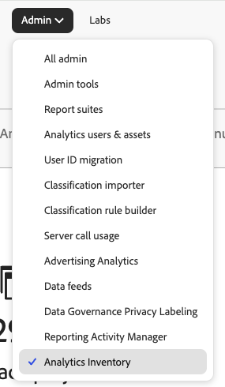
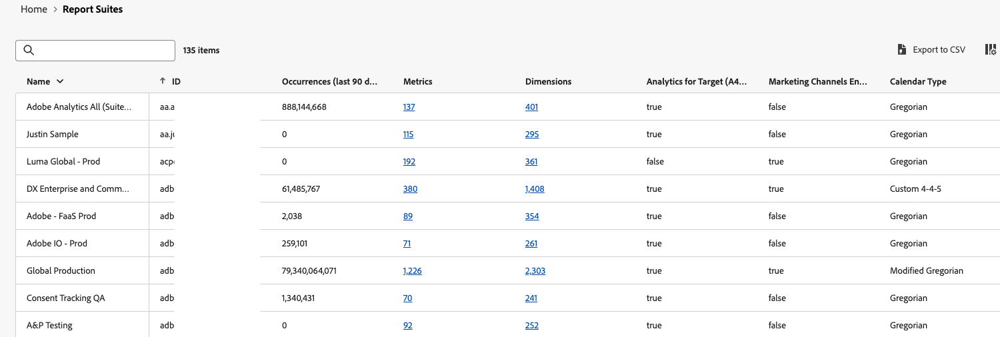

# Analytics inventory {#analytics-inventory}

<!-- markdownlint-disable MD034 -->

>[!CONTEXTUALHELP]
>id="analytics-inventory"
>title="Analytics inventory"
>abstract="This page provides a comprehensive overview of your Adobe Analytics environment, including the number of projects and components, report suites, users, and more. This information is especially valuable as you begin preparations to upgrade to Customer Journey Analytics."

<!-- markdownlint-enable MD034 -->

The Analytics Inventory provides a comprehensive overview of your Adobe Analytics environment, including the number of projects and components, report suites, users, and more. This information is especially valuable as you begin preparations to upgrade to Customer Journey Analytics. 

The goal of this application is to help you answer the following questions:

* For your organization, which assets (such as report suites, segments, users, workspace projects, data feeds, and so on) do you need to upgrade and which assets can you leave behind?

* Once you have determined what asset need to be migrated:

    * Should you do some asset cleanup before this upgrade?
    
    * Should you do some asset consolidation as part of the process?
    
    * What should the upgrade sequence be for your assets?

    * What group of report suites should you upgrade first? last?

## Permissions

Analytics Inventory is available to users with Adobe Analytics Product Admin privileges in [Adobe Admin Console](https://experienceleague.adobe.com/en/docs/analytics/admin/admin-console/admin-roles-in-analytics). 

## Access Analytics Inventory

1. Click **[!UICONTROL Analytics Inventory]** in the **[!UICONTROL Admin]** menu. Or go to **[!UICONTROL All admin]** > **[!UICONTROL Analytics Inventory]**.

1. The main screen shows a comprehensive inventory of your Adobe Analytics environment:

    

    Specifically, this screen surfaces
    
    * The total number of Analysis Workspace and Mobile Scorecard projects that are active under this organization across all users.
    * The total number of segments and calculated metrics that are active under this organization across all users.
    * The total number of base report suites that have been defined (Virtual report suites are not included).
    * If the Media Analytics feature is active and if so, in what mode.
    * The total number of users defined under that organization.

## Components {#components}

<!-- markdownlint-disable MD034 -->

>[!CONTEXTUALHELP]
>id="analytics-inventory-components"
>title="Components"
>abstract="This section shows the number of projects, segments, and calculated metrics that exist in your Adobe Analytics environment. Projects and components can be migrated to Customer Journey Analytics."

<!-- markdownlint-enable MD034 -->

In this initial release, you can see summary inventory numbers for Workspace projects, Segments, and Calculated metric. Subsequent releases will allow you to analyze these components.

## Data configuration and collection {#data-config}

<!-- markdownlint-disable MD034 -->

>[!CONTEXTUALHELP]
>id="analytics-inventory-data-config"
>title="Data configuration and collection"
>abstract="This section shows the number of report suites in your Adobe Analytics environment, as well as your access to Streaming Media. "

<!-- markdownlint-enable MD034 -->

### Report suites

The report suites view shows all the report suites defined under an organization. It lets you answer the following questions:

* What report suites have received the most hit in the last 90 days?
* What report suites have received no hit in the last 90 days?
* What report suites have the largest number of dimension defined?
* What report suites have the largest number of metrics defined?

The answers to these questions will give you a good idea as to which report suites are the best candidates for migration.

>[!NOTE]
>
>This table populates slowly, one cell value at a time. 

1. To analyze report suites, navigate to **[!UICONTROL Data configuration and collection]** > **[!UICONTROL Report suites]** and click **[!UICONTROL Analyze]**.

    

    | Element | Description |
    | --- | --- |
    | Name | The name of the report suite |
    | ID | The report suite ID (rsid). Specifies a unique ID that can contain only alphanumeric characters. This ID cannot be changed after it is created. Adobe sets the required ID prefix and it cannot be changed, either. |
    | Occurrences (last 90 days) | How many hits did this report suite receive in the last 90 days? |
    | Metrics | How many metrics are defined in this report suite? |
    | Dimensions | How many dimensions are defined in this report suite? |
    | Analytics for Target (A4T) Enabled | Is this report suite enabled for [Analytics for Target](https://experienceleague.adobe.com/en/docs/target/using/integrate/a4t/a4t)? |
    | Marketing Channels Enabled | Is this report suite enabled for [Marketing Channels](https://experienceleague.adobe.com/en/docs/analytics/components/marketing-channels/c-getting-started-mchannel)? |
    | Source Connector Enabled | [In development] Is this report suite enabled for the [Adobe Analytics Source Connector for report suite data](https://experienceleague.adobe.com/en/docs/experience-platform/sources/connectors/adobe-applications/analytics) in Adobe Experience Platform? In other words, can this report suite be migrated to Customer Journey Analytics using the Analytics Source Connector? |
    | Calendar Type | For more information, refer to [Custom Calendars](https://experienceleague.adobe.com/en/docs/analytics/admin/admin-tools/manage-report-suites/edit-report-suite/report-suite-general/custom-calendar#) |

#### Analyze dimensions

This screen provides a detailed view of all the dimensions defined for a specific report suite. From this view, you can answer the following questions:

* What dimensions are enabled for this report suite?
* What are the top ten dimension items for the last 90 days for this dimension?

1. Click the dimension link on the Report suite page.

#### Analyze metrics

This screen provides a detailed view of all the metrics defined for a specific report suite. From this view, you can answer the following questions:

* What metrics are enabled for this report suite?
* What are the top ten metrics for the last 90 days?

#### Export to CSV

1. To export the list of report suites to a .csv file, click **[!UICONTROL Export to CSV]**.

1. The .csv file will appear in your Downloads folder.

1. Open and save it with a spreadsheet application on your device.

## User management {#user-management}

<!-- markdownlint-disable MD034 -->

>[!CONTEXTUALHELP]
>id="analytics-inventory-user-management"
>title="User management"
>abstract="This section shows the number of users in your Adobe Analytics environment."

<!-- markdownlint-enable MD034 -->

User management will be available in a later release of Analytics inventory.