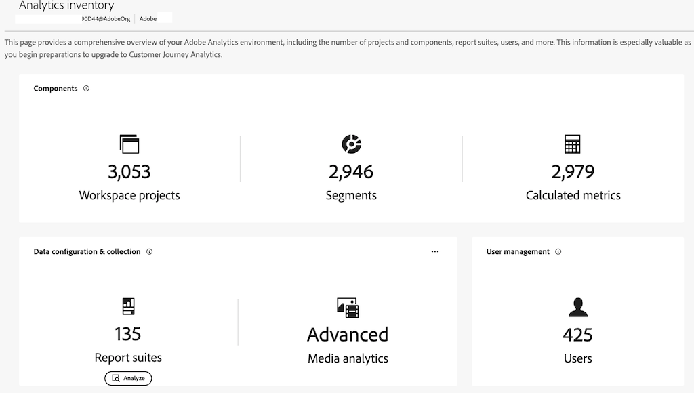

# Analytics inventory {#analytics-inventory}

<!-- markdownlint-disable MD034 -->

>[!CONTEXTUALHELP]
>id="analytics-inventory"
>title="Analytics inventory"
>abstract="This page provides a comprehensive overview of your Adobe Analytics environment, including the number of projects and components, report suites, users, and more. This information is especially valuable as you begin preparations to upgrade to Customer Journey Analytics."

<!-- markdownlint-enable MD034 -->

The Analytics Inventory provides a comprehensive overview of your Adobe Analytics environment, including the number of projects and components, report suites, users, and more. This information is especially valuable as you begin preparations to upgrade to Customer Journey Analytics. 

The goal of this application is to help you answer the following questions:

* For your organization, which assets (such as report suites, segments, users, workspace projects, data feeds, and so on) do you need to upgrade and which assets can you leave behind?

* Once you have determined what asset need to be migrated:

    * Should you do some asset cleanup before this upgrade?
    
    * Should you do some asset consolidation as part of the process?
    
    * What should the upgrade sequence be for your assets?

    * What group of report suites should you upgrade first? last?

## Permissions

Analytics Inventory is available to users with Adobe Analytics Product Admin privileges in [Adobe Admin Console](https://experienceleague.adobe.com/en/docs/analytics/admin/admin-console/admin-roles-in-analytics). 

## Access Analytics Inventory

1. Click **[!UICONTROL Analytics Inventory]** in the **[!UICONTROL Admin]** menu. Or go to **[!UICONTROL All admin]** > **[!UICONTROL Analytics Inventory]**.

2. The main screen shows a comprehensive inventory of your Adobe Analytics environment:

    

>[!IMPORTANT]
>
>   In this initial release, you can see summary numbers for Workspace projects, Segments, Calculated metrics, Advanced (Media Analytics) data, and Users. Currently, the only actionable items are Report suites.

## Components {#components}

<!-- markdownlint-disable MD034 -->

>[!CONTEXTUALHELP]
>id="analytics-inventory-components"
>title="Components"
>abstract="This section shows the number of projects, segments, and calculated metrics that exist in your Adobe Analytics environment. Projects and components can be migrated to Customer Journey Analytics."

<!-- markdownlint-enable MD034 -->

In this initial release, you can see summary inventory numbers for Workspace projects, Segments, and Calculated metric. Subsequent releases will allow you to analyze these components.

## Data configuration and collection {#data-config}

<!-- markdownlint-disable MD034 -->

>[!CONTEXTUALHELP]
>id="analytics-inventory-data-config"
>title="Data configuration and collection"
>abstract="This section shows the number of report suites in your Adobe Analytics environment, as well as your access to Streaming Media. "

<!-- markdownlint-enable MD034 -->

### Analyze report suites

1. To analyze report suites and decide which ones to migrate, navigate to **[!UICONTROL Data configuration and collection]** > **[!UICONTROL Report suites]** and click **[!UICONTROL Analyze]**.

    

1. 

### Export to CSV

1. To export the list of report suites to a .csv file, click **[!UICONTROL Export to CSV]**.

1. The .csv file will appear in your Downloads folder.

1. Open and save it with a spreadsheet application on your device.

## User management {#user-management}

<!-- markdownlint-disable MD034 -->

>[!CONTEXTUALHELP]
>id="analytics-inventory-user-management"
>title="User management"
>abstract="This section shows the number of users in your Adobe Analytics environment."

<!-- markdownlint-enable MD034 -->

User management will be available in a later release of Analytics inventory.