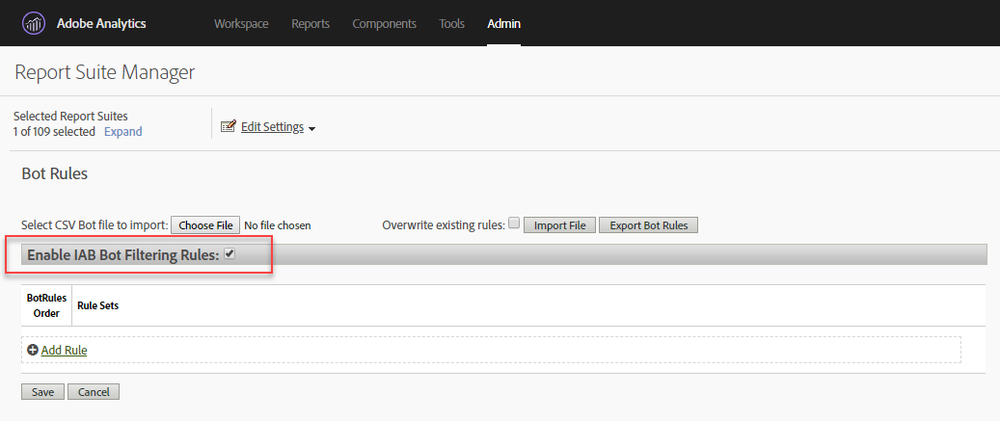

# Bot Rules overview

Bot Rules let you remove traffic from your report suite that is generated by known spiders and bots. Removing bot traffic can provide a more accurate measurement of user activity on your website.

Here is a video on configuring bot rules:

>[!VIDEO](https://video.tv.adobe.com/v/335738/?quality=12)

After bot rules are defined, all incoming traffic is compared against the defined rules. Traffic that matches any of these rules is not collected in the report suite and is not included in traffic metrics.

To update or upload bot rules, navigate to **[!UICONTROL Analytics]** > **[!UICONTROL Admin]** > **[!UICONTROL Report Suites]**. Select the correct Report Suite, and then go to **[!UICONTROL Edit Settings]** > **[!UICONTROL General]** > **[!UICONTROL Bot Rules]**.

Removing bot traffic typically reduces the volume of traffic and conversion metrics. Many customers find that removing bot traffic results in increased conversion rates and increases in other usability metrics. Before removing bot traffic, communicate with stakeholders to make sure they can make the necessary adjustments to key performance indicators as a result of this change. If possible, we recommend first removing bot traffic from a small report suite to estimate the potential impact.

Bot traffic data is stored in a separate repository for display in the Bots and Bot Pages reports. There are two options for enabling bot filtering: 

| Rule Type  | Description  |
|--- |--- |
|Standard IAB bot rules|Selecting [!UICONTROL Enable IAB Bot Filtering Rules] uses the [IAB's](https://www.iab.com) (International Advertising Bureau's) International Spiders &amp; Bots List to remove bot traffic. Most customers select this option at a minimum.|
|Custom bot rules|You can define and add custom bot rules based on user agents, IP addresses or IP ranges.|

## Standard IAB bot rules

Standard IAB bot rules can be turned on by checking the [!UICONTROL Enable IAB Bot Filtering Rules] checkbox. This selection will remove bots in  IAB's (International Advertising Bureau's) International Spiders & Bots List to remove bot traffic. Adobe updates this list from the IAB on a monthly basis.



Adobe is unable to provide the detailed IAB bot list to customers, though you can use the Bots Report to view a list of bots that have accessed your site. To submit a bot to the IAB list, visit [IAB](https://www.iab.com).

## Custom bot rules

>[!NOTE]
>
>The user interface allows for 500 rules to be manually defined. After this limit is reached, rules must be managed in bulk through the Import File and Export Bot Rules options.

Custom bot rules let you filter traffic based conditions you define.

Custom bot rules are defined using the following condition types:

* User Agent 
* IP Address 
* IP Range

Multiple conditions can be defined for a single rule. Multiple conditions are matched using "or". For example, if you provide a value for User Agent and IP Address, the traffic is considered bot traffic if either condition is met.

### User Agent

A User Agent condition checks the user agent value to see if it **[!UICONTROL starts with]** or **[!UICONTROL contains]** the specified string. If **[!UICONTROL contains]** is selected, the substring is matched if it occurs anywhere in the user agent.

Optional values can be included in the **[!UICONTROL does not contain]** list to define values that the user agent must not contain for a successful match. Multiple values can be specified by including one value per line. If the user agent meets the criteria specified in the match string, but also contains a string on the does not contain list, it is not considered a match.

The **[!UICONTROL contains]** field is limited to 100 characters. The does not contain list is limited to 255 characters minus a separator character for each new line. (This is equal to the number of strings - 1. If you specify 4 *does not contain* strings, 3 separator characters are required.) All string matches are case-insensitive.

### IP Address (including wildcard matches)

Matches an IP address or multiple addresses in the same block using wildcards (&#42;). Provide the numeric values of the IP address you want to match. Substitute &#42; for any values you want to match using a wildcard. The following list contains examples of IP address match string:

```
10.10.10.1
10.10.10.*
```

### IP Address Range

Provide the start and end ranges of the IP addresses to match. Substitute &#42; for any values you want to match using a wildcard.

### Define a custom bot rule

1. Go to **[!UICONTROL Analytics]** > **[!UICONTROL Admin]**, select one or more report suites and click **[!UICONTROL General]** > **[!UICONTROL Bot Rules]**.
1. Click **[!UICONTROL Add Rule]** and define one or more match conditions.
1. Click **[!UICONTROL Save]**. The change should take effect within 30 minutes.

## Upload bot rules

To bulk import bot rules, you can upload a CSV file that defines the rules.

Create a CSV file with the following columns, in the order presented: 

| Column 1 | Column 2 |Column 3|Column 4|Column 5|
|--- |--- |---|---|---|
|Bot Name|IP Start|IP End|Agent Match Rule<br>(contains or starts with)</br>|Agent Exclude<br>(255-character limit)</br>|

You can define three types of bot rules:

* User agent contains or starts with 
* Single IP address or wildcard match 
* IP range match

Each row in the import file can contain only one of the following bot definitions:

* **User agent contains or starts with**: Provide a single user agent string to match in the Agent Include column. Specify the type of match you want performed by placing *contains* or *starts with* in the Agent Match Rule field. An optional value can be included in the Agent Exclude column that defines one or more pipe-delimited ( `|` ) strings that the Agent does not contain. String matches are case-insensitive. Both the IP Start and IP End columns must be empty.

* **Single IP address or wildcard match**: To match a single IP address ( `10.10.10.1`) or wildcard IP address ( `10.10.*.*`), place the same value in both the IP Start and IP End columns. Match Rule, Agent Include, and Agent Exclude must be empty.

* **IP range match**: Define a range of IP addresses using the IP Start and IP End columns. Wildcards can be used to match IP ranges, for example `10.10.10.*` to `10.10.20.*`. Match Rule, Agent Include, and Agent Exclude must be empty.

### Multiple Rules Combined with OR

To match a bot using a combination of rules joined with an OR (for example, user agent or IP address), provide an identical name for all rules that you want to combine in the bot name field. AND matches are not supported.

### Overwrite All Rules with an Upload File

Select the **[!UICONTROL Overwrite existing rules]** checkbox to delete all existing rules and replace them with the rules defined in the upload file.

### Export Rules

The **[!UICONTROL Export Uploaded Bot File]** button exports all rules defined in the UI in a CSV format.


## Impact of bot rules on data collection {#section_F01A3130E7A04A9993371CF26F6586F2}

Bot Rules are applied to all analytics data. Data removed by Bot Rules is visible only in the Bots and Bot Pages Reports.

VISTA rules are applied after Bot Rules (see [Processing Order).](/help/admin/admin/c-processing-rules/c-processing-rules-configuration/processing-rule-order.md)

**High-Hit Visit Processing:** If more than 100 hits occur in a visit, reporting determines if the time of the visit in seconds is less than or equal to the number of hits in the visit. In this situation, due to the cost of processing long, intense visits, reporting starts over with a new visit. High-hit visits are typically caused by bot attacks and are not considered normal visitor browsing.

>[!NOTE]
>
>Hits marked as *`bots`* are billed as [server calls.](/help/admin/c-server-call-usage/overage-overview.md)

## Impact of IP Obfuscation on bot filtering {#section_92E60B95BE8940D983F28C79E0CD6B12}

The IAB bot list is based solely on user agent, so filtering based on that list is not impacted by IP obfuscation settings. For non-IAB bot filtering (custom rules), IP may be part of the filtering criteria. If filtering bots using IP, bot filtering happens after the last octet has been removed if that setting is enabled, but before the other IP obfuscation options, such as deleting the entire IP or replacing it with some unique ID.

If IP obfuscation is enabled, IP exclusion happens before the IP address is obfuscated, so customers do not need to change anything when they enable IP obfuscation.

If the last octet is removed, that is done before IP filtering. As such, the last octet is replaced with a 0, and IP exclusion rules should be updated to match IP addresses with a zero on the end. Matching &#42; should match 0.
