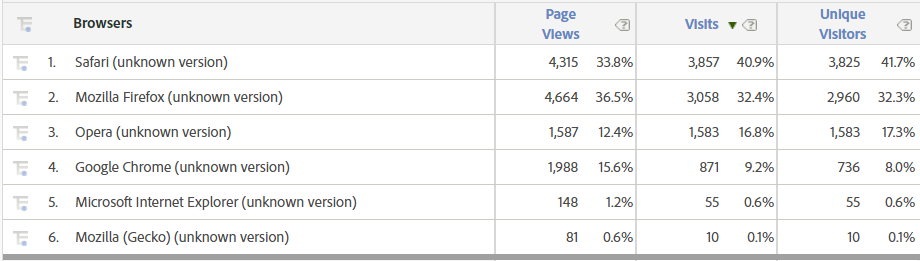
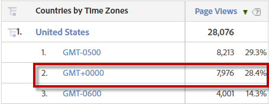

# Common bot signatures

While identifying bots in a data set is different depending on the environment, here are some common ways to identify bots. 

## High number of page views per visit

You can pull a Data Warehouse report with IP address, page views, and unique visitors. Then create a calculation ​​in Excel for page views per visit, and sort from highest to lowest. Bots commonly have a very high number of page views per visit (several hundred to thousands). You will see a sharp decline as you move into actual real traffic. 

## No referrer

Bots typically don't have a referring URL. In segmentation this can be filtered as `Referring Domain equals Typed/Bookmarked`.

## Strange User Agents

Bots often use custom user agents that aren't classified in the Browsers dimension or show up as an `unknown` version of a standard browser. Unknown Safari and unknown Opera have an extremely high likelihood of being bots.

## Linux or "Not Specified" operating systems

We don't mean to discredit the great open-source Linux operating system, but apparently bots like to set it as their operating system. However, be careful about excluding legitimate traffic from Linux users. Bots also like to not set an operating system, which can be segmented on as `Operating System ​equals Not Specified`. 

## Page Views = Visits = Unique Visitors

This applies especially to the user agent report. As you can see in the screenshot below, the "unknown version" of these browsers has almost the same number of visitors as unique visitors (and almost the same number of page views). This can be isolated in segmentation by building an [!UICONTROL Include] container for `Single Page Visits equals Enabled` or `Hit Depth is less than 2`. 

## Visit number of 1

Bots usually get a new visitor ID every time they execute, thus incurring only one visit ever and all their traffic will consist of a visit number of 1. 

## Lower monitor resolutions

Modern users have much higher resolution monitors than in years past. Hits with the following resolutions seem to be very popular for bots:

* 1024 x 768​​
* 1366 x 768
* 1600 x 864
* 800 x 600
* 1600 x 1200
* Not Specified
* 1024 x 667

## Country + Time Zone mismatch

You would notice a mismatch between the originating country and the time zone. For example, the location might be the United States but the time zone might me GMT.

## Not logged in

The user doesn't log in at any point in their visit, and their user identification eVars aren't persisting from previous visits. While some bots can be set up to authenticate, the majority aren't that smart. 

## No KPIs in visit

Bots typically don't add products to a shopping cart or check out. Most of the time they aren't submitting lead forms or other success events, but some bots do submit simple HTML forms. ​

## Specific query string present

Sometimes bots try to bust cache or otherwise break sites by hitting malformed URLs or URLs that don't exist (like typical LAMP or Wordpress admin pages) or by appending specific query strings. 

## IP addresses that originate from distributed computing platforms

Web hosting services like Amazon Web Services or Google Cloud can be abused as bot farms. These IP addresses are at a high risk of being bots:
​
* [Google Cloud](https://cloud.google.com/compute/): IP address starts with `​35.199` or `35.194​`
