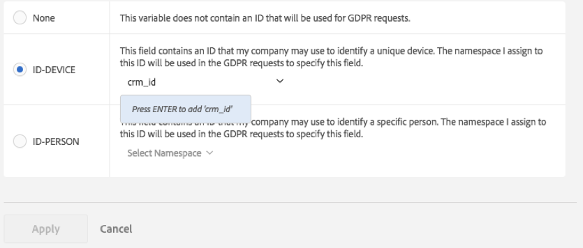

# Data Privacy Labels for Analytics Variables

## Why label your data? {#why-label}

Adobe's customers, as the Data Controllers, are responsible for complying with applicable Data Privacy laws such as GDPR and CCPA. Customers should consult with their own legal teams to determine how their data should be handled to comply with Data Privacy laws. Adobe understands that each of its customers has unique needs related to privacy, which is why Adobe enables its customers to customize their desired settings for Data Privacy data processing. This allows each unique customer to process Data Privacy requests in the way that makes most sense for their brand and their unique data set.

Adobe Analytics provides tools for labeling data according to its sensitivity and contractual restrictions. Labels are an important step for: (1) identifying Data Subjects, (2) determining which data to return as part of an access request, and (3) identifying data fields that must be deleted as part of a deletion request.

Before you can figure out which labels should be applied to which variables/fields, you need to [understand the IDs](/help/admin/admin/c-data-governance/data-labeling/gdpr-analytics-ids.md) that you are capturing in your Analytics data, and to decide which you will use for Data Privacy requests.

The Adobe Analytics Data Privacy implementation supports the following labels for identity data, sensitive data, and data governance.

## Identity data labels {#identity-data-labels}

Identity data "I" labels are used to categorize data that can identify or contact a specific person.

| Label | Definition | Other Requirements|
| --- | --- | --- |
| I1 | Directly identifiable: Data that can specifically identify or enable direct contact with an individual, such as a name or an email address.|<ul><li>Cannot be set on events</li><li>Cannot be set on Merchandising eVars</li></ul>|
| I2 | Indirectly identifiable: Data that can be used in combination with any other data to identify or enable direct contact with an individual or device.  Does not allow identification of an individual by itself, but can be combined with other information (that may or may not be in your possession) to identify someone. Examples include a customer loyalty number, or an ID used by a company's CRM system that is unique for each of their customers. | <ul><li>Cannot be set on events</li><li>Cannot be set on Merchandising eVars</li></ul> |

{style="table-layout:auto"}

## Sensitive data labels {#sensitive-data-labels}

Sensitive data "S" labels are used to categorize sensitive data such as geographic data. Additional Sensitive Data labels will be introduced in the future to identify other types of sensitive information.

| Label | Definition |
| --- | --- |
| S1 | Precise geo-location data related to latitude and longitude that can be used to determine the exact location of a device (within 100 meters or less). |
| S2 | Geo-location data that can be used to determine a broadly defined geo-fence area. |

{style="table-layout:auto"}

## Data Governance labels (Data Privacy) {#data-governance-labels}

Data Governance labels provide users the ability to classify data that reflects privacy-related considerations and contractual conditions to help Adobe's customers remain compliant with regulations and corporate policies.

### Data Privacy Access labels

| Label | Definition | Other Requirements |
| --- | --- | --- |
| None | Select this option if this variable does not contain data that must be included in data returned to the Data Subject as part of a Data Privacy access request. | |
| ACC-ALL | Values in this field should be included in all Data Privacy access requests. If this hit came from a device shared by multiple individuals, by applying this label, you, as the data controller, are indicating that it is acceptable to share the data in this field with any individual who had access to the shared device.| Fields with this label will be returned for all Data Privacy requests. |
| ACC-PERSON | Values in this field should be included only for Data Privacy access requests when you are reasonably certain that the hit was from the Data Subject, as determined by a Data Privacy request ID matching an ID-PERSON field's value. | You must also have an ID-PERSON label set on some variable within this report suite, and submit requests using that ID, or this label will never apply. |

{style="table-layout:auto"}

While few variables will receive any of the other labels, it is expected that access labels will be applied to many of your variables. However, it is up to you, in consultation with your Legal team, to decide which data you have collected should be shared with Data Subjects.

### Data Privacy Delete labels

Unlike the other labels, these Delete labels are not mutually exclusive. You can select either, both or none. A separate [!UICONTROL None] label is not necessary, because [!UICONTROL None] is indicated simply by not checking either of the Delete options.

A Delete label is required only for fields that contain a value that would allow a hit to be associated with the Data Subject (i.e. that would allow identification of the Data Subject). Other personal information (favorites, browsing/purchase history, health conditions, etc.) does not need to be deleted since the association with the Data Subject will be severed.

| Label | Definition | Other Requirements |
| --- | --- | --- |
| DEL-DEVICE | For Data Privacy delete requests, values in this field should be anonymized only for requests where a specified ID-DEVICE is present in the hit.  If the same value occurs on other hits that are not being deleted, then those other instances will not be changed. This will result in the counts changing for reports which compute unique counts on this field. On shared devices, this may remove identifiers for other individuals, beyond just the Data Subject.  Counts do not change if this field also has an ID-DEVICE label and the value in this field was used as an ID for the Data Privacy request.|<ul><li>Also requires I1 or I2 or S1 label</li><li>Cannot be set on events</li><li>Cannot be set on Merchandising eVars</li></li><li>Cannot be set on Classifications</li><li>You must submit requests using an ID-DEVICE or set expandIDs to true, or this label will never apply.</li></ul> |
| DEL-PERSON | For Data Privacy delete requests, values in this field should be anonymized only for requests where a specified ID-PERSON is present in the hit.  If the same value occurs on other hits that are not being deleted, then those other values will not be changed. This will result in the counts changing for reports that compute unique counts on this field. Counts will not change if this field also has an ID-PERSON label and the value in this field was used as an ID for the Data Privacy request.| <ul><li>Also requires I1 or I2 or S1 label</li><li>Cannot be set on events</li><li>Cannot be set on Merchandising eVars</li></li><li>Cannot be set on Classifications</li><li>You must submit requests using an ID-PERSON label set on some variable within this report suite and submit requests using that ID, or this label will never apply.</li></ul> |

{style="table-layout:auto"}

### Data Privacy Identity labels

| Label | Definition | Other Requirements |
| --- | --- | --- |
| None | This variable does not contain an ID that will be used for Data Privacy requests.|You need to set one of these other labels only if this field contains an ID that you will use when submitting access or delete requests through the [Privacy Service API](https://experienceleague.adobe.com/docs/experience-platform/privacy/api/overview.html) or UI.|
| ID-DEVICE | This field contains an ID that can be used to identify a device for a Data Privacy request, but cannot distinguish between different users of a shared device.  You do not need to specify this label for all variables that contain IDs (that is what the I1/I2 labels are for). Use this label if you submit Data Privacy requests using IDs stored in this variable and want to search this variable for the specified ID.|Also requires I1 or I2 label.<ul><li>Cannot be set on events</li><li>Cannot be set on Merchandising eVars</li><li>Cannot be set on Classifications</li></ul> |
| ID-PERSON | This field contains an ID that can be used to identify an authenticated user (a specific person) for a Data Privacy request.  You do not need to specify this label for all variables that contain IDs (that is what the I1/I2 labels are for). Use this label if you will submit Data Privacy requests using IDs stored in this variable and want to search this variable for the specified ID. | <ul><li>Also requires I1 or I2 label.</li><li>Cannot be set on events</li><li>Cannot be set on Merchandising eVars</li><li>Cannot be set on Classifications</li></ul> |

{style="table-layout:auto"}

## Provide a namespace when labeling a variable as ID-DEVICE or ID-PERSON {#provide-namespace}

When you label a variable as ID-DEVICE or ID-PERSON, you are prompted to provide a namespace. You can either use a previously defined namespace or define a new one.

### Use a previously defined namespace

If you have previously assigned an ID label to other variables in any of the report suites in your login company, you can select one of these existing namespaces. You should reuse the namespace if this variable contains the same type of IDs as other variables that are already labeled with this namespace and you want to search all of them when submitting a request.

1. Click **[!UICONTROL Select Namespace]** and select one of the existing namespaces.
1. Click **[!UICONTROL Apply]**.


### Define a new namespace

You can also define a new namespace. We recommend that namespace strings be limited to alphanumeric characters, plus the characters underscore, dash and space. They will be converted to all lower case.

1. Click **[!UICONTROL Select Namespace]** and type in the namespace title.

   

1. Press **[!UICONTROL Enter]** to add this namespace. Only now will the Apply button be activated.
1. Click **[!UICONTROL Apply]**.

The string you specify as the namespace is the same string you should use when submitting requests through the Data Privacy API as the value of the "namespace" parameter. The request then causes Adobe Analytics to search all variables in all of your report suites that share this namespace for the ID you specified with the request.

You do not need to specify the ID-DEVICE or ID-PERSON labels on all variables that contain IDs (that is what the I1/I2 labels are for). Use this label if you will be submitting Data Privacy requests using IDs stored in this variable and want to search this variable for the specified ID. As an example, if eVar1 can contain an email address, and eVar2 can contain a login user name, but you will only ever submit requests using the user name, then you might label eVar1 as I1, ACC-PERSON, DEL-PERSON, but eVar2 as I2, ACC-PERSON, DEL-PERSON, ID-PERSON with namespace "user name". You can then submit a request with a user section JSON block such as:

```
{
     "namespace": "user name",
     "type": "analytics",
     "value": "rocketman123"
}

```

It is acceptable to use the same namespace for different variables within the same report suite. For example, some custom implementations store a CRM-ID in both a prop and an eVar. If the CRM-ID always occurs in one of them (such as the eVar), and only occasionally occurs in the other (the prop), and never in the prop when not also in the eVar, then only the eVar requires an ID label and a namespace because Adobe can search only in that eVar for the ID. If, however, the CRM-ID sometimes occurs in one variable and sometimes in the other, then both should have the same namespace and Adobe will search both variables for occurrences of the ID specified as part of a Data Privacy request with this namespace. You should still have DEL labels on all of these variables, so that the value is anonymized no matter where it occurs.

As another example, you might have a CRM ID that is sometimes sent in via eVar1 and sometimes sent in via prop7. You then have a processing rule that copies the value from eVar1, if it exists, into eVar3. Otherwise, it copies the value from prop7 into eVar3. In this scenario, eVar3 will always contain the CRM ID if it is known, so only eVar3 requires an ID-PERSON label.

>[!CAUTION]
>
>The namespaces "visitorId" and "customVisitorId" are reserved for identifying the Analytics legacy tracking cookie and the Analytics customer visitor ID. Do not use these namespaces for custom traffic or conversion variables.

## Variable types and the Data Privacy labels they support {#variable-types}

Data Privacy labeling affects four broad classes of Analytics variables. Not all variables support all labels. This table shows which variables support or do not support which labels.

|Variable Type|Supported Labels|Unsupported Labels|
|--- |--- |--- |
|<ul><li>Custom Success Events</li><li>Merchandising eVars</li><li>Multi-valued variables (mvVars)</li><li>Hierarchy variables</li></ul> |<ul><li>S1/S2</li><li>ACC-ALL, ACC-PERSON</li></ul>|<ul><li>I1/I2</li>  <li>ID-DEVICE, ID-PERSON</li><li>DEL-DEVICE, DEL-PERSON</li></ul> |
| Classifications |<ul><li>I1/I2, S1/S2</li><li>ACC-ALL, ACC-PERSON</li></ul> |<ul><li>ID-DEVICE, ID-PERSON</li><li>DEL-DEVICE, DEL-PERSON</li></ul> |
|<ul><li>Traffic variables (props)</li><li>Commerce variables (non-merchandising eVars)</li></ul> | All labels | - |
| Most other variables  (*See table below for exceptions*) | ACC-ALL, ACC-PERSON | <ul><li>I1/I2, S1/S2</li><li>ID-DEVICE, ID-PERSON</li><li>DEL-DEVICE, DEL-PERSON)</li></ul> |

{style="table-layout:auto"}

## Variables to which labels other than ACC-ALL/ACC-PERSON can be assigned/modified {#variables}

<table id="table_0972910DB2D7473588F23EA47988381D"> 
 <thead> 
  <tr> 
   <th colname="col1" class="entry"> Group </th> 
   <th colname="col2" class="entry"> Variables </th> 
   <th colname="col3" class="entry"> Modifiable Labels </th> 
   <th colname="col4" class="entry"> Comment </th> 
  </tr>
 </thead>
 <tbody> 
  <tr> 
   <td colname="col1" morerows="1"> 
    <ul id="ul_62FA1BAA3B9245909509566D8C03F900"> 
     <li id="li_38F7C4E18ECB42C292370713F502B8EB">Conversion Dimensions </li> 
     <li id="li_41CB61F927CB4402AAB4A62E219CD153">Custom Traffic Dimensions </li> 
    </ul> </td> 
   <td colname="col2"> <p>All, except classifications </p> </td> 
   <td colname="col3"> <p>All </p> </td> 
   <td colname="col4"> </td> 
  </tr>
  <tr> 
   <td colname="col1"> <p>Traffic Variables </p> </td> 
   <td colname="col2"> <p>List Props </p> </td> 
   <td colname="col3"> <p>None / S1 / S2 </p> </td> 
   <td colname="col4"> <p>List props can contain multiple values and are not allowed as privacy identifiers.</p> </td> 
  </tr> 
  <tr> 
   <td colname="col2"> <p>Classifications </p> </td> 
   <td colname="col3"> <p>None / I1 / I2 </p> <p>None / S1 / S2 </p> </td> 
   <td colname="col4"> </td> 
  </tr> 
  <tr> 
   <td colname="col1"> <p>Conversion Events </p> </td> 
   <td colname="col2"> <p>All </p> </td> 
   <td colname="col3"> <p>None / S1 / S2 </p> </td> 
   <td colname="col4"> </td> 
  </tr> 
  <tr> 
   <td colname="col1"> <p>Solution Dimensions and Events </p> </td> 
   <td colname="col2"> <p>Activity Map Link, </p> <p>Activity Map Page </p> </td> 
   <td colname="col3"> <p>None / I1 / I2 </p> <p>None / DEL-DEVICE / DEL-PERSON </p> </td> 
   <td colname="col4"> <p>Variables can contain URL parameters, which may include directly or indirectly identifiable data. If your implementation does not collect directly or indirectly identifiable data in these variables, then they do not need Identity or deletion labels. </p> <p>Note that delete clears the URL parameters, but preserves the base URL. </p> </td> 
  </tr> 
  <tr> 
   <td colname="col1"> <p>Data Processing Dimensions </p> </td> 
   <td colname="col2"> <p>Custom Visitor ID </p> </td> 
   <td colname="col3"> <p>ID-DEVICE/ID-PERSON </p> <p>DEL-DEVICE/DEL-PERSON </p> </td> 
   <td colname="col4"> <p>You cannot remove the ID or DEL labels (set to None), but you can change them to be either the DEVICE or PERSON variants, depending on your custom ID implementation. </p> <p>If you do not use the custom visitor ID, then the setting does not matter. </p> </td> 
  </tr> 
  <tr> 
   <td colname="col1" morerows="1"> 
    <ul id="ul_5EB0193732D44A20AEA08CE9DFE01DBD"> 
     <li id="li_F70D969F83314A94BD8567449968EE2F">Standard Dimensions </li> 
     <li id="li_6046764B19FF4679B51E55671C2C0ADB">Data Processing Dimensions </li> 
    </ul> </td> 
   <td colname="col2"> <p>IP Address </p> <p>IP Address 2 </p> </td> 
   <td colname="col3"> <p>DEL-DEVICE/DEL-PERSON </p> </td> 
   <td colname="col4"> <p>You cannot remove the DEL label, but you can change it to be either DEL-DEVICE or DEL-PERSON, or both. </p> </td> 
  </tr> 
  <tr> 
   <td colname="col2"> <p>ClickMap Action (Legacy), </p> <p>ClickMap Context (Legacy), </p> <p>Page, </p> <p>Page URL, </p> <p>Original Entry Page URL, </p> <p>Referrer, </p> <p>Visit Start Page URL </p> </td> 
   <td colname="col3"> <p>None / I1 / I2 </p> <p>None / DEL-DEVICE / DEL-PERSON </p> </td> 
   <td colname="col4"> <p>Variables can contain URL parameters, which may include directly or indirectly identifiable data. If your implementation does not collect directly or indirectly identifiable data in these variables, then they do not need Identity or deletion labels. </p> <p>Note that delete clears the URL parameters, but preserves the base URL. </p> </td> 
  </tr> 
 </tbody> 
</table>

## Deletion handling {#deletion}

Adobe Analytics support for Data Privacy deletion requests is designed to minimize impacts to reporting. In most cases, the metrics displayed in reports should not change. A historical report that was run before Data Privacy deletion will match the same report run after deletion has been performed. This is accomplished by completely disassociating the deleted data from the Data Subject, while leaving non-identifiable data in place so that reported values remain consistent.

The following table describes how various variables are "deleted". This is not a complete list.

| Variables | Deletion Method |
| --- | --- |
| <ul><li>Traffic Variables (props)</li><li>Commerce Variables (eVars)</li></ul>| Existing value is replaced with a new value of the form "Data Privacy-356396D55C4F9C7AB3FBB2F2FA223482" where the 32-digit hexadecimal value after the "Data Privacy-" prefix is a cryptographically strong 128-bit pseudorandom number.<p>Because it is essentially being replaced by a random string, there is no way to determine the original value from this new value, and no way to derive the new value knowing the original value.  For a given variable, if the identical value as that being replaced occurs within other hits that are also being deleted as part of the same Data Privacy request, all instances of that value will be replaced with the same new value.<p>If some instances of a value are replaced with one delete request, and a later request deletes other (new) instances of the original value, the new replacement value will be different than the original replacement value. |
| Purchase ID | Existing value is replaced by a new value of the form "G-7588FCD8642718EC50" where the 18 hexadecimal digits after the "G-" prefix are the first 18 digits of a cryptographically strong 128-bit pseudorandom number. All comments that apply to deletion of traffic and commerce variables apply here as well.<p>The Purchase ID is a transaction ID whose main purpose is to make sure that a purchase is not credited twice, such as when someone refreshes their purchase confirmation page. The ID itself may tie the purchase to a row in your own DB where the purchase is recorded. In most cases it is not necessary to delete this ID, so it is not deleted by default.<p>If you are still able to tie the purchase back to a user after the Data Privacy delete request of your own data, then you may need to delete this field, so that the Analytics data for this visitor cannot be tied back to the purchaser. |
| Visitor ID | Value is a 128-bit integer and is replaced with a cryptographically strong 128-bit pseudorandom value. |
|<ul><li>MCID</li><li>Custom Visitor ID</li><li>IP Address</li><li>IP Address 2 | Value is cleared (set to either the empty string or 0 depending on the variable's type). |
|<ul><li>ClickMap Action (Legacy)</li><li>ClickMap Context (Legacy)</li><li>Page</li><li>Page URL</li><li>Original Entry Page URL</li><li>Referrer</li><li>Visit Start Page URL</li></ul> | URL parameters are cleared/removed. If the value does not look like a URL, then the value is cleared (set to the empty string). |
|<ul><li>Latitude</li><li>Longitude</li></ul> | Precision is reduced to no better than 1 km. |

{style="table-layout:auto"}

## Variables that may not support the expected Delete labels {#no-delete-support}

This section intends to clarify information about Analytics variables that may not support deletion. Sometimes, these variables get deleted by non-Analytics users (such as the legal team) who do not understand the type of data contained in the variable and make assumptions based on the name of the variable. 

It is important to understand what type of data is contained in each variable prior to making a decision about labeling or deletion, and not to rely on variable name alone. Here is a list of some of these variables and why they may not require deletion, or why they may not require a specific deletion label:

| Variable | Comments |
| --- | --- |
| [!UICONTROL New Visitor ID] | New Visitor ID is a Boolean that is true the first time we see a given visitor ID. There is no need to delete it once the visitor ID is anonymized. After anonymization, it will correspond to the first time we have seen this anonymized ID.|
| [!UICONTROL Zip Code]<p>[!UICONTROL Geo Zip Code] | Zip codes are set only for hits originating in the USA. They are not set for hits coming from the EU. Even when set, they only provide a broad geographic area that makes re-identification of the Data Subject difficult. |
| [!UICONTROL Geo Latitude]<p>[!UICONTROL Geo Longitude] | These provide a rough location derived from the IP address. The accuracy is generally similar to that of a zip code, within a few dozen kilometers of the actual location. |
| [!UICONTROL User Agent] | The User Agent identifies the version of the browser that was used. |
| [!UICONTROL User ID] | Specifies the Analytics report suite (as a number) containing the data. |
| [!UICONTROL Report Suite ID] | Specifies the name of the Analytics report suite containing the data. |
| [!UICONTROL Visitor ID]<p>[!UICONTROL MCID] / [!UICONTROL ECID]|These IDs have a DEL-DEVICE label, but the DEL-PERSON label cannot be added. If you specify [!UICONTROL ID Expansion] with each request, then these IDs will automatically be deleted for all delete requests, even those using an ID-PERSON.<p>If you do not use ID Expansion, but want these cookie IDs anonymized on hits that contain a matching ID in a prop or eVar, you can work around this labeling limitation by labeling the prop or eVar with an ID-DEVICE label, even if it really identifies a person (all DEL-PERSON labels would also need to be changed to DEL-DEVICE labels). In this case, because only some instances of the visitor ID or ECID are being anonymized, unique visitor counts will change in historical reporting. |
| [!UICONTROL AMO ID] | The Adobe Advertising Cloud ID is a solution variable that has an unmodifiable [!UICONTROL DEL-DEVICE] label. It is populated from a cookie just as the Visitor ID and MCID are. It should be deleted from hits whenever those other IDs are deleted. See the description for those variables for more details.|

{style="table-layout:auto"}

## Date fields for access requests {#access-requests}

There are five standard variables that contain timestamps: 

| Time Stamp | Definition |
| --- | --- |
| Hit Time UTC | The time that Adobe Analytics received the hit. |
| Custom Hit Time UTC | Time that the hit occurred, which for some mobile apps and other implementations may be earlier than the time it was received. For example, if a network connection was not available when it occurred, the app may hold the hit and send it in when a connection becomes available. |
| Date Time | Same value as Custom Hit Time UTC, but in the time zone of the report suite, rather than GMT. |
| First Hit Time GMT | The Custom Hit Time UTC value for the first hit received for the visitor ID value for this hit. |
| Visit Start Time UTC | The Custom Hit Time UTC value for the first hit received for the current visit for this visitor ID. |

{style="table-layout:auto"}

The code for generating the files returned for Data Privacy access requests requires that at least one of the first three timestamp variables be included in the access request (have an ACC label that applies to the type of request). If none of these are included, then Custom Hit Time UTC will be treated as if it has an ACC-ALL label.

The hit-level CSV file returned for Data Privacy access requests will convert the values in these fields from unix timestamps to date/time fields of the format YYYY-MM-DD HH:MM:SS (for example, 2018-05-01 13:49:22). In the summary HTML file, these timestamp values will be truncated to only include the date, YYYY-MM-DD, to reduce the number of unique values that occur for these fields.
