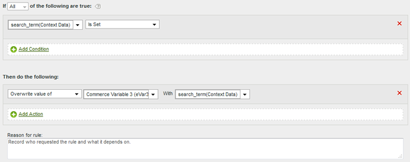
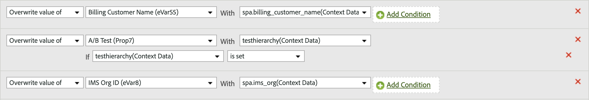

# Copy a context data variable to an eVar

Processing rules are used to move values from context data variables to props and eVars. Without processing rules, context data variables are meaningless and do not populate any reports in Analytics.

The [!UICONTROL Context Variables] list contains all variables that were sent to the report suite in the previous 30 days. If you know the context data variable name but have not sent it into the current report suite, you can add a value by typing the variable name and clicking **[!UICONTROL Add variable name context data]**:

The following example takes the `search_term` context data variable and places its value into `eVar3`:

The above example works great when there are only a few eVars to populate. If your organization has hundreds of context data variables that each need their own eVar, you can use conditional statements. Dozens of conditional statements can fit inside a single processing rule, allowing your organization the ability to populate all eVars in a report suite without running into the processing rule limit of 150 rules.

The following example populates `prop7` with the context data variable `testhierarchy`, but only if `testhierarchy` is set:

For more information on implementing context data variables, see [Context data variables](/help/implement/vars/page-vars/contextdata.md) in the Implement user guide.
