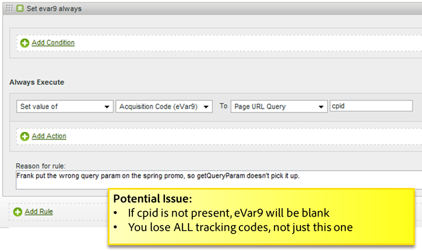
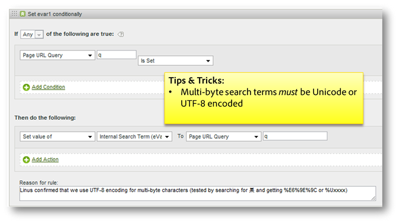

# Processing rules tips and tricks

This section contains guidelines for testing processing rules and a list of common mistakes to avoid.

## Test Processing Rules {#section_F092D2FECDE24082AE9FC6F8BE87F29F}

This section contains some guidelines to help test processing rules before they are deployed to production.

**Testing Rules That Read Search Terms**

For any criteria based on a search, such as if prop1 contains "news", go to the prop 1 report and search for "news" and see if there are any matches you were not expecting.

**Testing Rules that Read Variables**

Create a blank HTML page on your desktop, include the s_code from your site, and set the `s.account` variable to a dev report suite. If your rules are based on referrer, referring domain, and so on, take some sample URLs from the live referrers report, set the `s.referrer` variable with one of those values and load the page. Likewise, if the rule is based on the page URL value, you can set `s.pageURL`. This same process can be used for any variables.

**Using a Dev Report Suite**

We recommend configuring processing rules on a dev report suite to make sure they're working correctly. If possible, we recommend copying the rules to a small production report suite before broad deployment.

## Check for Empty Values {#section_EE84A5525E26415787930723B0CAAE0F}

When you create a rule, consider the case when a value is empty. If you do not add a condition that checks for an empty value you can unintentionally overwrite variables with empty values.

It is also important to consider the processing order. In the following example, it appears that the Previous Pagename custom eVar will be set to the URL if the Page Name is not present. However, the URL is placed into the page name after processing rules are applied, so in this case, the Page Name is empty if it is not set on the page.

## Avoid Overwriting Values {#section_49FCCA31E31A433EA2EF5EAF91443DAF}

In the following example, two context data variables are used on the site to capture search terms: search_keyword and search_term. However, based on the configuration, the search_keyword value is always overwritten, even if search_term is empty.

This rule should be reconfigured to test each context data variable for a value before populating the Internal Search Term, and optionally, concatenating the two values if there is a use case for keeping them both.

## Encode Search Terms to UTF-8 or Unicode {#section_3BBBE1FB8FEA48589362452DE51DB575}

Search terms pulled from a query string must be encoded correctly or they won't be matched by processing rules.

## Starts With, Contains, and Ends With {#section_80CE853244FC435B844A09EA51868D8D}

Select the correct matching condition to find the most restrictive condition that matches correctly. You can search for values in a report before creating a rule to make sure there are no unintended matches. For example, you should search the Prop2 report to find all locations where this condition matches before enabling this rule.

## How Processing Rules are Applied when Copying Hits using VISTA

If you have a VISTA rule configured to copy hits to another report suite, the hits are sent through any processing rules defined in the other report suite.

If you have processing rules defined on the original report suite, these rules may or may not be applied based on how the VISTA rule was configured by Engineering Services. To find out, you can ask your implementation specialist if the VISTA rule copies the "pre" or the "post" values to the additional report suite. If the "pre" value is copied, processing rules defined on the original report suite are not applied. If the "post" value is copied, processing rules are applied before the hit is copied.
