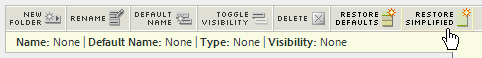

# Customize menus

You can customize the report menus that a user sees in Reports & Analytics. You can show or hide reports, as well as move them in different folders across all users. This is especially useful if your organization only uses certain reports and does not want to clutter your left-hand menu with unused or irrelevant data.

The menu changes apply to all users who access the report suite. However, users can restore a menu's default configuration while using the report suite.

>[!NOTE]
>
>Any change in menu structure does not affect Report Builder. Renaming a report will, however, be reflected in this tool.

To customize the menus users see in Reports & Analytics:

1. Navigate to **[!UICONTROL Analytics]** > **[!UICONTROL Admin]** > **[!UICONTROL Report Suites]** to open the Report Suite Manager.
1. Select the report suite for which you want to implement the simplified menu structure.
1. Go to **[!UICONTROL Edit settings]** > **[!UICONTROL General]** > **[!UICONTROL Customize Menus]**.

   

1. Select from the following menu options:

   |Option|Description|
   |--- |--- |
   |New Folder|Adds a new folder above the currently selected item. Note that you must add at least one report to a folder before the folder is visible.|
   |Rename|Lets you change the name of the currently selected item.|
   |Default Name|Restores the default name of the currently selected item.|
   |Toggle Visibility|Hides (displays) the currently selected item. Hidden items appear with a gray line pattern in the Menu Customization page.|
   |Delete|Removes the currently selected item from the menu.|
   |Restore Defaults|Restores the menu to its original state.|
   |Restore Simplified|
Implements the simplified reports menu.

Be aware that applying the simplified menu removes all customization you may have made to the default menu structure. It also implements the simplified menu structure for all marketing reports and analytics users in your organization. Think carefully about the ramifications (such as training developed around your existing menu structure) before implementing this new menu, as you cannot revert to any customization in your existing menu structure.
|
