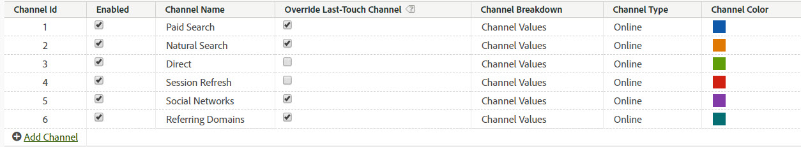

# Manage marketing channels

>[!NOTE]
>
> For general information on Marketing Channels, see [Get started with Marketing Channels](/help/components/c-marketing-channels/c-getting-started-mchannel.md).
>
> To maximize effectiveness of Marketing Channels for Attribution IQ and Customer Journey Analytics, we have published some [revised best practices](/help/components/c-marketing-channels/mchannel-best-practices.md).

**[!UICONTROL Analytics]** > **[!UICONTROL Admin]** > **[!UICONTROL Report Suites]** > **[!UICONTROL Edit Settings]** > **[!UICONTROL Marketing Channels]** > **[!UICONTROL Marketing Channel Manager]**.

Add or enable marketing channels in the Marketing Channel Manager. For report suites that have no marketing channels, an automatic setup lets you create several channels for you, along with their rules. You can edit predefined channels to suit your needs, or create your own (up to a total of 25).

Adding channels to the [!UICONTROL Marketing Channels] page is done independently of creating rules on the [Marketing Channel Processing Rules](/help/components/c-marketing-channels/c-rules.md) page. You associate rules with channels when creating the rule.

Here are guidelines for creating channels:

* Plan ahead by making a list of all your channels, so that all of your visitor hits are categorized to the right channel.
* Include channels for the categories of [Internal](/help/components/c-marketing-channels/c-rules.md) hits and [Direct](/help/components/c-marketing-channels/c-rules.md) hits.
* Include a catch-all "Other Campaigns" channel, to be placed after paid channels and before organic channels.

## Prerequisites {#prereqs}

* Set up access to the Marketing Channel dimensions.

  See [Marketing Channels permissions](/help/components/c-marketing-channels/c-channel-report-access.md).

## Add marketing channels {#add-mktg-channels}

Add marketing channels in the Marketing Channel Manager.

>[!NOTE]
>
>You cannot delete a channel. If you do not want to use a channel, you can disable or rename it, and preserve it for later use.

1. Click **[!UICONTROL Analytics]** > **[!UICONTROL Admin]** > **[!UICONTROL Report Suites]**.
1. On the [!UICONTROL Report Suite Manager] page, select a report suite.

   If you select multiple report suites, select a template that copies settings from the template to the selected report suites.

   See [Apply template report suite settings to multiple report suites](/help/components/c-marketing-channels/c-getting-started-mchannel.md).

1. Click **[!UICONTROL Edit Settings]** > **[!UICONTROL Marketing Channels]** > **[!UICONTROL Marketing Channel Manager]**.

   If your report suite does not have channels defined, the [Auto Setup](/help/components/c-marketing-channels/c-getting-started-mchannel.md) page displays.

1. On the [!UICONTROL Marketing Channel Manager] page, click **[!UICONTROL Add Channel]**.

   This option is not available when 25 channels are defined.

1. Click **[!UICONTROL Save.]**
1. To configure rules for the channel, click **[!UICONTROL Marketing Channel Processing Rules]**.

   See [Create Marketing Channel processing rules](/help/components/c-marketing-channels/c-rules.md).

## Apply channel settings {#mktg-channel-mgr}

There are various settings that can be applied to each channel on the [!UICONTROL Marketing Channel Manager] page.

| Field  | Definition  |
|--- |--- |
|Enabled|Enables or disables this marketing channel.|
|Channel Name|The friendly name of the marketing channel.|
|Override Last-Touch Channel|Lets you choose whether to override an existing, persistent last-touch channel with the selected channel. If you select this checkbox, any channel (including Direct and Internal) would override an existing last-touch channel. The result is conversion being attributed to a channel that might not deserve credit. For example, this option can ensure that the Direct channel does not receive credit for conversion if the user had previously been acquired via the Natural Search channel.|
|Channel Breakdown|Lets you break down a channel by this value. You can add possible channel breakdowns (subchannels) when creating [marketing channel classifications](/help/components/c-marketing-channels/classifictions-mchannel.md).|
|Type|Specifies how the user came to your site. You can select Online or Offline. Use Online channels for visitors who come through a search engine or email campaign. Offline channels apply to visitors who found your site through newspaper coupons or magazine advertisements. Offline channels usually include data imported through reporting Data Sources. See [Data Sources](https://experienceleague.adobe.com/docs/analytics/import/data-sources/datasrc-home.html). See [Add Offline Data](/help/components/c-marketing-channels/c-getting-started-mchannel.md).|
|Color|Reports & Analytics only: The color associated with this marketing channel. This color represents the channel in the  Marketing Channel report.|

### Override best practices

It is a best practice to uncheck the override last-touch option for Direct and Internal channels, so that they can't take credit from other persisting last touch channels (or each other). 

## Define channel rules

Before channels and channel data can be displayed in the report, create the channels and the underlying rules that process data. You can also specify how long you want the [visitor engagement period](/help/components/c-marketing-channels/visitor-engagement.md) to last. 

Adobe provides several predefined channels during an [automatic setup](/help/components/c-marketing-channels/c-getting-started-mchannel.md) that you can edit to suit your needs. Additionally, you can modify this setup and define custom rules within [Marketing Channel processing rules](/help/components/c-marketing-channels/c-rules.md).

>[!NOTE]
>
>Adobe recommends that you set up your report in a report suite that you can use as a template for testing purposes. You can use the template to apply channel and rule sets globally to one or more production report suites.
>
>See [Apply Template Report Suite Settings to Multiple Report Suites](/help/components/c-marketing-channels/c-getting-started-mchannel.md).
