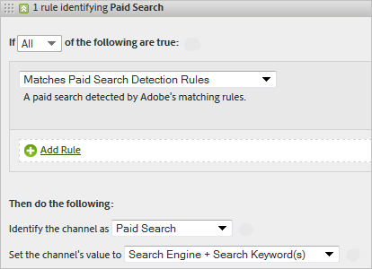
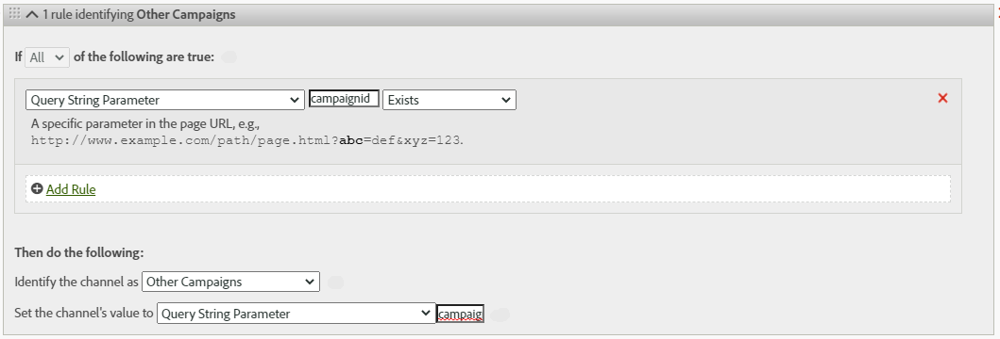

# Processing rules for Marketing Channels

Marketing Channel processing rules determine if a visitor hit meets the criteria assigned to a channel by processing every hit a visitor makes on your site. The rules are processed in the order that you specify, and when a rule is met, the system stops processing the remaining rules.

**[!UICONTROL Analytics]** > **[!UICONTROL Admin]** > **[!UICONTROL Report Suites]** > **[!UICONTROL Edit Settings]** > **[!UICONTROL Marketing Channels]** > **[!UICONTROL Marketing Channel Processing Rules]**.

Additional notes about processing :

* Data collected with these rules are permanent. Rules altered after data collection is not retroactive. Adobe strongly recommends that you review and consider all circumstances before saving [!UICONTROL Marketing Channel Processing Rules] to mitigate data being collected in incorrect channels.
* You can configure up to 25 separate marketing channels.
* Rules can access variables that VISTA has set, but cannot access data that VISTA has deleted.
* Two marketing channels never receive credit for the same event (such as purchases or clicks). In this way, marketing channels differ from eVars (where two eVars might receive credit for the same event).
* If there is a gap coverage of your rules, you may see [No Channel Identified.](/help/components/c-marketing-channels/c-faq.md)

## Prerequisites

* Review the conceptual information in [Getting Started with Marketing Channels](/help/components/c-marketing-channels/c-getting-started-mchannel.md).
* Create one or more channels so that you can assign rules to them. See [Add marketing channels](/help/admin/admin/c-manage-report-suites/c-edit-report-suites/marketing-channels/c-channels.md).
* Review the best practices for using [!UICONTROL Marketing Channels] with [!UICONTROL Attribution IQ].

## Create Marketing Channel processing rules

Create Marketing Channel processing rules, which determine if a visitor hit meets the criteria assigned to a channel.

1. Click **[!UICONTROL Analytics]** > **[!UICONTROL Admin]** > **[!UICONTROL Report Suites]**.
2. Select a report suite.

   If your report suite does not have channels defined, the [!UICONTROL Marketing Channels: Auto Setup] page displays.

   See [Run the Automatic Setup](/help/components/c-marketing-channels/c-getting-started-mchannel.md).

3. Click **[!UICONTROL Edit Settings]** > **[!UICONTROL Marketing Channels]** > **[!UICONTROL Marketing Channel Processing Rules]**. If you ran the automatic setup, a set of channel and rules were automatically defined for you.

   

4. If you want to add a rule, select from the **[!UICONTROL Add New Rule Set]** menu. If you select a channel, you are given a rule template and if you select Custom, you start from a blank slate. Both options allow you to modify the rule set as needed. 

   

5. To continue creating rules, click **[!UICONTROL Add New Rule SetRule]**.
6. To prioritize rules, drag-and-drop them to the desired position.
7. Click **[!UICONTROL Save.]**

### Set the marketing channel value

**[!UICONTROL Set the channel's value]** defines the marketing channel detail dimension that is available for that channel.

### Rule criteria

This reference table defines the fields, options, and hit attributes you can use to define Marketing Channel Processing Rules. 

>[!NOTE]
>
>Any text field that you define, such as query string parameter or lists of values to match against, are evaluated as **case-insensitive** values. For example, if you have a rule where query string parameter `cmp = abc123`, all uppercase and lowercase variations of both `cmp` and `abc123` match. 

| Term  | Definition  |
|--- |--- |
|All|Activates this channel only when all criteria in the rule are true.|
|Any|Activates this channel when any of the criteria in the rule are true. This option is available only if more than one criterion exists in the rule.|
|AMO ID|The primary tracking code used by the Advertising Cloud and Advertising Analytics integrations. When one of these integrations is enabled, then the tracking code prefix can be used to identify Advertising Cloud specific channels. Use "AMO ID" starts with "AL" for Search, "AC" for Display, or "AO" for Social. When the AMO ID is used in marketing channels the click/cost/impression metrics can be attributed to the correct channel (when not configured, these metrics go to Direct or None).|
|AMO ED ID|The secondary tracking code used by Advertising Cloud. The main purpose of this tracking code is to serve as the key for sending data back to Ad Cloud. It can however also be used to identify display ClickThroughs vs. display ViewThroughs if you desire to see these as two separate marketing channels. This can be done by setting the marketing channel logic for "AMO EF ID" ends with `:d` for Display ClickThroughs or "AMO EF ID" ends with `:i` for Display ViewThroughs. If you do not desire to split Display into two channels, then use the AMO ID dimension instead.|
|Conversion Variables|Consists of eVars that are enabled for this report suite, and applies only when these variables are set via the Adobe code on the page. |
|Exists|Several selections are available, including:<ul><li>**Does Not Exist**: Specifies that the hit attribute does not exist on the request. For example, in a referring domain, if the user types a URL or clicks a bookmark, the referring domain attribute does not exist.</li><li>**Is Empty**: Specifies that a hit attribute exists, usually an eVar or query string parameter, but there is no value associated with the hit attribute.</li><li>**Does Not Contain**: Lets you specify, for example, that a referring domain does not contain a specific value (as opposed to using the selection "Contains".)</li></ul>|
|Identify the channel as|Associates the rule with a marketing channel that you added to the  Marketing Channel Manager  page. |
|Matches Paid Search Detection Rules|A paid search detected by Adobe. Paid searches are when companies pay a fee for the search engine to list their site. Paid searches usually appear at the top or the right side of the search results.|
|Matches Natural Search Detection Rules|A non-paid search detected by Adobe reporting.|
|Referrer Matches Internal URL Filters|A visit whose page URL matches an internal URL filter, as defined for the report suite in Admin Tools.|
|Referrer Does Not Match Internal URL Filters|The referring URL does not match an internal URL filter, as defined for the report suite in Admin Tools. You can use this setting with  Page URL  and  Exists  to set up a catch-all rule, so that no visits land in the  No Channel Identified  section of the report.|
|Ignore hits matching internal URL filters|(For referrers) Tracks only hits coming from externally referred sites. Typically, leave this setting enabled unless you want to include internal traffic.|
|Is First Page of Visit|The first page of a visit detected by Adobe reporting.|
|Page| The [Page](/help/components/dimensions/page.md) dimension. |
|Page Domain|The domain of the page on which the visitor lands, such as `products.example.com`.|
|Page Domain and Path|The domain and path, such as `products.example.com/mens/pants/overview.html` .|
|Page Root Domain (TLD+1)|The root domain of the page on which the visitor lands, such as example.co.uk .|
|Page URL|The URL of a web page on your site.|
|Referring Domain| The [Referring domain](/help/components/dimensions/referring-domain.md) dimension |
|Query String Parameter| Use an individual query string parameter. You can specify only one query string parameter per criterion. To add additional query string parameters, use `ANY` as your operator, then add query string parameters to the rule. |
|Referrer|The web page location (full URL) your visitors were at before coming to your site. A referrer exists outside your defined domain.|
|Referring Domain and Path|A concatenation of the Referring Domain and URL path. Examples include:    `www.example.com/products/id/12345` or `ad.example.com/foo`|
|Referring Parameter|A query string parameter on the referrer URL. For example, if your visitors come from `example.com/?page=12345&cat=1`, then page and cat are the referring parameters.|
|Referring Root Domain|The root domain of the referrer. A referrer exists outside of your defined domain.|
|Search Engine|A search engine like Google or Yahoo! that brought visitors to your site.|
|Search Keywords|A word used to perform a search using a search engine.|
|Search Engine + Keywords|A concatenation of the Search Keyword and Search Engine to uniquely identify the search engine. For example, if you search for the word computer, the search engine and keyword are identified as follows: `Search Tracking Code = "<search_type>:<search engine>:<search keyword>" where    search_type = "n" or "p", search_engine = "Google", and search_keyword = "computer"`**Note:** n = natural; p = paid|
|Set the channel's value to| Sets the [Marketing Channel Detail](/help/components/dimensions/marketing-detail.md) dimension. You determine what value would be best in the context of the rule. Examples include banner ad ID, search keyword, or email campaign. |

## Marketing Channel rule order and definitions {#channel-rules}

Channel rules are processed in the order that you specify. Adobe recommends that you place paid or managed channels first (such as paid search, natural search, display, or email) so that they receive credit over organic channels (such as direct, internal, referring domains).

Below is the recommended order for channel rules and example definitions:

### Paid Search {#paid-search}

Paid search is a word or phrase that you pay a search engine for placement in search results. This channel is typically defined based on query string parameter (see Display channel example) or paid search detection rules.

#### Paid search detection

To match paid search detection rules, the marketing channel uses settings configured on the [!UICONTROL Paid Search Detection] page. ( **[!UICONTROL Admin]** > **[!UICONTROL Report Suites]** > **[!UICONTROL Edit Settings]** > **[!UICONTROL General]** > **[!UICONTROL Paid Search Detection]**). The destination URL matches the existing paid search detection rule for that search engine.

For the marketing channel rule, the [!UICONTROL Paid Search] settings are as follows:

See [Paid Search Detection](../general/paid-search-detection/paid-search-detection.md) for more information.

### Natural Search {#natural-search}

Natural search is when visitors find your website through a search engine, and the search engine ranked your site without you paying for the listing. 

Adobe determines search traffic based on an internal lookup of search engines. If a referrer matches criteria for a search engine, it then determines if it is paid or natural using [Paid Search Detection](../general/paid-search-detection/paid-search-detection.md) rules that you have configured. A hit is considered natural search when it does not match any paid search detection rules.

For the marketing channel rule, the Natural Search settings are as follows:

### Display {#display}

This rule identifies visitors originating from banner advertisements. It is identified by a query string parameter in the destination URL, in this case *`Ad_01`*. Query string parameter and the values it looks for are evaluated as case-insensitive values.

### Email {#email}

This rule identifies visitors originating from email campaigns. It is identified by a query string parameter in the destination URL, in this case *`eml`*:

### Affiliates {#afilliates}

This rule identifies visitors that originate from a specified set of referring domains. In the rule, you list the domains of affiliates you would like to track, as follows:

### Other Campaigns {#other-campaigns}

A best practice is to include an "Other campaigns" channel following all paid channel rules. This channel acts as a catch-all for uncategorized paid traffic.

### Social Networks {#social-networks}

This rule identifies visitors that originate from a social network, such as Facebook. The channel is often renamed to Organic Social. The settings can be as follows:

### Internal (Session Refresh) channel {#internal}

This rule visitors where their referring URL matches the Internal URL Filters setup in the Admin Console, meaning the visitor came from within the site to start their visit. This channel is often renamed to Session Refresh.

See [Reasons for Internal (Session Refresh)](https://experienceleague.adobe.com/docs/analytics/components/marketing-channels/c-faq.html#internal) for more information on why this channel occurs.

### Direct {#direct}

This rule identifies visitors that have no referring domain, which includes visitors that come to your site directly, such as from a Favorites link or by pasting a link in their browser. This channel is often renamed to Direct Typed/Bookmarked.

### Referring Domains channel {#referring-domains}

The Referring Domains channel identifies visitors that have a referring domain. Together, the Internal, Direct, and Referring domains channels act as a catch-all for all remaining hits that have not yet been categorized into a channel.

