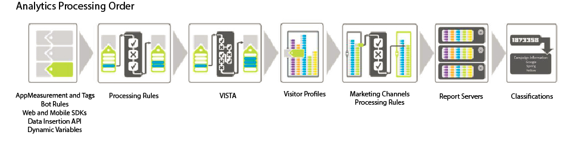

# Processing Order

To effectively use processing rules, it is essential to understand when they are applied during data collection.

The following tables list the data that is typically available before and after processing rules are applied.

## Before Processing Rules

| Dimension  | Description  |
|--- |--- |
| [Dynamic variables](/help/implement/vars/page-vars/dynamic-variables.md) | Variables that are populated dynamically by pulling information from HTTP headers or other variables. |
| [AppMeasurement](/help/implement/home.md) | Functions and plug-ins used in AppMeasurement libraries are executed in the browser or client application. |
| [Tag implementation](/help/implement/launch/overview.md) | Rules defined in the Adobe Analytics extension within Adobe Experience Platform Data Collection. |
| [Adobe Experience Platform Web SDK](https://experienceleague.adobe.com/docs/experience-platform/edge/data-collection/adobe-analytics/analytics-overview.html) | Data collected through the Web SDK is sent to Adobe Experience Edge, then forwarded to the desired report suite. |
| [Bot rules](/help/admin/admin/bot-removal/bot-rules.md) | Lets you remove traffic generated by known spiders and bots. |

## After Processing Rules

| Dimension  | Description  |
|--- |--- |
|Data added by VISTA|Processing rules are applied before VISTA.|
|Visit page number| Processing rules are only aware of the data that is contained in the current hit. Visit page number is compiled after processing rules are applied.|
|Clean URL is added as page name if it is not set|After processing rules and VISTA are applied, the clean URL is added as the page name if there is no page name set. Since this logic occurs after processing rules are applied, Adobe recommends adding a condition to check if the page name is blank.  If you run the **[!UICONTROL Site Content]** > **[!UICONTROL Pages]** Report and you see URL values for page names, it is likely that the page name variable is blank.  You can set up a condition to test for an empty page name, or to test to see if the page name or the page URL contains a specific value. The page name can then be set as needed.|
|Marketing Channel Processing Rules|You can use processing rules to prepare data for processing by [Marketing Channel Processing Rules](https://experienceleague.adobe.com/docs/analytics/components/marketing-channels/c-rules.html).|
|GEO lookup| Includes the Visitor State and Visitor ZIP/Postal code values.|
|eVars persistence|eVars that were contained in a previous hit are not persisted to each hit during rule processing. Only eVars that are set on the current hit being processed are available.|

## How Processing Rules are Applied when Copying Hits using VISTA

If you have a VISTA rule configured to copy hits to another report suite, the hits are sent through any processing rules defined in the other report suite.

If you have processing rules defined on the original report suite, these rules may or may not be applied based on how the VISTA rule was configured by Engineering Services. To find out, you can ask your implementation specialist if the VISTA rule copies the "pre" or the "post" values to the additional report suite. If the "pre" value is copied, processing rules defined on the original report suite are not applied. If the "post" value is copied, processing rules are applied before the hit is copied.
