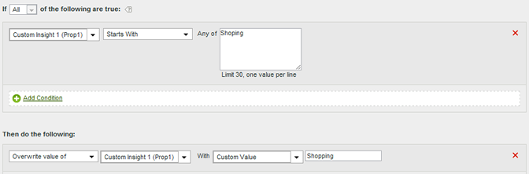

# Clean up values in a report

You can match values against common misspellings and update them to display correctly in reports.

To make sure you do not inadvertently match other values, use the most restrictive matching option available. You can run a report on the variable (prop1 in the example below) and search for the terms you select to replace to make sure it doesn't match unintended values. String comparisons are case-insensitive.

|  Rule Set  | Value  |
|---|---|
|  Condition  | If prop1 Starts With Shopping  |
|  Action  | Overwrite value of prop1 to Custom Value Shopping  |

For example: 

