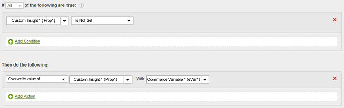

# Determine a path by copying an eVar value to a prop

You can copy the value of an eVar to a prop to enable pathing.

When setting values, the variable on the left receives the value (even if it is empty) from the variable on the right.

|  Rule Set  | Value  |
|---|---|
|  Condition  | None (always execute)  |
|  Action  | Overwrite Value of Prop1 with eVar1  |

You can modify this rule to set the value of Prop1 only if it does not already contain a value, similar to the following: 

|  Rule Set  | Value  |
|---|---|
|  Condition  | If Prop1 Is Not Set  |
|  Action  | Overwrite Value of Prop1 with eVar1  |

For example:

