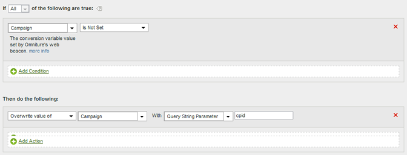

# Populate a campaign ID from a query string parameter

You can populate a variable using a query string parameter.

In most cases you use a plugin to populate variables from the query string. If a typo or similar issue prevents the value from being populated, you can populate the variable using processing rules.

You should always check to see if a value is empty or contains the expected value before you overwrite it. 

|  Rule Set  | Value  |
|---|---|
|  Condition  | Campaign is Not Set  |
|  Action  | Overwrite value of Campaign to Query String Parameter cpid  |

For example:

