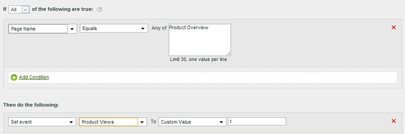

# Set the product view event from the product overview page

Events can be set based on page values or based on specific values in a variable.

|  Rule Set  | Value  |
|---|---|
|  Condition  | If the Page Name Equals Product Overview  |
|  Action  | Set Event Product Views Event To Custom Value 1  |

For example:

