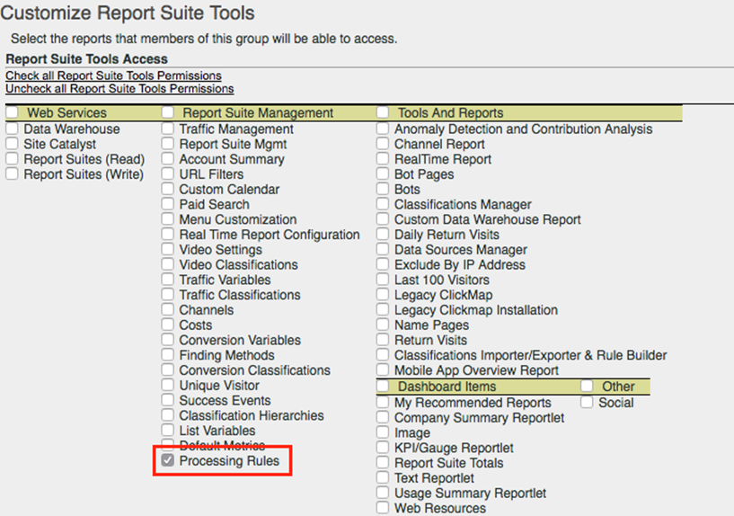

# Processing rules overview

Processing rules simplify data collection and manage content as it is sent to reporting. Processing rules help simplify interaction with IT groups and Web developers by providing an interface to:

* Set an event on the product overview page
* Populate campaign with a query string parameter
* Concatenate category and page name in a prop for easier reporting
* Copy an eVar into a prop to see paths
* Clean up misspelled site sections
* Pull internal search terms or a campaign ID from the query string into an eVar

>[!VIDEO](https://video.tv.adobe.com/v/26124/?quality=12&learn=on)

## Processing Rules Permissions {#section_8A4846688050453784DAE4D89355169A}

Administrators have rights to use processing rules **by default**. Administrators can also grant these rights to non-administrators through the Admin Tools interface. For instructions, see []



## Use Context Data to Simplify Data Collection {#section_09EEA03612D24C15839631AA9E9668D8}

Context data variables are a type of variable that are available only to processing rules. To use context data variables, key/value data pairs are sent in by your implementation, and processing rules are used to capture these values in standard Analytics variables. This frees programmers from understanding exactly which prop and/or eVar should contain which value.

```js
s.contextData['author'] = "Robert Munch";
s.contextData['section'] = "Books";
s.contextData['genre'] = "Youth";
```

Once set in code, you can set processing rules to assign values to variables. For example:

1. Map `author` to `eVar2`
2. Map `section` to `prop1` and `eVar3`
3. If `author` and `section` exist, set `event5`

See [contextData](/help/implement/vars/page-vars/contextdata.md) in the Implement user guide for more information.

## Use Processing Rules to Transform Hit Data and Trigger Events {#section_8284E72E999244E091CD7FB1A22342B6}

Processing rules can monitor incoming values to transform common typos and set events based on reported data. Props can be copied to eVars. Values can be concatenated for reports, and events can be set.

## Using Context Data Variables in Reporting {#section_BD098BC503024A0B8703596628071134}

Once context data variables are defined within your implementation, they must be copied to variables such as eVars to be used in reporting.

See [Copy a context data variable to an eVar](processing-rules-examples/processing-rules-copy-context-data.md) and [Set an event using a context data variable](processing-rules-examples/processing-rules-copy-context-data-event.md) for more information.

## Known limitations

**Use of carats (^) in processing rules.** If you want to use carats in processing rules for delimiters or other purposes, each single carat must be represented by two carats. For example, represent a single carat as ^^, a double carat as ^^^^, etc.