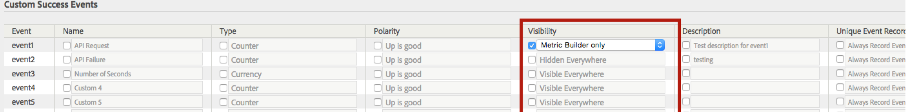

# Configure success events

Steps that describe how to configure success events.

1. Click **[!UICONTROL Analytics]** > **[!UICONTROL Admin]** > **[!UICONTROL Report Suites]**.
1. Select a report suite.
1. Click **[!UICONTROL Edit Settings]** > **[!UICONTROL Conversion]** > **[!UICONTROL Success Events]**.

   

1. In the **[!UICONTROL Name]** column, select the checkbox next each item to enable editing, then specify the desired name.
1. In the **[!UICONTROL Type]** column, select the checkbox next each item to enable the drop-down list, then select the desired type.

   >[!NOTE]
   >
   >Before you change an event type, see [Change event type](/help/admin/admin/c-success-events/event-type.md).

   See [Success Events Page - Descriptions](/help/admin/admin/c-success-events/success-event.md) for information about these elements.

1. In the **[!UICONTROL Polarity]** column, specify whether an upward trend for this metric is good or bad.
1. In the **[!UICONTROL Visibility]** column, you can hide standard (built-in) metrics, custom events, and built-in events in the Menu, Metric Selectors, Calculated Metrics Builder, and the Segment Builder.

   This setting does not impact the data collection for that metric or event; it affects only its visibility in the user interface. [More...](/help/admin/admin/metric-visibility.md) 
1. Provide a description.
1. Check whether to always record the event.
1. Enable or disable participation metrics.

   >[!NOTE]
   >
   >You can enable participation for up to 100 custom events. Beyond that, you can create participation metrics in the [Calculated Metrics](/help/components/c-calcmetrics/c-workflow/cm-workflow/c-build-metrics/participation-metric.md) builder.

1. Click **[!UICONTROL Save]**.
