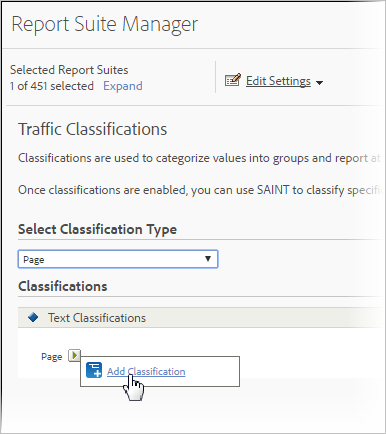

# Traffic classifications

Traffic classifications allow you to classify traffic variables (props). Traffic classifications can use only text classifications.

## Traffic classifications {#concept_028079B29A9C412AA68910A87E11176F}

Traffic classifications allow you to classify traffic variables (props). Traffic classifications can use only text classifications.

The Traffic Classifications page lets you create classifications for the selected report suites. Once classified, any report that you can generate using the key data can also be generated using the associated attributes.

After enabling classifications, use [Classifications Importer](/help/components/classifications/importer/c-working-with-saint.md) to assign specific values to the appropriate classification.

## Add a Traffic Classification {#task_4DB49CCB1D764483907BC33A5CEB7315}

<!-- 

t_classification_add_traffic.xml

 -->

Steps that describe how to add or edit classifications for the selected report suites.

1. Click **[!UICONTROL Admin]** > **[!UICONTROL Report Suites]** in the Suite header.
1. Select a report suite.
1. In the **[!UICONTROL Select Classification Type]** field, select the variable where you want to add a classification.
1. Click **[!UICONTROL Edit Settings]** > **[!UICONTROL Traffic]** > **[!UICONTROL Traffic Classifications]**.

   

1. Mouse over the **[!UICONTROL Edit Classification]** icon, then select **[!UICONTROL Add Classification]** or **[!UICONTROL Edit Classification]**.
1. In the **[!UICONTROL Text Classification]** dialog box, configure the classification as desired:

   **[!UICONTROL Name:]** Specify the classification name.

   **[!UICONTROL Description]**: Provide a more detailed description.
1. Click **[!UICONTROL Save]**.
