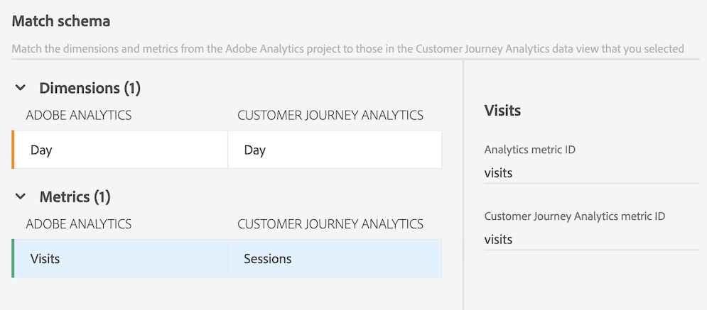
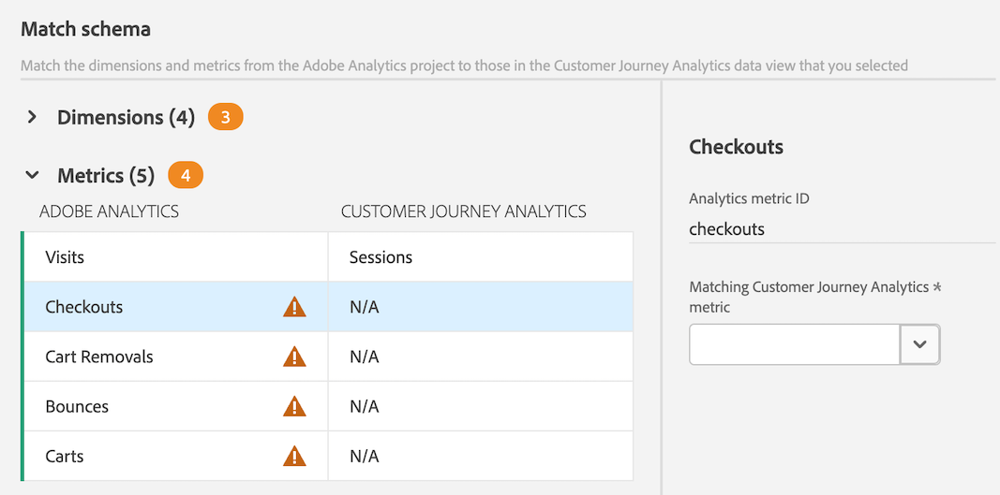
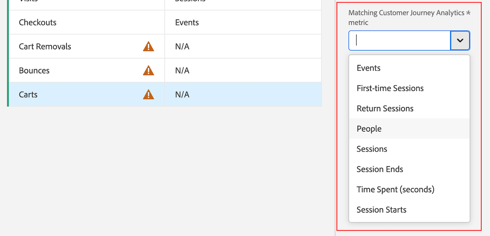

# Migrate components and projects from Adobe Analytics to Customer Journey Analytics

Adobe Analytics administrators can migrate Adobe Analytics projects and their associated components to Customer Journey Analytics. 

The migration process includes:

* Re-creating Adobe Analytics projects in Customer Journey Analytics. 

* Mapping dimensions and metrics from Adobe Analytics report suites to dimensions and metrics in Customer Journey Analytics data views. 

  Some dimensions and metrics are automatically mapped; others you must manually map as part of the migration process. Segments are also migrated, but they do not need to be mapped as part of the migration process. 
  
  All migrated components display in the migration summary when the migration completes.

## Prepare for a migration

Before anyone in your organization begins migrating projects, complete the following sections.

### Prerequisites

Before your projects and their associated components are ready to migrate, you first need to:

* Use the Analytics source connector to view Adobe Analytics report suite data in Customer Journey Analytics. To do that, you need to:

  * [Set up report suites for ingestion into Adobe Experience Platform and Customer Journey Analytics](https://experienceleague.adobe.com/docs/analytics-platform/using/compare-aa-cja/cja-aa-comparison/aa-data-in-cja.html?lang=en#set-up-report-suites-for-ingestion-into-the-adobe-experience-platform-and-customer-journey-analytics)

  * [Ingest and use the data](https://experienceleague.adobe.com/docs/analytics-platform/using/cja-data-ingestion/ingest-use-guides/analytics.html)

* Ensure that users in Customer Journey Analytics are provisioned to the data views where data is being mapped. 

  For more information, see [Customer Journey Analytics permissions in the Admin Console](https://experienceleague.adobe.com/docs/analytics-platform/using/cja-admin/cja-access-control.html?lang=en#customer-journey-analytics-permissions-in-admin-console) in [Customer Journey Analytics access control](https://experienceleague.adobe.com/docs/analytics-platform/using/cja-admin/cja-access-control.html).

  The Permissions tab is part of each product profile in Admin Console. You can add users to specific product profiles. Then you assign rights to specific data views and specify which permissions the users in a product profile have. 

* Create a migration plan, as described in the section below, [Create a migration plan as an organization](#create-a-migration-plan-as-an-organization).

### Understand what is included in a migration

The following tables outlines which elements of a project and component are included in a migration:

#### Component elements that are migrated

Dimensions and metrics are migrated as part of the mapping process described in [Migrate Adobe Analytics projects to Customer Journey Analytics](#migrate-adobe-analytics-projects-to-customer-journey-analytics), whereas segments and date ranges are re-created in Customer Journey Analytics based on the

|  | Migrated |
|---------|---------|
| **[Owner](/help/components/c-calcmetrics/c-workflow/cm-workflow/cm-manager.md)** | Dimensions and metrics: No
Segments and date ranges: 
 |
| **[Sharing](/help/analyze/analysis-workspace/components/analysis-workspace-components.md)** | Dimensions and metrics: No
Segments and date ranges: No
 |
| **[Descriptions](/help/analyze/analysis-workspace/components/add-component-descriptions.md)** | Dimensions and metrics: No
Segments and date ranges: 
 |
| **[Tags](/help/analyze/analysis-workspace/components/analysis-workspace-components.md)** | Dimensions and metrics: No
Segments and date ranges: No
 |
| **[Attribution (on dimensions)](/help/analyze/analysis-workspace/attribution/overview.md)** | Dimensions and metrics: No
Segments and date ranges: No
 |

{style="table-layout:auto"}

#### Project elements that are migrated

|  | Migrated | 
|---------|----------|
| **[Date ranges](/help/analyze/analysis-workspace/components/calendar-date-ranges/calendar.md)** |  | 
| **[Segments](/help/components/segmentation/seg-overview.md)** |  | 
| **[Quick segments](/help/analyze/analysis-workspace/components/segments/quick-segments.md)** |  | 
| **[Dimensions](/help/components/dimensions/overview.md)** |  Mapped automatically or manually | 
| **[Metrics](/help/components/metrics/overview.md)** |  Mapped automatically or manually | 
| **[Panels](/help/analyze/analysis-workspace/c-panels/panels.md)** |  | 
| **[Visualizations](/help/analyze/analysis-workspace/visualizations/freeform-analysis-visualizations.md)** |  |
| **[Owner](/help/analyze/analysis-workspace/build-workspace-project/freeform-overview.md)** |  Defined by user doing the migration | 
| **[Curation](/help/analyze/analysis-workspace/curate-share/curate.md)** | No | 
| **[Sharing (project roles)](/help/analyze/analysis-workspace/curate-share/share-projects.md)** | No <!-- Add info on Share with Anyone? Is it the same?--> | 
| **[Annotations](/help/analyze/analysis-workspace/components/annotations/overview.md)** | No | 
| **[Folder structure](/help/analyze/analysis-workspace/build-workspace-project/workspace-folders/about-folders.md)** | No | 
| **[Descriptions](/help/analyze/analysis-workspace/build-workspace-project/freeform-overview.md)** |  | 
| **[Tags](/help/analyze/analysis-workspace/build-workspace-project/freeform-overview.md)** | No | 
| **[Schedules](/help/components/scheduled-projects-manager.md)** | No |

{style="table-layout:auto"}

<!-- What about Anomaly Detection and Favorites? -->

### Understand unsupported elements that cause errors

The following visualizations, panels, and features are not supported in Customer Journey Analytics. When these elements are included in a project prior to migration, they can either cause the migration to fail or they can result in errors after the project is migrated.

Remove these elements from the Adobe Analytics project before migrating the project to Customer Journey Analytics. If a migration fails, remove these elements before retrying the migration.

#### Unsupported Visualizations

* [Map](/help/analyze/analysis-workspace/visualizations/map-visualization.md)

#### Unsupported Panels

* [Analytics for Target (A4T)](/help/analyze/analysis-workspace/c-panels/a4t-panel.md)

* [Segment comparison](/help/analyze/analysis-workspace/c-panels/c-segment-comparison/segment-comparison.md)

* [Media Average Minute Audience](/help/analyze/analysis-workspace/c-panels/average-minute-audience-panel.md)

* [Next or previous item](/help/analyze/analysis-workspace/c-panels/next-previous.md)

* [Page summary](/help/analyze/analysis-workspace/c-panels/page-summary.md)

#### Unsupported features

* [Contribution Analysis](/help/analyze/analysis-workspace/virtual-analyst/contribution-analysis/ca-tokens.md)

* [Alerts](/help/components/c-alerts/intellligent-alerts.md)

### Decide as an organization how you will map components

>[!IMPORTANT]
>
>The migration process identifies components in your Adobe Analytics project that can't be automatically mapped to components in Customer Journey Analytics, and it allows you to manually map them. 
>
>**Any mappings made on one project apply to all future projects across your entire organization, regardless of which user is performing the migration. These mappings cannot be modified or undone except by contacting Customer Care.** 
>
>Because of this, it's important that your organization decides how dimensions and metrics will be mapped before any projects are migrated. Doing so avoids individual administrators making decisions in a silo when considering only a single project.
>
>Following is a list of dimensions and metrics that you must manually map if they exist in your project. We recommend reviewing this list before your migration. If any of these components exist in your project, decide now which Customer Journey Analytics components you will map them to.

#### Dimensions that must be manually mapped

* averagepagetime
* pagetimeseconds
* singlepagevisits
* visitnumber
* timeprior
* timespent
* category
* connectiontype
* customerloyalty
* customlink
* downloadlink
* exitlink
* hitdepth
* hittype
* pathlength
* daysbeforefirstpurchase
* dayssincelastpurchase
* dayssincelastvisit
* identificationstate
* optoutreason
* persistentcookie
* returnfrequency
* searchenginenatural
* searchenginenaturalkeyword
* mobilecarrier
* monitorresolution
* surveybase
* mcaudiences
* tntbase
* targetraw

#### Metrics that must be manually mapped

* timespentvisit
* timespentvisitor
* reloads
* bounces
* bouncerate
* pageevents
* pageviewspervisit
* orderspervisit
* averagepagedepth
* averagetimespentonsite
* exitlinkinstances
* customlinkinstances
* downloadlinkinstances
* darkvisitors
* singlepagevisits
* singlevaluevisits
* visitorhomepage
* visitorsmcvisid
* pagesnotfound
* newengagements
* time_granularity
* concurrent_viewers_visitors
* concurrent_viewers_occurrences
* devices
* estimatedpeople
* playback_time_spent_seconds
* playback_time_spent_minutes
* average_minute_audience_time_based
* average_minute_audience_media_time
* average_minute_audience_content_time
* video_length
* targetconversion
* targetimpression

## Migrate Adobe Analytics projects to Customer Journey Analytics

>[!IMPORTANT]
>
>Before you migrate any projects to Customer Journey Analytics as described in this section, learn more about migrating projects in the [Plan the migration](#plan-the-migration) section above. 
>
>Any dimensions or metrics that you map are permanent, both for this project and for all future projects that are migrated throughout your entire organization. Any mappings that you make cannot be modified after the migration comlpetes.

1. In Adobe Analytics, select the [!UICONTROL **Admin**] tab, then select [!UICONTROL **All admin**].

1. Under [!UICONTROL **Data configuration & collection**], select [!UICONTROL **Component migration**].

1. Locate the project that you want to migrate. You can filter, sort, or search the project list.

   By default, only projects that are shared with you are displayed. To view all projects in your organization, select the **Filter** icon, then expand [!UICONTROL **Other filters**] and select [!UICONTROL **Show all**]. (For more information about filtering, sorting, and searching the project list, see [Filter, sort, and search the list of projects](#filter-sort-and-search-the-list-of-projects).)

1. Mouse over the project that you want to migrate, then select the **Migrate** icon .

   Or

   Select the project that you want to migrate, then select [!UICONTROL **Migrate to Customer Journey Analytics**].

   You can select only one project at a time to migrate.

   The [!UICONTROL **Migrate project_name to Customer Journey Analytics**] dialog box is displayed.

   <!-- add screenshot -->
   
1. In the [!UICONTROL **Project owner**] field, begin typing the name of the user who you want to set as the owner of the project in Customer Journey Analytics, then select their name in the drop-down menu. 

   The owner that you specify has full management rights to the project. 

1. In the [!UICONTROL **Map schema for report suites**] section, select a report suite.

1. In the [!UICONTROL **Data view**] drop-down menu, select the Customer Journey Analytics data view where you want the the project and components to be migrated.  

1. Select [!UICONTROL **Map schema**].

1. In the [!UICONTROL **Map schema**] section, expand the [!UICONTROL **Dimensions**] and [!UICONTROL **Metrics**] sections. 

   Some dimensions and metrics in Adobe Analytics are automatically mapped to a dimension or metric in Customer Journey Analytics. Others need to be manually mapped.

   **Automatically map dimensions and metrics**

   Some dimensions and metrics in Adobe Analytics are automatically mapped to a dimension or metric in Customer Journey Analytics. You can't make any mapping decisions for these dimensions and metrics.
   
   For example, the **Visits** metric in Adobe Analytics is automatically mapped with the **Sessions** metric in Customer Journey Analytics.

   You can select any dimension or metric to view their associated IDs. 

   <!-- update screenshot after I can see the Status column -->

   

   **Manually map dimensions and metrics**
   
   Some dimensions and metrics in Adobe Analytics cannot be automatically mapped to a dimension or metric in Customer Journey Analytics. 

   When a dimension or metric cannot be automatically mapped, an orange counter displays next to the [!UICONTROL **Dimensions**] or [!UICONTROL **Metrics**] section header, indicating the number of dimensions or metrics that need to be manually mapped. In the table, a warning icon  displays next to each dimension or metric that needs to be manually mapped.

   In addition, the [!UICONTROL **Status**] column says [!UICONTROL **Not mapped**]. 

   <!-- update screenshot after I can see the Status column -->

   

1. To manually map dimensions and metrics, select a dimension or metric that contains a warning icon , then in the [!UICONTROL **Mapped Customer Journey Analytics metric**] field (or the [!UICONTROL **Mapped Customer Journey Analytics dimension**] field if you are mapping a dimension), select the dimension or metric in Customer Journey Analytics that you want to map to the dimension or metric you selected.

   

   After a dimension or metric is mapped, the warning icon disappears and the [!UICONTROL **Status**] column changes to [!UICONTROL **Mapped**] with a green dot. (A status of [!UICONTROL **Mapped**] with a gray dot indicates that the dimension or metric was mapped during a previous migration; any previous mappings cannot be updated.)
   
   Repeat this process for each dimension or metric that contains the warning icon.
   
   After all dimensions and metrics in the Adobe Analytics report suite are mapped to a dimension or metric in the Customer Journey Analytics data view, a green check mark  appears next to the report suite name in the [!UICONTROL **Map schema for report suites**] section.

1. (Conditional) If the project you are migrating contains more than one report suite, select another report suite in the [!UICONTROL **Map schema for report suites**] section, then repeat step 6 through Step 10. <!-- double-check that the step numbers are still correct -->

1. Select [!UICONTROL **Migrate**].

   >[!WARNING]
   >
   >   An on-screen warning message displays after you select [!UICONTROL **Migrate**]. Before you choose to continue, understand that any dimensions or metrics you map are permanent, both for this project and for all future projects that are migrated throughout your entire organization. If you continue, the mappings you make cannot be modified.

   After a migration completes, the [!UICONTROL **Migration status**] page provides a summary of what was migrated.

   If the migration fails, see the [Retry a failed migration](#retry-a-failed-migration) section below for more information.

## Retry a failed migration

If a migration fails, you can retry the migration.

Before retrying a failed migration, make sure you remove any [unsupported elements](#understand-unsupported-elements-that-cause-errors) from the project.

>[!NOTE]
>
>If the migration continues to fail after retrying, contact Customer Care with the project ID. You can find the project ID on the Migration status page. <!-- when does this page display? How can they get there -->

To retry a failed migration:

1. In Adobe Analytics, select the [!UICONTROL **Admin**] tab, then select [!UICONTROL **All admin**].

1. Under [!UICONTROL **Data configuration & collection**], select [!UICONTROL **Component migration**].

1. Select [!UICONTROL **Failed**] in the [!UICONTROL **Migration status**] column next to the project that you want to retry. 

    

   The [!UICONTROL **Migration status**] page displays.
   
   This page also displays immediately after completing the migration steps described in the section [Migrate Adobe Analytics projects to Customer Journey Analytics](#migrate-adobe-analytics-projects-to-customer-journey-analytics) above. 

1. Select [!UICONTROL **Retry migration**].

## Filter, sort, and search the list of projects

You can filter, sort, and search the list of projects on the Component migration page. 

### Filter the list of projects

   You can filter by the following criteria:

   |Filter | Description |
   |---------|----------|
   | [!UICONTROL **Status**] | The status of the migration: <ul><li>[!UICONTROL **Not started**]</li><li>[!UICONTROL **Started**]</li><li>[!UICONTROL **Completed**]</li><li>[!UICONTROL **Failed**]</li></ul>. | 
   | [!UICONTROL **Tags**] | Select any tags in the list of tags. Only projects that have the selected tags applied are displayed. | 
   | [!UICONTROL **Report suite**] | Select any report suite in the list of report suites. Only projects that use the selected report suites are displayed. |
   | [!UICONTROL **Owners**] | Select any owner in the list of owners. Only projects that are owned by the users you select are displayed. |
   | [!UICONTROL **Other filters**] | The following additional filters are available: <ul><li>[!UICONTROL **Mine**]: Shows only projects where you are set as the owner.</li><li>[!UICONTROL **Shared with me**]: Shows only projects that have been shared with you.</li><li>[!UICONTROL **Favorites**]: Shows only projects that are marked as a favorite. (You can mark a project as a favorite from the [project landing page](/help/analyze/landing.md).)</li><li>[!UICONTROL **Monthly**]</li><li>[!UICONTROL **Yearly**]</li></ul>|

   {style="table-layout:auto"}

### Sort the list of projects

You can sort the list of projects by any column. 

To sort the list of projects:

1. Select the column header of the column you want to sort by. 

1. (Optional) Select the same column header again to reverse the sort order.

### Search for a project

You can search the list of projects on the Component migration page to find the project that you want to migrate. 

1. In the search field at the top of the Component migration page, begin typing the name of the project that you want to migrate. 

1. Select the project when it appears in the drop-down menu. 

<!-- is there going to be a way to customize the columns that are displayed? -->
