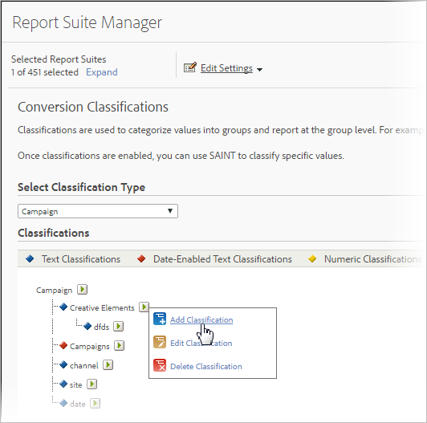

# Conversion classifications

Classifications are used to categorize values into groups and report at the group level. For example, you can classify all [!UICONTROL Paid Search] campaigns into a category like *pop music terms* and report on the success of that category relative to metrics like Instances (click-throughs), and conversion to success events. You can add up to 255 classifications to a variable.

Conversion classifications let you classify conversion variables. Once classified, any report that you can generate using the key data can also be generated using the associated data properties.

After enabling classifications, use the [Classification Importer](/help/components/classifications/importer/c-working-with-saint.md) to assign specific values to the appropriate classification.

>[!WARNING]
>
>Renaming a classification can cause issues with existing rules created in the [Classification rule builder](/help/components/classifications/crb/classification-rule-builder.md). If you rename a classification that has classification rules, make sure that you correct each rule so it points to the renamed classification.

## Conversion Classifications Descriptions 

| Element | Description |
| --- | --- |
| Name | The classification name |
| Date Enabled (Text Only) | Indicates if the text classification is a date range for campaign variables. |
| Options (Text Only) | Creates a list of classification values available for this classification. Use  Options with campaign variables to provide users with a list of supported values for the classification in the  Campaign Manager. |
| Number Type (Numeric Only) | Specifies the type of number in the numeric classification. Options include  Numeric,  Percent, and  Currency. |

## Add conversion classifications 

Steps that describe how to add conversion classifications in Admin.

1. Click **[!UICONTROL Admin]** > **[!UICONTROL Report Suites]**.
1. Select a report suite.
1. Click **[!UICONTROL Edit Settings]** > **[!UICONTROL Conversion]** > **[!UICONTROL Conversion Classifications]**.
1. From the **[!UICONTROL Select Classification Type]** drop-down list, select the variable where you want to add a classification.

   

1. Mouse over the **[!UICONTROL Edit Classification]** icon, then select **[!UICONTROL Add Classification]**.
1. In the **[!UICONTROL Select Type]** field, select the type of classification you want to add to the variable.

   Options include **[!UICONTROL Text]** and **[!UICONTROL Numeric]**. For more information on classification types, see [About Classifications](/help/components/classifications/c-classifications.md).
1. In the **[!UICONTROL Text Classifications]** dialog box, configure the classification as desired.

1. In the **[!UICONTROL Dropdown List]** dialog box, add or remove options.

   Adding Options creates a list of classification values available for this classification. You can use this option with Campaign variables to provide users with a list of supported values for the classification in the Campaign Manager. Use this for classification dimensions where you have a small number of allowed values that rarely or never change. For example, you might run different campaigns aimed at different levels of customer loyalty: Silver, Gold, and Platinum. You could then use the drop-down list to ensure that the only values that are accepted are those that match your three levels. If anyone tries to use a different value, it gets discarded.
   
1. Click **[!UICONTROL Save]**.

## Delete a conversion classification 

Delete a conversion classification when it is no longer needed.

1. Open the Report Suite Manager by clicking **[!UICONTROL Admin]**> **[!UICONTROL Report Suites]** in the Suite header.
1. Select a report suite.
1. Click **[!UICONTROL Edit Settings]** > **[!UICONTROL Conversion]** > **[!UICONTROL Conversion Classifications]**.
1. From the **[!UICONTROL Select Classification Type]** drop-down list, select the variable where you want to delete a classification.
1. Mouse over the **[!UICONTROL Edit Classification]** icon, then select **[!UICONTROL Delete Classification]**.
1. In the Delete Classification dialog box, click **[!UICONTROL Delete]**.
