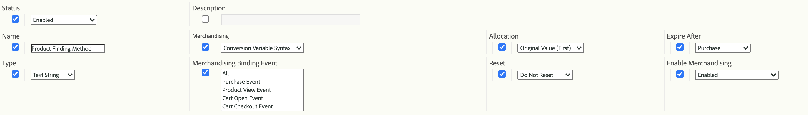

# Merchandising eVars and product finding methods

This document explains the concepts behind merchandising eVars, which process and allocate data differently than standard eVars. It also explains how merchandising eVars relate to product finding methods.

While most retail websites have many ways to find products, Adobe considers the following to be the fundamental product finding methods that every retail client should track in Adobe Analytics:

* Internal Search Keywords 
* Internal Campaign Tracking Codes 
* Merchandising/Browse Categories
* Cross-selling Links

For the purposes of this document, let's map a few eVars to the solutions as follows:

* eVar2: Internal Search Keywords 
* eVar3: Internal Campaign Tracking Codes 
* eVar4: Merchandising/Browse Categories
* eVar5: Cross-Selling Links

We can use an additional eVar to measure the performance of all product finding methods in relation to each other. In addition to the finding methods described above, the eVar includes other finding methods in its comparison, such as links to product detail pages from external websites.

* eVar1: Product Finding Methods

Instead of configuring any of these variables to be standard eVars, configure them to be merchandising eVars. Using merchandising eVars allows you to allocate any successful activity to the values captured by the eVars at a *per-product* level instead of a *per-visit/per-order* level. This document clarifies the difference between per-product and per-order allocation throughout.

To demonstrate how to set these variables, here is an example where a visitor decides to use the internal keyword search "sandals" to find a product on the site. On the keyword search results page, you must capture data in at least two eVars: 

* `eVar2` is equal to the keyword that was used in the search ("sandals") 
* `eVar1` is equal to the product finding method used ("internal keyword search"). 

When you set these two variables equal to these specific values, you know that the visitor is using the internal keyword search term of "sandals" to find a product. At the same time, you know that the visitor is not using the other product finding methods to find products (for example, the visitor is not browsing through product categories at the exact same time they are performing a keyword search). To ensure that proper per-product allocation takes place, these unused methods should not get credit for finding a product that was found via an internal keyword search. Hence, you must insert logic into the code (such as AppMeasurement, AEP Web SDK, and so on) that automatically sets the eVars associated with these other finding methods equal to a "non-finding method" value.

For example, when a user searches for products using the keyword "sandals", the Analytics code’s logic should set the variables equal to the following on the internal keyword search results page:

* eVar2="sandals": the keyword "sandals" was used in the internal keyword search
* eVar1="internal keyword search": the "internal keyword search" finding method was used
* eVar3="non-internal campaign": an internal campaign was not used to access the search results page
* eVar4="non-browse": a browse category was not accessed on the search results page
* eVar5="non-cross-sell": a cross-sell link was not clicked on the Search results page

## Merchandising eVars settings

Before continuing with the "sandals" example, here are the different settings that you can use with your merchandising eVars.  The following screenshot comes from the Report Suite Manager. Access it by going to Analytics > Admin > Report Suites > Edit Settings > Conversion > Conversion Variables > Add new > Enable Merchandising.

The sections below the table contain more detail on these settings.

| Setting  | Description  |
|--- | --- |
| Name | The Name, or the reporting dimension that the variable is meant to be associated with. If `eVar1` is meant to capture Product Finding Methods, then the Name field for `eVar1` should be set to "Product Finding Methods". |
| Merchandising | The type of syntax that will be used to capture the merchandising eVar values |
| Allocation | Helps determines the merchandising eVar value that should receive credit when a successful event takes place. |
| Expire After | Determines when existing product and merchandising eVar bindings should no longer be in effect. |
| Type | The type of data being collected in the merchandising eVar |
| Merchandising Binding Event | The event(s) that determine when a product should be bound to a merchandising eVar value |
| Reset | A trigger that will reset all back-end data for the eVar at that point |
| Enable Merchandising | A flag that needs to be set to "Enabled" to turn the eVar from a standard eVar to a Merchandising eVar |

### Merchandising

This option is not available for regular eVars. The [!UICONTROL Merchandising] setting lets you to pick either [!UICONTROL Conversion Variable Syntax] or [!UICONTROL Product Syntax] as the method for capturing the merchandising eVar's value.  

**[!UICONTROL Conversion Variable Syntax]** means that you set the eVar value in its own variable. For example, with Conversion Variable Syntax, the `eVar1` value of "internal keyword search" is set as follows within the page code (or the AppMeasurement code, AEP Web SDK code, and so on):

`s.eVar1="internal keyword search";`

With **[!UICONTROL Product Syntax]**, however, the eVar is set within only the Adobe Analytics products variable. The Analytics products variable is divided up into six different portions per product:

`s.products="[category];[productID];[quantity];[revenue];[events];[eVars]"`

* [!UICONTROL Category] is a deprecated feature and is no longer recommended as a viable option for keeping track of product category performance.  Its mere existence demonstrates why in most implementations of the products variable, a single semicolon precedes the productID portion of the variable value. 
* [!UICONTROL Quantity] and [!UICONTROL Revenue] are useful when a product purchase is being tracked.  
* [!UICONTROL Events is useful for recording custom incremental or currency event values that are not meant to be counted as revenue (such as shipping, discounts, etc.)

Merchandising eVars that are configured to use Product Syntax are set within the final portion of the products variable. For example, suppose that a visitor used an internal keyword search to find product ID "12345". The Product syntax-based way for setting eVar1 in this example would look like this:

`s.products=";12345;;;;eVar1=internal keyword search";`

Notice that we still have semicolon-delimited placeholders for the quantity, revenue, and event portions of the products variable.  Without these placeholders, the `eVar1` setting of internal keyword search would be completely ignored.

### Allocation

The term "Allocation" for merchandising eVars is a misnomer, especially for merchandising eVars that use Conversion Variable Syntax. All eVars that use standard syntax can have their own individual allocation setting but merchandising eVars with Conversion Variable Syntax use only an allocation setting of "Most Recent (Last)" regardless of what the allocation settings in the Report Suite Manager show. 

To understand what this setting does means that you need to understand the difference between eVar allocation and merchandising eVar binding.  For merchandising eVars, "Merchanding eVar Binding" could be considered a more proper name for this "Allocation" setting.
Whenever any eVar with standard syntax is collected from an image request, the Adobe Analytics processing servers insert data into another database column, called a post_evar column, alongside the regular eVar column.  Since eVars are meant to be persistent (i.e. they expire at some point beyond the current hit in most cases), the servers will then set this post_evar column on every subsequent image request and set it equal to the last value passed into its corresponding eVar. For standard (i.e. non-Merchandising) eVars, when a success event takes place, Adobe Analytics uses the post_evar column instead of the regular eVar column to determine the eVar value that should be given credit for the event. 
For standard (i.e. non-Merchandising) eVars, the Allocation setting determines whether the first or the last eVar value that was collected during a certain period will be inserted into the post_evar column. If the Allocation setting for a standard eVar is equal to "Original Value (First)", then the first eVar value collected from the visitor will be inserted into the post_evar column for all subsequent image requests.  This will continue for all future requests sent from this visitor's browser until the eVar expires per its "Expire After" setting.  
If a standard eVar's Allocation setting is equal to "Most Recent (Last)", then the most recent eVar value collected from the visitor will be filled into the post_evar column for all subsequent image requests. "Most Recent (Last)" allocation implies that the post_evar value will change every time its corresponding eVar is set to a new value in any image request.  "Original Value (First)" allocation implies that the post_evar column will not change across hits even though its corresponding eVar might be set to a different value in a future image request. 
As mentioned before, all merchandising eVars with Conversion Variable Syntax have only "Most Recent (Last)" allocation (per the standard eVar definition).  Hence, I need to explain what the "Allocation" setting actually means for merchandising eVars.  As implied earlier, this setting doesn't determine what values are inserted into the post_evar column as a visitor continues to use the site.  Rather, the Allocation setting for merchandising eVars determines which eVar value binds to a product and how such products allocate 

