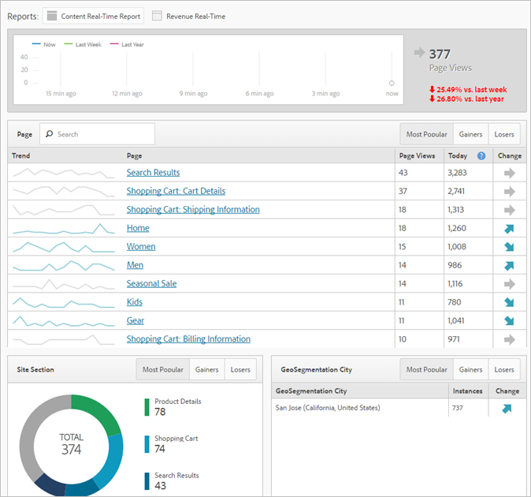

# Real-time reports

Displays web page traffic and ranks page views in real time. Provides actionable data to base your business decisions on.

>[!NOTE]
>
>The Real-Time Report requires no additional implementation or tagging. It leverages your existing implementation of Adobe Analytics. To configure real-time reports, see [Real-Time Reports Configuration](/help/admin/admin/realtime/t-realtime-admin.md).

Here is a video overview: 

>[!VIDEO](https://video.tv.adobe.com/v/25454/?quality=12)

**[!UICONTROL Site Metrics]** > **[!UICONTROL Real-Time]**

Real-Time answers the following questions: What is trending on my site, and why? It allows you as a marketer to quickly respond to and actively manage the performance of your marketing content and campaigns. The real-time data reported is less than two minutes latent and auto-updates on a minute-by-minute basis.

The dashboard includes Adobe Analytics high-frequency metrics and site analytics to visually report traffic and page view trending of dynamic news and retail web sites. Real-Time understands trends in your data from minute to minute, within seconds of collection. It collects and streams data into an auto-updating UI, using real-time correlation and tracking of content and some conversion.

Two of the most prevalent usage scenarios include publishers who would like to promote/demote stories as user activity changes, and marketers who would like to track the launch of a new product line.

As an Administrator, you can

* Create up to 3 real-time reports per report suite, using existing dimensions or classifications and metrics. Use the secondary dimensions to correlate with (or break down) the primary one.
* Add 3 dimensions (or classifications) per report (one primary and two secondary), in addition to 1 site-wide metric.
* Use any custom event, shopping cart event, or instance.
* View up to 2 hours of historical real-time data and modify this setting:

  * Last 15 minutes: 1-minute granularity 
  * Last 30 minutes: 1-minute granularity 
  * Last 1 hour: 2-minute granularity 
  * Last 2 hours: 4-minute granularity

* Compare, for example, last week's values to last year's values (as well as to the total of today.)

Keep in mind that eVars (conversion metrics) are not supported, since there is no concept of persistence. While you can select conversion metrics, they only work if they are set on the same page as the dimension(s). For more information, see the warning message captured in [Setting up Real-Time Reports](/help/admin/admin/realtime/t-realtime-admin.md).

Setting up and viewing Real-Time reports is restricted to Admins or any user in the "All Report Access" and "Advanced Reporting" permission groups . However, Real-Time does respect permissions. If, for example, you do not have rights to see revenue, you won't be able to view a real-time report that includes revenue data.

## Data Latency as a Result of A4T Configuration {#section_806CE36354FC4C539A0DED9266A5C704}

After the A4T integration is enabled in Adobe Target, you will experience an additional 5-10 minutes of latency in Adobe Analytics. This latency increase allows data from Analytics and Target to be stored on the same hit, allowing you to break down tests by page and site section.

This increase is reflected in all Adobe Analytics services and tools, including the live stream and real-time reporting, and applies in the following scenarios:

* For live stream, real-time reports & API requests, and current data for traffic variables, only hits with a supplemental data ID are delayed.
* For current data on conversion metrics, finalized data, and data feeds, all hits are delayed an additional 5-7 minutes.

Be aware that the latency increase starts after you implement the Identity Service, even if you have not fully implemented this integration.
