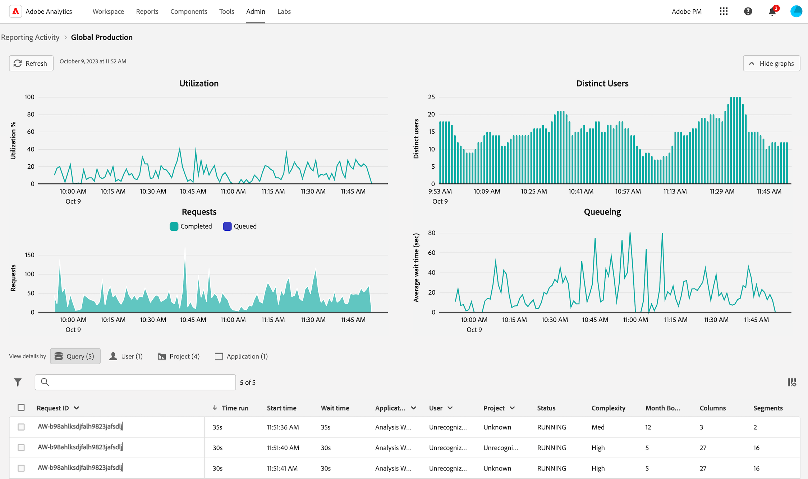
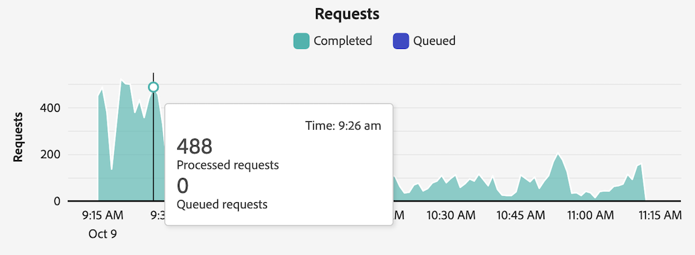
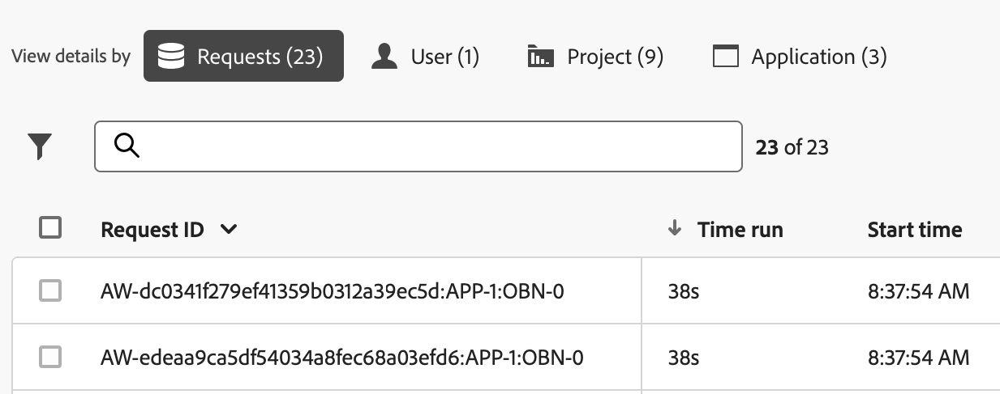

# View reporting activity in the Reporting Activity Manager

{{release-limited-testing}}

The [!UICONTROL Reporting Activity Manager] enables administrators to quickly diagnose and fix reporting capacity issues during peak reporting times.

For more information about Reporting Activity manager, including key benefits and permission requirements, see [Reporting Activity Manager overview](/help/admin/admin/reporting-activity-manager/reporting-activity-overview.md).

## View reporting activity for all report suites {#view-all-report-suites}

1. In Adobe Analytics, go to **[!UICONTROL Admin]** > **[!UICONTROL Reporting Activity Manager]**.

   A list of your enabled base report suites is displayed.

   

1. (Optional) You can search or filter the list of report suites:

   * Use the search field to search for a specific report suite. Begin typing the report suite name or ID and the list of report suites updates as you type.

   * Select the [!UICONTROL **Filter**] icon  to expand the list of filter options. You can filter by [!UICONTROL **Favorites**] or [!UICONTROL **Status**].

     To mark a report suite as a favorite, select the star icon to the left of the report suite name.
      
     <!-- (does this option still exist?) 1. (Optional) Select **[!UICONTROL Refresh]** at the top-right to refresh the data. -->

1. View utilization information about each report suite. You can select a column header to sort the table by  that column. 

   The following columns are available: 

   | UI Element | Description |
   | --- | --- |
   | **[!UICONTROL Report Suite]** | The base report suite whose reporting activity you are monitoring.|
   |  **[!UICONTROL Virtual report suites]** | Shows all virtual report suites that feed into this base report suite. Virtual report suites add complexity to reporting requests due to additional levels of applied filtering and segmentation. All requests that are coming from the virtual report suites are combined into the base report suite.
For example, if you have 10 requests coming from 5 virtual report suites, that's 50 requests at the base level report suite. This way, you can very quickly hit capacity. |
   | **[!UICONTROL Capacity utilization]** | The percentage of the report suite's reporting capacity that is being used, in real time. 
**Note** A usage capacity that is at 100% doesn't necessarily suggest that you should immediately start cancelling reporting requests. 100% usage capacity can be healthy if the average wait time is reasonable. On the other hand, 100% usage capacity could suggest a problem if the number of queued requests is also growing.
 |
   | **[!UICONTROL Queued requests]** | The number of requests waiting to be processed. <!-- ??? --> |
   | **[!UICONTROL Queue wait time]** | The average wait time before requests begin to process. <!-- ???? --> |
   | **[!UICONTROL Status]** | The possible statuses are: <ul><li>[!UICONTROL **Active**] (blue): Reports have been run on the report suite and it is being monitored for activity.</li><li>[!UICONTROL **Inactive**] (gray): No reports have ever been run on the report suite. This status is shown only when report suites are first created.</li></ul> |

   {style="table-layout:auto"}

## View reporting activity for a single report suite

1. In Adobe Analytics, select [!UICONTROL **Admin**] > [!UICONTROL **Reporting Activity Manager**].

1. Select the linked title of the report suite for which you want to view details.

   Reporting activity data is displayed for the report suite that you selected.
   
   <!-- Need to update this screenshot:  -->

1. Use the available graphs and table to understand reporting activity in the report suite.

   * [View graphs](#view-graphs)

   * [View table](#view-table)

### View graphs

The following graphs are available to help you better understand the activity happening in the report suite. 

If graphs are not visible, select the [!UICONTROL **Show graphs**] button.

#### Utilization graph {#utilization}

The Utilization graph shows reporting utilization for the selected report suite over the last 2 hours. 

Hover over the chart to view points in time where the usage capacity percentage was highest for that minute.

* **X-axis**: The reporting usage capacity over the last 2 hours.
* **Y-axis**: The reporting usage capacity percentage, by minute.

   

#### Distinct Users graph

The Distinct Users graph shows the reporting activity for the selected report suite over the last 2 hours. 

Hover over the chart to view points in time where the maximum number of users was highest for that minute.

* **X-axis**: The reporting activity over the last 2-hour time frame.
* **Y-axis**: The number of users who have made reporting requests, by minute.

   

#### Requests graph

The Requests graph shows the number of processed and completed requests for the selected report suite over the last 2 hours. 

Hover over the chart to view points in time where the maximum number of requests was highest for that minute.

* **X-axis**: The number of processed and completed requests over the last 2-hour time frame.
* **Y-axis**: The number of processed requests (in purple) and completed requests (in green), by minute.

   

#### Queueing graph

The Queueing graph shows the average queue wait time (in seconds) for reporting requests for the selected report suite over the last 2 hours. 

Hover over the chart to view points in time where the maximum average wait time was highest for that minute.

* **X-axis**: The average queue wait time for reporting requests over the last a 2-hour time frame.
* **Y-axis**: The average wait time (in seconds).

   

### View table {#view-table}

You can choose to view data by choosing any of the following tabs at the top of the data table: [!UICONTROL **Request**], [!UICONTROL **User**], [!UICONTROL **Project**], or [!UICONTROL **Application**].

>[!TIP]
>
>You can select [!UICONTROL **Hide graphs**] to show only the table.

#### View data by request

When you select the [!UICONTROL **Request**] tab, the following columns are available in the table:

| Column | Description |
| --- | --- |
| [!UICONTROL **Request ID**] | Can be used for troubleshooting purposes. |
| [!UICONTROL **Time run**] | How long the request has been running. |
| [!UICONTROL **Start time**] | When the request started processing (based on the administrator's local time). |
| [!UICONTROL **Wait time**] | How long the request has been waiting before being processed. This value is generally at "0" when there is enough capacity. |
| [!UICONTROL **Application**] | The applications supported by the [!UICONTROL Reporting Activity Manager] are: <ul><li>Analysis Workspace UI</li><li>Workspace scheduled projects</li><li>Report Builder</li><li>Builder UIs: Segment, Calculated Metrics, Annotations, Audiences, etc.</li><li>API calls from 1.4 or 2.0 API</li><li>Intelligent alerts</li></ul> |
| [!UICONTROL **User**] | The user who initiated the request. 
**Note:** If the value of this column is [!UICONTROL **Unrecognized**], this means that the user is in a login company where you do not have administrative permissions.
 |
| [!UICONTROL **Project**] | Saved Workspace project names, API Report ID's, etc. (Metadata can vary across various applications.) |
| [!UICONTROL **Status**] | Status indicators: <ul><li>**Running**: Request is currently being processed.</li><li>**Pending**: Request is waiting to be processed.</li></ul> |
| [!UICONTROL **Complexity**] | Not all requests require the same amount of time to process. Request complexity can help provide a general idea about the time required to process the request. 
Possible values include:
 <ul><li>[!UICONTROL **Low**]</li><li>[!UICONTROL **Medium**]</li><li>[!UICONTROL **High**]</li></ul>This value is influenced by the values in the following columns:<ul><li>[!UICONTROL **Month boundaries**]</li><li>[!UICONTROL **Columns**]</li><li>[!UICONTROL **Segments**]</li></ul> |
| [!UICONTROL **Month Boundaries**] | The number of months that are included in a request. More month boundaries adds to the complexity of the request. |
| [!UICONTROL **Columns**] | The number of metrics and breakdowns in the request. More columns adds to the complexity of the request. |
| [!UICONTROL **Segments**] | The number of segments applied to the request. More segments adds to the complexity of the request. |

{style="table-layout:auto"}

#### View data by user

When you select the [!UICONTROL **User**] tab, the following columns are available in the table:

| Column | Description |
| --- | --- |
| [!UICONTROL **User**] | The user who initiated the request. If the value of this column is [!UICONTROL **Unrecognized**], this means that the user is in a login company where you do not have administrative permissions. |
| [!UICONTROL **Number of requests**] | The number of requests initiated by the user. |
| [!UICONTROL **Number of projects**] | The number of projects associated with the user. <!-- ??? --> |
| [!UICONTROL **Application**] | The applications supported by the [!UICONTROL Reporting Activity Manager] are: <ul><li>Analysis Workspace UI</li><li>Workspace scheduled projects</li><li>Report Builder</li><li>Builder UIs: Segment, Calculated Metrics, Annotations, Audiences, etc.</li><li>API calls from 1.4 or 2.0 API</li><li>Intelligent alerts</li></ul> |
| [!UICONTROL **Avg complexity**] | The average complexity of requests initiated by the user. 
Not all requests require the same amount of time to process. Request complexity can help provide a general idea about the time required to process the request.

The value in this column is based on a score that is determined by the values in the following columns:
<ul><li>[!UICONTROL **Avg Month Boundaries**]</li><li>[!UICONTROL **Avg Columns**]</li><li>[!UICONTROL **Avg Segments**]</li></ul> |
| [!UICONTROL **Avg Month Boundaries**] | The average number of months that are included in the requests. More month boundaries adds to the complexity of the request. |
| [!UICONTROL **Avg Columns**] | The average number of metrics and breakdowns in the included requests. More columns adds to the complexity of the request.  |
| [!UICONTROL **Avg Segments**] | The average number of segments applied to the included requests. More segments adds to the complexity of the request. |

{style="table-layout:auto"}

#### View data by project

When you select the [!UICONTROL **Project**] tab, the following columns are available in the table:

| Column | Description |
| --- | --- |
| [!UICONTROL **Project**] | The project where the requests were initiated. |
| [!UICONTROL **Number of requests**] | The number of requests associated with the project. |
| [!UICONTROL **Number of users**] | The number of users associated with the project. <!-- ??? --> |
| [!UICONTROL **Application**] | The applications supported by the [!UICONTROL Reporting Activity Manager] are: <ul><li>Analysis Workspace UI</li><li>Workspace scheduled projects</li><li>Report Builder</li><li>Builder UIs: Segment, Calculated Metrics, Annotations, Audiences, etc.</li><li>API calls from 1.4 or 2.0 API</li><li>Intelligent alerts</li></ul> |
| [!UICONTROL **Avg complexity**] | The average complexity of requests included in the project. 
Not all requests require the same amount of time to process. Request complexity can help provide a general idea about the time required to process the request.

The value in this column is based on a score that is determined by the values in the following columns:
<ul><li>[!UICONTROL **Avg Month Boundaries**]</li><li>[!UICONTROL **Avg Columns**]</li><li>[!UICONTROL **Avg Segments**]</li></ul> |
| [!UICONTROL **Avg Month Boundaries**] | The average number of months that are included in the requests. More month boundaries adds to the complexity of the request. |
| [!UICONTROL **Avg Columns**] | The average number of metrics and breakdowns in the included requests. More columns adds to the complexity of the request. |
| [!UICONTROL **Avg Segments**] | The average number of segments applied to the included requests. More segments adds to the complexity of the request. |

{style="table-layout:auto"}

#### View data by application

When you select the [!UICONTROL **Application**] tab, the following columns are available in the table:

| Column | Description |
| --- | --- |
| [!UICONTROL **Application**] | The application where the requests were initiated. |
| [!UICONTROL **Number of requests**] | The number of requests associated with the application. |
| [!UICONTROL **Number of users**] | The number of users associated with the application. <!--???--> |
| [!UICONTROL **Number of projects**] | The number of projects associated with the application. <!--???--> |
| [!UICONTROL **Avg complexity**] | The average complexity of requests associated with the application. 
Not all requests require the same amount of time to process. Request complexity can help provide a general idea about the time required to process the request.

The value in this column is based on a score that is determined by the values in the following columns:
The value in this column is based on a score that is determined by the values in the following columns:<ul><li>[!UICONTROL **Avg Month Boundaries**]</li><li>[!UICONTROL **Avg Columns**]</li><li>[!UICONTROL **Avg Segments**]</li></ul> |
| [!UICONTROL **Avg Month Boundaries**] | The average number of months that are included in the requests. More month boundaries adds to the complexity of the request. |
| [!UICONTROL **Avg Columns**] | The average number of metrics and breakdowns in the included requests. More columns adds to the complexity of the request. |
| [!UICONTROL **Avg Segments**] | The average number of segments applied to the included requests. More segments adds to the complexity of the request. |

{style="table-layout:auto"}

