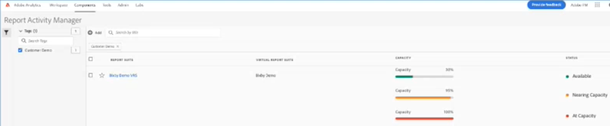

# Reporting Activity Manager

>[!NOTE]
>
>This functionality is currently in beta testing.

The Reporting Activity Manager lets you see the reporting capacity for each report suite in your organization. It provides you, as an Admin, with detailed visibility into reporting consumption and helps you easily diagnose and fix capacity issues during peak reporting times. When your organization reaches reporting request capacity and experiences a degradation in reporting performance, you now have a way to self-diagnose reporting issues without intervention from Adobe customer care or engineering. You can easily manage reporting queues within a single interface and immediately act​​ to improve your users' experience. This tool:

* Informs you about your current reporting capacity  across your report suites.
* Provides detailed report query information on current reporting requests, whether queued and in progress.
* Lets you optimize the reporting queue by prioritizing some and canceling other reporting requests to free up capacity. In other words, you can ask in real time: is this report necessary at this time or can I cancel it in favor of more urgent reports?

## Access the Reporting Activity Manager

In Adobe Analytics, Admins go to **[!UICONTROL Admin]** > **[!UICONTROL Reporting Activity Manager]**.

## Manage the reports queue

When opening the Reporting Activity Manager, you will see a list of base report suites. Virtual report suites are not included in this view.

Virtual report suites add complexity to reporting requests due to additional levels of applied filtering and segmentation. All requests that are coming from the virtual report suites are combined and come down to the base report suite. So if you have 10 requests coming from 5 VRSs, that's 50 requests at the base level report suite. This way, you can very quickly hit capacity. 

Here is a view of a VRS whose reporting capacity is shown in real time:

Refresh the page to change the results.

## Workspace reporting implications

