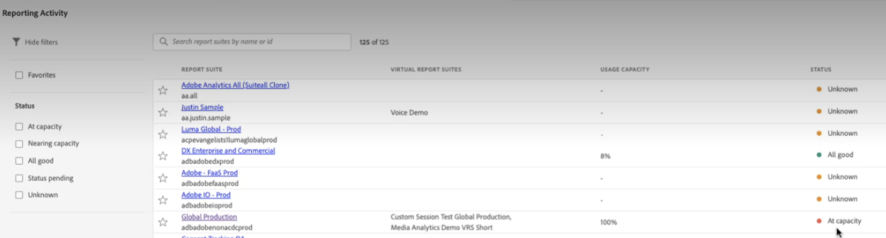

# Reporting Activity Manager

>[!NOTE]
>
>This functionality is currently in beta testing.

The Reporting Activity Manager lets you see the reporting capacity for each report suite in your organization. It provides you, as an Admin, with detailed visibility into reporting consumption and helps you easily diagnose and fix capacity issues during peak reporting times. When your organization reaches reporting request capacity and experiences a degradation in reporting performance, you now have a way to self-diagnose reporting issues without intervention from Adobe customer care or engineering. You can easily manage reporting queues within a single interface and immediately act​​ to improve your users' experience. This tool:

* Informs you about your current reporting capacity  across your report suites.
* Provides detailed report query information on current reporting requests, whether queued and in progress.
* Lets you optimize the reporting queue by prioritizing some and canceling other reporting requests to free up capacity. In other words, you can ask in real time: is this report necessary at this time or can I cancel it in favor of more urgent reports?

## Access the Reporting Activity Manager

In Adobe Analytics, Admins go to **[!UICONTROL Admin]** > **[!UICONTROL Reporting Activity Manager]**.

## View the reports queue

When opening the Reporting Activity Manager overview page, you will see a list of your enabled base report suites.

| UI Element | Description |
| --- | --- |
| **[!UICONTROL Report Suite]** | The base report suite |
|  **[!UICONTROL Virtual Report Suite]** | All virtual report suites that feed into this base report suite. Virtual report suites add complexity to reporting requests due to additional levels of applied filtering and segmentation. All requests that are coming from the virtual report suites are combined and come down to the base report suite.
If you have 10 requests coming from 5 VRSs, that's 50 requests at the base level report suite. This way, you can very quickly hit capacity. |
| **[!UICONTROL Usage Capacity]** | Percentage wise, how much of the report suite's reporting capacity is being used, in real time. |
| **[!UICONTROL Status]** | Four possible status indicators: <ul><li>**Red - At Capacity**: The report suite is maxed out in terms of reporting capacity.</li><li>**Yellow - Nearing capacity**: This report suite is in danger of reaching its maximum capacity.</li><li>**Green - Available**: There is plenty of reporting capacity.</li><li>**Grey - Unavailable**: The report suite is not configured for reporting capacity.</li></ul>|

Refresh the page to change the results.

## Filter report suites

You can filter the report suites by the

