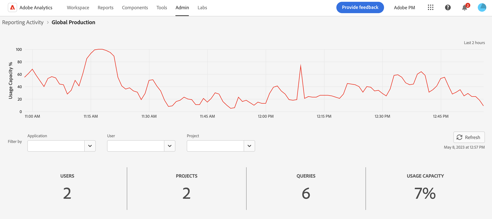
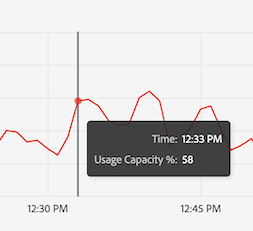
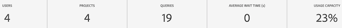
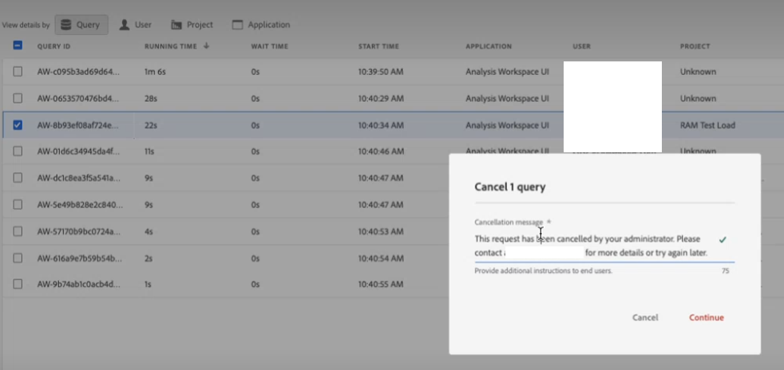

# Reporting Activity Manager

>[!NOTE]
>
>This functionality is currently in beta testing.

The Reporting Activity Manager lets you see the reporting capacity for each report suite in your organization. It provides you, as an Admin, with detailed visibility into reporting consumption and helps you easily diagnose and fix capacity issues during peak reporting times. When your organization reaches reporting request capacity and experiences a degradation in reporting performance, you now have a way to self-diagnose reporting issues without intervention from Adobe customer care or engineering. You can easily manage reporting queues within a single interface and immediately act​​ to improve your users' experience. This tool:

* Informs you, in real time, about your current reporting capacity  across your report suites.
* Provides detailed report query information on current reporting requests, whether queued and in progress.
* Lets you optimize the reporting queue by prioritizing some and canceling other reporting requests to free up capacity. In other words, you can ask in real time: is this report necessary at this time or can I cancel it in favor of more urgent reports?

## Access the Reporting Activity Manager

In Adobe Analytics, Admins go to **[!UICONTROL Admin]** > **[!UICONTROL Reporting Activity Manager]**.

## Permissions

You require Analytics System Admin permissions to manage reporting activity. Product Admin access is not sufficient.

## View the reports queue

When opening the Reporting Activity Manager overview page, you see a list of your enabled base report suites.

| UI Element | Description |
| --- | --- |
| **[!UICONTROL Report Suite]** | The base report suite whose reporting activity you are monitoring.|
|  **[!UICONTROL Virtual Report Suite]** | Shows all virtual report suites that feed into this base report suite. Virtual report suites add complexity to reporting requests due to additional levels of applied filtering and segmentation. All requests that are coming from the virtual report suites are combined and come down to the base report suite.
For example, f you have 10 requests coming from 5 VRSs, that's 50 requests at the base level report suite. This way, you can very quickly hit capacity. |
| **[!UICONTROL Usage Capacity]** | Percentage wise, how much of the report suite's reporting capacity is being used, in real time. |
| **[!UICONTROL Status]** | Four possible status indicators: <ul><li>**Red - [!UICONTROL At Capacity]**: The report suite is maxed out in terms of reporting capacity. (95% - 100%) </li><li>**Yellow - [!UICONTROL Nearing capacity]**: This report suite is in danger of reaching its maximum capacity. (90% - 94%)</li><li>**Green - [!UICONTROL All good]**: There is plenty of reporting capacity. (0% - 90%)</li><li>**Grey - [!UICONTROL Status pending]**: ?</li></ul>|

### Other Reporting Activity actions

* Click **[!UICONTROL Refresh]** at the top right to refresh the results.
* Click the star to the left of the report suite name to favorite this report suite.
* Check **[!UICONTROL Favorites]** at the top left to show your favorites.
* Search on report suites by name or by ID in the search bar.
* Filter report suites by their status.

## View reporting activity for individual report suites

Click the title link of a report suite for which you want to view details.

### Line graph

The line graph shows the reporting activity for the selected report suite over the last 2 hours. 

* The x-axis shows the reporting capacity data over the last 2 hours.
* The y-axis shows the average wait time for a query, in seconds.
* You can hover over the line chart to view points in time and average wait time for that instant.

   

### Filter

You can filter the table by Application (see list in the table below), by User, and by Project.

### Summary Numbers

The Summary Numbers show the following information:

| Summary Number | Description |
| --- | --- |
| Users | How many users are currently sending reporting requests to this report suite.  |
| Projects | Workspace projects, Report Builder workbooks, etc.  | 
| Queries | The number of queries currently running. |
| Average Wait Time | The average wait time for all running queries.  |
| Usage Capacity | The current usage capacity for this report suite. |

{style="table-layout:auto"}

### Table

The detailed table below shows details on the report suite.

| Column | Description |
| --- | --- |
| Query ID | Can be used for troubleshooting purposes. |
| Running Time | How long the query has been running. |
| Wait Time | How long the query has been waiting before being processed. Generally at "0" when there is enough capacity. |
| Start Time | When the query started processing (Admin's local time). |
| Application | The applications supported by the Reporting Activity Manager are: <ul><li>Analysis Workspace UI</li><li>Workspace scheduled projects</li><li>Report Builder</li><li>Builder UIs: Segment, Calculated Metrics, Annotations, Audiences, etc.</li><li>API calls from 1.4 or 2.0 API (5 concurrent requests)</li><li>Intelligent alerts</li></ul> |
| User | The user who initiated the query. |
| Project | Workspace projects, Report Builder workbooks, etc. |
| Month Boundaries | How many monthly boundaries a request crosses. This adds to the complexity of the request. |
| Columns | The number of metrics and breakdowns in Workspace to gauge the complexity of the request. |
| Segments | How many segments are applied to this request. This adds to the complexity of the request. |
| Status | Four possible status indicators: <ul><li>**Red - [!UICONTROL At Capacity]**: The report suite is maxed out in terms of reporting capacity. (95% and up)</li><li>**Yellow - [!UICONTROL Nearing capacity]**: This report suite is in danger of reaching its maximum capacity (90% - 95%).</li><li>**Green - [!UICONTROL All good]**: There is plenty of reporting capacity.</li><li>**[!UICONTROL Status pending]**: Status not available.</li></ul> |

{style="table-layout:auto"}

## Cancel reporting requests

To cancel a request 

1. Check the box to the left of one or more **[!UICONTROL Query ID]** in the table and click **[!UICONTROL Cancel requests]** at the bottom.
1. In the **[!UICONTROL Cancel x query]** window that appears, you can modify the cancellation message, if needed.
1. Click **[!UICONTROL Continue]**.

   

Application users in Workspace, for example, will see the following notice appear in their projects:

## Frequently asked questions

| Question | Answer |
| --- | --- |
| Can I purchase additional reporting capacity? | This capability will be available in the near future. |
| Other questions? |  |

{style="table-layout:auto"}
