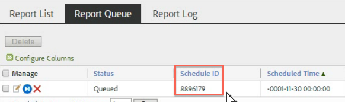

# Scheduled reports queue

Lets Admin-level users see and manage scheduled reports across the organization.

**[!UICONTROL Analytics]** > **[!UICONTROL Components]** > **[!UICONTROL All components]** > **[!UICONTROL Scheduled Reports]**

Admin-level capabilities in the Scheduled Reports Manager include:

* The option to [Show all Scheduled Reports](/help/admin/admin/scheduled-reports-admin.md#section_3F167CAAEEC24140B476CF95B7402690) in your organization.
* [Advanced Filtering Capabilities](/help/admin/admin/scheduled-reports-admin.md#section_206A52A85DE84947AAB3AD082FBF6275) across your organization.
* The new [Report Queue](/help/admin/admin/scheduled-reports-admin.md#section_03C866115D354BB182E90BF4D52F1E0B) tab that lists all reports that are queued for execution on reporting servers.
* Exposing the [Schedule ID](/help/admin/admin/scheduled-reports-admin.md#section_568B70F4228C4229977CB85D2DCD53A1) in the Report Queue interface.

## Show all Scheduled Reports {#section_3F167CAAEEC24140B476CF95B7402690}

On the **[!UICONTROL Report List]** tab, you can **[!UICONTROL Show All Scheduled Reports]** in your organization, in addition to the ones you personally scheduled.

>[!NOTE]
>
>The **[!UICONTROL Report Name]** column displays the name of the report which is being scheduled and the **[!UICONTROL File Name]** column displays any custom file name set by you in Advanced Delivery Options. As a result, if you schedule multiple reports of the same report type and you specify customized names for each, the Scheduled Reports Manager would display multiple entries with the same Report Name but with different file names. This is because the back end report being scheduled is same, so the Report Name column would have the same report names for all but customized file names (as set).

## Advanced Filtering Capabilities {#section_206A52A85DE84947AAB3AD082FBF6275}

For example, if you wanted to filter on all reports that are scheduled hourly, you would specify **[!UICONTROL Frequency equals Hourly]** in the **[!UICONTROL Advanced]** filter and click **[!UICONTROL Apply]**:

## Report Queue {#section_03C866115D354BB182E90BF4D52F1E0B}

This queue lets you manage and potentially delete any scheduled reports that are "clogging up" the queue. (Typically, reports time out after 4 hours.)

The Report Queue also gives you the ability to "Skip a scheduled report once". Just click the blue icon in the **[!UICONTROL Manage]** column.

## Schedule ID {#section_568B70F4228C4229977CB85D2DCD53A1}

Having the **[!UICONTROL Schedule ID]** exposed in the Report Queue interface helps when you need to contact Adobe Client Care for resolution of a scheduled reports issue.

