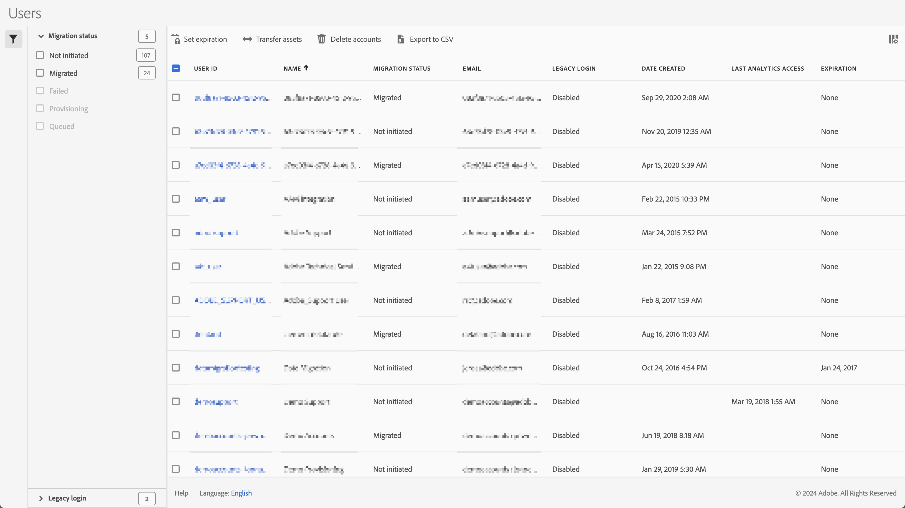

# Manage legacy user accounts, assets, expirations

You can manage legacy user accounts, their migration status, the expiration data, the transfer of assets to other users, and more using **[!UICONTROL Admin] > [!UICONTROL All Admin] >  [!UICONTROL Analytics users & admin]**. 

The Users screen shows a list of current Adobe Analytics users, with the following columns:

| Column | Description |
|---|---|
| [!UICONTROL User ID] | The user id that the user uses to log in to Adobe Analytics.|
| [!UICONTROL Name] | The name of the user. |
| [!UICONTROL Migration status] | The status of the migration from a legacy user account to an Enterprise ID or Adobe ID.  The status can be Not initiated, Queued or Migrated. |
| [!UICONTROL Email] | The email of the user. |
| [!UICONTROL Legacy login] | The status of legacy login, which can be Enabled or Disabled. |
| [!UICONTROL Date created] | Timestamp when the user account was created in the Adobe Analytics. |
| [!UICONTROL Last Analytics access] | Timestamp of latest access of the user account to Adobe Analytics, |
| [!UICONTROL Expiration] | Date of expiration for the user account, or None if the user account is not expiring. | 

- To search for a specific user, use the  *Search by title* field.
- To filter the list on migration status, select  **[!UICONTROL Migration status]**. 
- To filter the list on legacy login status, select  **[!UICONTROL Legacy login]**.
- To change the display of columns, select  and select the columns from the popup.

You can apply various actions when selecting one or more users from the list:

|  Action  | Description  |
|---|---|
|  **[!UICONTROL Migrate]** | You can migrate one or more users to Enterprise IDs or Adobe IDs. |
|  **[!UICONTROL Set expiration]** | You can set an expiration date for using legacy Adobe Analytics login for the selected users.  Select the date to use a calendar popup to specify the date. Select **[!UICONTROL Done]** to confirm the expiration. |
|  **[!UICONTROL Transfer assets]** | This action is only available when selecting one user. If the user has assets that can be transferred, you can select the account items (like bookmarks, dashboards, and more). Select **[!UICONTROL Transfer]** to complete the transfer.  |
|  **[!UICONTROL Delete accounts]** | A dialog is shown to confirm the deletion of the selected accounts. Select **[!UICONTROL OK]** to delete the accounts. Select **[!UICONTROL Cancel]** to cancel. |
|  **[!UICONTROL Export to CSV]** | This action immediately downloads a file containing a comma-separated value list of the selected users with their details (name, migration status, email, and more). |

