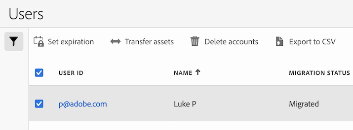

# Transfer user assets or set account expirations

Most user and product management functions have moved to the [Adobe Admin Console](https://helpx.adobe.com/enterprise/using/admin-console.html). (To get started managing user permissions for Adobe Analytics users, see [Analytics in the Adobe Admin Console](/help/admin/admin-console/home.md).) 

While most user and product management functions are now available only in the Adobe Admin Console, the administrative functions described on this page are available only from the Adobe Analytics Admin area.

## Transfer assets from one Analytics user to another 

1. Go to **Admin** > [!UICONTROL **Analytics users & assets**].
   The Users page is displayed.
1. (Optional) Use either of the following options to more easily locate any users you are looking for:
   * In the search field, begin typing the name of the user for whom you want to set an account expiration date.
   * Select the **Filter** icon  to show or hide the filter settings. You can filter by migration status or legacy login status.
1. Select the user whose assets you want to transfer.
   
1. Select [!UICONTROL **Transfer assets**].
1. On the Transfer assets page, in the [!UICONTROL **Transfer assets to**] field, begin typing the name of the user to whom you want to transfer the assets, then select their name when it appears in the drop-down menu.
1. In the [!UICONTROL **Select account items to transfer**] section, navigate to and select the assets you want to transfer, then select [!UICONTROL **Transfer**].
  
   Any assets you selected are transferred to the designated user.

## Set an expiration date for a user account

1. Go to **Admin** > [!UICONTROL **Analytics users & assets**].
   The Users page is displayed.
(Optional) Use either of the following options to more easily locate any users you are looking for:
   * In the search field, begin typing the name of the user for whom you want to set an account expiration date.
   * Select the **Filter** icon  to show or hide the filter settings. You can filter by migration status or legacy login status.
1. Select the user for whom you want to set an account expiration date.
   
1. Select [!UICONTROL **Set expiration**].
1. Choose the expiration date, then select [!UICONTROL **Done**].
