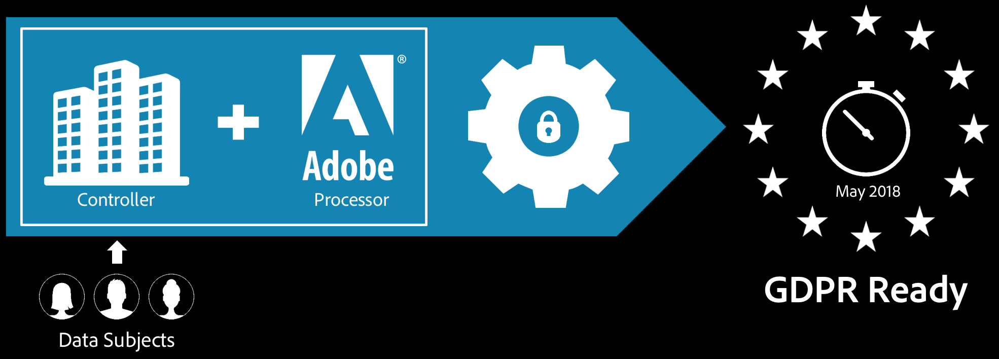

# Adobe Analytics and GDPR

This document describes what you need to do in Adobe Analytics to support your data subjects' GDPR access and delete rights.

## Adobe Overview {#section_E582A1D77583410EBB790BB646854A2C}

>[!IMPORTANT]
>
>The contents of this document are not legal advice and are not meant to substitute for legal advice. Please consult your company's legal department for advice concerning GDPR.

On May 25, 2018, the European Union's General Data Protection Regulation (GDPR) goes into effect. For more information about Adobe's response and what this means for you as an Adobe customer, see [GDPR and Your Business](https://www.adobe.com/privacy/general-data-protection-regulation.html).

When Adobe is providing software and services to an enterprise, Adobe is acting as a data processor for any personal data it receives and stores on behalf of our customers, as part of providing the services. As a data processor, Adobe processes personal data in accordance with your company’s permission and instructions (for example, as set out in your agreement with Adobe).

As the data controller, you will determine the personal data that Adobe processes and stores on your behalf. If you use Adobe Experience Cloud solutions, Adobe might host personal data for you depending on the solutions you use and the information you choose to send to your Adobe Experience Cloud account. For a list of examples, see [Adobe Experience Cloud privacy](https://www.adobe.com/privacy/marketing-cloud.html#collect).

## How Adobe Handles GDPR Data {#section_A20BCC08A80B410D97601BFB1CAF83F1}

The Adobe Cloud Platform (ACP) provides an integrated solution that connects your brand's data governance infrastructure with the Adobe tools it uses to create and manage consumer experiences. The data governance features of the Adobe Cloud Platform enable a direct linkage of data governance policy to data usage.

Familiarize yourself with [how Adobe Analytics handles GDPR](https://www.adobe.com/data-analytics-cloud/analytics/general-data-protection-regulation.html) which discusses steps for GDPR readiness and how to integrate with the Adobe Experience Cloud GDPR API.

## GDPR Readiness and your Adobe Analytics Data {#section_9A47CDCD614C42238F6E05CFF0180195}

Adobe realizes that you are most familiar with the custom data in your report suites and we are giving you the opportunity to define your data governance settings and preferences.

To that end, Adobe Analytics provides a Data Governance user interface that lets you, as the data controller, set [privacy labels](../../admin/c-data-governance/gdpr-labels.md#concept_F4061E29353446B5B0A7CF248D54E6F2) on your Analytics reports suites and all the dimensions and metrics in those report suites. You can identify the columns in your data set that contain directly identifiable data or indirectly identifiable data so that you can submit your access and delete requests to address that data. For each request, the labels defined in the Analytics Data Governance user interface will be honored for the specific identifier that corresponds to that request.

See [Label Report Suite Data](../../admin/c-data-governance/gdpr-setup-reportsuite.md#concept_FAA948AD8CEA4BC38CB482EAF3648731) for more information on how to set the labels.

## Prerequisites {#section_3C766371CE0641C0821FE8E750E5AE0C}

* Familiarize yourself with [GDPR terminology](../../admin/c-data-governance/gdpr-terminology.md#concept_83C744A9D077476BAD8F8492DF68EBD7). 
* Link your login company to an Experience Cloud organization, if it isn't already. Contact Adobe Customer Care and refer to [Organizations and account linking](https://marketing.adobe.com/resources/help/en_US/mcloud/organizations.html). 
* Map any Adobe Analytics report suite that you want to set up for data governance to [your Experience Cloud organization](https://marketing.adobe.com/resources/help/en_US/mcloud/report-suite-mapping.html). 
* Set a data retention policy for each report suite so that GDPR Delete and Access requests can be honored. 

  >[!NOTE]
  >
  >Adobe Analytics cannot assist you with processing requests to the GDPR API, i.e., processing access or deletion requests you receive from your end users, if the data retention period has not been set in Adobe Analytics. Please contact your Customer Success Manager in order to set your data retention period.

* Check your permissions: to use the Data Governance Management interface in Adobe Analytics, you must be an Adobe Analytics Administrator.

