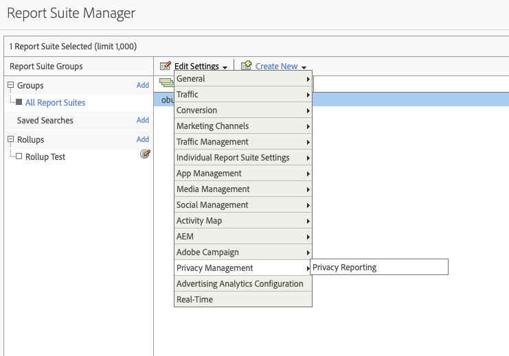
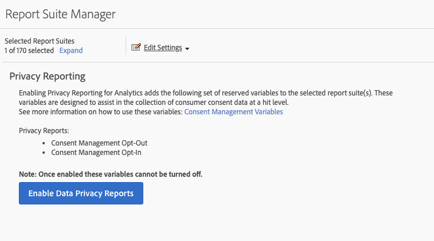
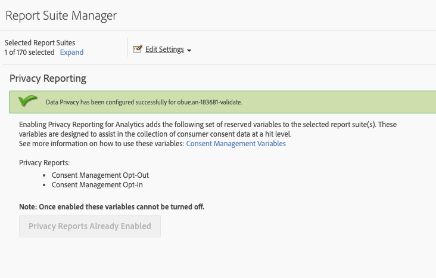
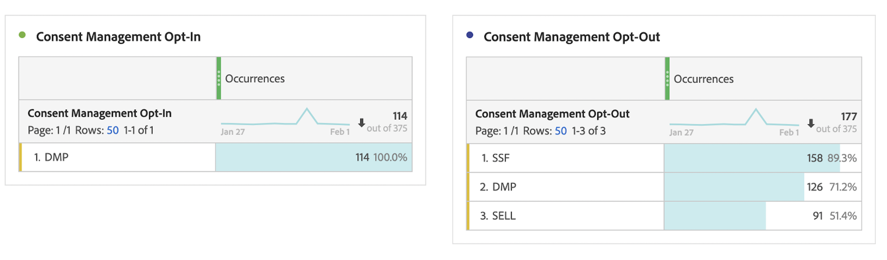

# Privacy Reporting Variables

To provide additional assistance in managing privacy data, a set of reserved variables are available to be used in conjunction with specific context data variables.
These privacy reporting variables provide an easy-to-use framework for capturing the privacy status on each analytics hit.

## Variables

* Consent Management Opt-Out
   * Reserved Variable: List Prop
   * Type: Comma-delimited string
   * Contains:
      * `contextData.['cm.ssf']=1` displayed as SSF
      * `contextData.['opt.dmp']=N` displayed as DMP
      * `contextData.['opt.sell']=N` displayed as SELL

* Consent Management Opt-In
   * Reserved Variable: List Prop
   * Type: Comma-delimited string
   * Contains:
      * `contextData.['opt.dmp']=Y` displayed as DMP
      * `contextData.['opt.sell']=Y` displayed as SELL

## Reporting

You can enable the Privacy Reporting Variables through a new Privacy setting available within the Analytics Admin Console.

Each report suite can be configured as follows:
1. In Reports & Analytics click **[!UICONTROL Admin > Report Suites]**.
1. Select the report suite(s) where you are collecting media data and click **[!UICONTROL Edit Settings > Privacy Management]**.

    

1. Click the **[!UICONTROL Enable Data Privacy Reports]** button.

   >[!NOTE]
   >
   >Once enabled these variables cannot be turned off.

   

1. Once enabled, you will see a confirmation message.

   

1. The reserved variables are now available for analysis in Reports & Analytics and Workspace. See Consent Management Opt-Out and Consent Management Opt-In.

    

## Implementation

Three context data variables have been pre-defined to work with the privacy reporting management reserved variables.  It is up to each implementation engineer to determine how to manage and persist the setting of these variables.

See [Context Data Variables](/help/implement/vars/page-vars/contextdata.md) for general guidance on implementing context data variables.

### SSF

* Context Data: `contextData.['cm.ssf']`
* Accepted Values:
   * 1 - When sending the value "1", this indicates that Server Side Forwarding is in an opt-out state. The value "1" paired with this variable will block the sharing of this hit with Adobe Audience Manager. See [AAM ePrivacy Compliance](https://experienceleague.adobe.com/docs/audience-manager/user-guide/overview/data-privacy/data-privacy.html?lang=en).
   * 0 - Optional. Use the value "0" for customers who consented to targeted marketing. Not setting the variable will also produce the same results.

### DMP

* Context Data: `contextData.['opt.dmp']`
* Accepted Values:  
   * N – When sending the value "N", this indicates that the consumer is opting out of sharing to data management platforms.  **Note**: As of January 15, 2020, setting this variable to "N" blocks server-side sharing of this hit to AAM.
   * Y - When sending the value "Y", this indicates that the consumer is opting in to sharing to data management platforms.

### SELL

* Context Data: `contextData.['opt.sell']`
* Accepted Values:  
   * N - When sending the value "N", this indicates that the consumer is opting out of the sharing or selling of the data to third parties.
   * Y - When sending the value "Y", this indicates that the consumer is opting in to the sharing or selling of the data to third parties.
