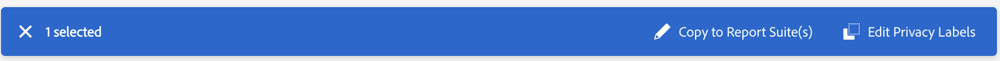

# Label report suite data

>[!NOTE]
>
>This updated UI is currently in limited testing.

Labeling report suite data means that you assign identity, sensitivity, and data governance labels to each variable in a given report suite. Make sure that you first familiarize yourself with the [labels and their definitions](/help/admin/c-data-governance/data-labeling/gdpr-labels.md).

>[!NOTE]
>
>Remember that Labeling needs to be reviewed each time a new report suite is created or when a new variable is enabled within an existing report suite. You may also need to review the labeling when new solution integrations are enabled, as they can expose new variables that may require labeling. A re-implementation of your mobile apps or websites may change the way that existing variables are used, which may also necessitate updates to labels.

## Assign or edit report suite privacy labels {#assign-edit}

**Example**: You, as the data controller, plan to collect email addresses and cookie IDs from data subjects to process their Data Privacy requests. These cookie IDs are stored in a report suite in Adobe Analytics. To create a label for email addresses and cookie IDs, you must use the Adobe Experience Cloud Platform's Data Usage Labeling & Enforcement (DULE) framework in Analytics.

1. In Adobe Analytics, navigate to **[!UICONTROL Admin]** > **[!UICONTROL All admin]** > **[!UICONTROL Data configuration and collection]** > **[!UICONTROL Data governance]**.

   

1. Select a report suite from the **[!UICONTROL Report Suites]** selector at the top. 

1. In the filter section on the left, select which groups of variables you want to label. You can label only one group of variables at a time.

   * **Standard Components** - Standard components are out-of-the-box Analytics dimensions and metrics that are collected by default within an Analytics implementation.
   * **Conversion Variables** - The Custom Insight Conversion Variable (or eVar) is placed in the Adobe code on selected web pages of your site. Its primary purpose is to segment conversion success metrics in custom marketing reports. An eVar can be visit based and function similarly to cookies. Values passed into eVar variables follow the user for a predetermined period of time.
   * **List Variables** - List variables are custom variables that you can use however you would like. They work similarly to eVars, except they can contain multiple values in the same hit. List variables do not have a character limit.
   * **Traffic Variables** - Custom Insight Traffic Variables (or props) enable you to correlate custom data with specific traffic-related events. The prop variables are embedded in the implementation code on each page of your website.
   * **Success Events** - Success events (also known as conversion events or custom events) are actions that can be tracked. You determine what a success event is. For example, if a visitor purchases an item, the purchase event could be considered the success event.
   * **Classifications** - Classification breakdowns are used to map Analytics reporting data to related properties. Classifications can be used for a variety of purposes, but are most commonly used for classifying campaign tracking codes (both internal and external) and product IDs.

1. Select a variable by clicking its checkbox, then click **[!UICONTROL Edit Privacy Labels]** on the blue bar that appears at the bottom of the screen.

   

   This screen shows currently applied labels and allows you to apply additional labels. You may not be able to apply or modify all labels, depending on the component.

   

   >[!NOTE]
   >
   >The Data Usage Labeling & Enforcement (DULE) Framework is designed to provide a uniform way across Solutions/Services/Platforms to capture, communicate, and use metadata about data across the Adobe Experience Cloud. The metadata helps data controllers indicate which data is personal information, which data is sensitive data, and what contract restrictions are associated with data.

1. Click **[!UICONTROL Apply]** once you have completed all labeling.

