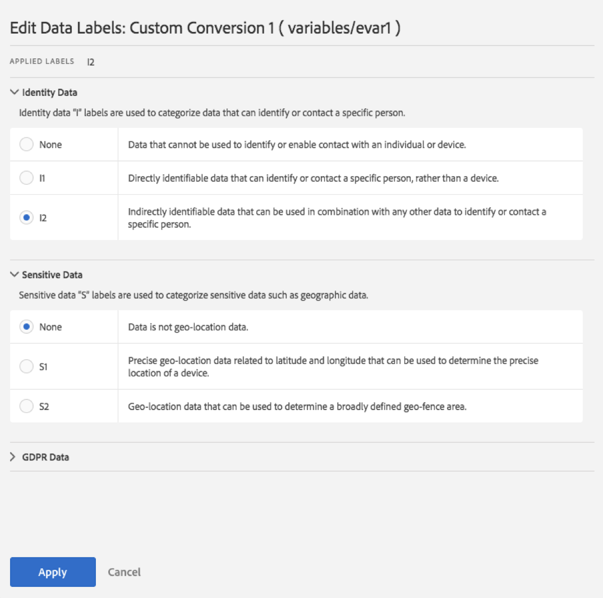

# Label report suite data

Labeling report suite data means that you assign identity, sensitivity, and data governance labels to each variable in a given report suite. Make sure that you first familiarize yourself with the [labels and their definitions](/help/admin/c-data-governance/gdpr-labels.md).

>[!NOTE]
>
>Remember that Labeling needs to be reviewed each time a new report suite is created or when a new variable is enabled within an existing report suite. You may also need to review the labeling when new solution integrations are enabled, as they can expose new variables that may require labeling. A re-implementation of your mobile apps or websites may change the way that existing variables are used, which may also necessitate updates to labels.

## Assign or edit report suite privacy labels {#assign-edit}

**Example**: You, as the data controller, plan to collect email addresses and cookie IDs from data subjects to process their Data Privacy requests. These cookie IDs are stored in a report suite in Adobe Analytics. To create a label for email addresses and cookie IDs, you must use the Adobe Experience Cloud Platform's Data Usage Labeling & Enforcement (DULE) framework in Analytics.

1. In Adobe Analytics, navigate to **[!UICONTROL Admin]** > **[!UICONTROL All admin]** > **[!UICONTROL Data configuration and collection]** > **[!UICONTROL Data governance]**.

   

1. Select a report suite from the **[!UICONTROL Report Suites]** selector at the top. 

1. In the filter section on the left, select which groups of variables you want to label. You can label only one group of variables at a time.

   * **Standard Components** - Standard components are out-of-the-box Analytics dimensions and metrics that are collected by default within an Analytics implementation.
   * **Conversion Variables** - The Custom Insight Conversion Variable (or eVar) is placed in the Adobe code on selected web pages of your site. Its primary purpose is to segment conversion success metrics in custom marketing reports. An eVar can be visit based and function similarly to cookies. Values passed into eVar variables follow the user for a predetermined period of time.
   * **List Variables** - List variables are custom variables that you can use however you would like. They work similarly to eVars, except they can contain multiple values in the same hit. List variables do not have a character limit.
   * **Traffic Variables** - Custom Insight Traffic Variables (or props) enable you to correlate custom data with specific traffic-related events. The prop variables are embedded in the implementation code on each page of your website.
   * **Success Events** - Success events (also known as conversion events or custom events) are actions that can be tracked. You determine what a success event is. For example, if a visitor purchases an item, the purchase event could be considered the success event.
   * **Classifications** - Classification breakdowns are used to map Analytics reporting data to related properties. Classifications can be used for a variety of purposes, but are most commonly used for classifying campaign tracking codes (both internal and external) and product IDs.

1. (Optional) Click the information (i) icon next to each variable to better understand its most common values over the last 90 days. (This functionality is not available for Data Processing Dimensions, because they are not available in the Analytics UI.)

   

1. Select one or more variables by clicking their checkbox, then select the **[!UICONTROL Edit]** icon (to the right) to edit one or more variable(s).

   

1. The **Identity Data** labels dialog opens automatically. These labels classify data that can be used by itself or in combination with other data to identify or enable direct contact with an individual. For more information on these options, refer to [Identity Data Labels (DULE).](/help/admin/c-data-governance/gdpr-labels.md#identity-data-labels)

   >[!NOTE]
   >
   >The Data Usage Labeling & Enforcement (DULE) Framework is designed to provide a uniform way across Solutions/Services/Platforms to capture, communicate, and use metadata about data across the Adobe Experience Cloud. The metadata helps data controllers indicate which data is personal information, which data is sensitive data, and what contract restrictions are associated with data.

   

1. Open the **Sensitive Data** section to set Sensitive Data Labels, which categorize geolocation data. For more information on these options, refer to [Sensitive Data Labels (DULE).](/help/admin/c-data-governance/gdpr-labels.md#sensitive-data-labels)

   

1. Open the Data Privacy Data section to set **Data Governance** Labels. Use this section to instruct Adobe how to handle each variable for Data Privacy access and delete requests, as well for defining which variables should be scanned to find data subject IDs for these requests. For more information on these options, refer to [Data Governance Labels (Data Privacy).](/help/admin/c-data-governance/gdpr-labels.md#data-governance-labels)

   

1. Click **[!UICONTROL Apply]** once you have completed all labeling.

## Copy Labels to Report Suite(s) {#copy-to-rs}

If you want to apply the same DULE/Data Privacy settings to more than one report suite, you can follow these steps:

1. Select the variable that you want to copy. Note that you can only copy the labels for one variable at a time.
1. Click **[!UICONTROL Copy to Report Suite(s)]** at the bottom of the Data Governance dialog.

   

1. The resulting screen shows the variable name, the currently applied label/s that you are trying to copy over, the report suites and their IDs, and whether the settings in the target report suites match.

   

   >[!IMPORTANT]
   >
   >Keep in mind that all report suites you select have to be mapped to your Experience Cloud organization.

   When you copy the labels for a variable or set of variables into a different report suite, the copy goes to the variable in the corresponding position in the destination report suite. For Standard Components, List Variables, and Success Events, the labels will be copied to the variable with the **same name** in the destination report suite.

   However, for Conversion Variables (eVars) and Traffic Dimensions (props) the copy be will to the variable with the **same number** in the destination report suite. For example, eVar12 will be copied into eVar12 in all destination report suites. The names of these variables will be ignored in determining the target of the copy. If the corresponding variable is not enabled in the destination report suite, the copy will fail for that variable.

   When copying the labels for Classifications defined for a variable, the labels will be copied to a classification on the corresponding variable in the destination report suite (such eVar7 to eVar7) that has a name identical to the classification being copied. Otherwise, the copy for that classification's labels will fail.

1. Check the box next to one or more report suites where the settings match.
1. Click **[!UICONTROL Apply]**.

   A status message is displayed after a labels has been applied. The status message will include the names of any destination variables or classifications and their report suites for which the copy failed.

   >[!IMPORTANT]
   >
   >You should always check the destination report suites to make sure that the labels copied over correctly. This is especially important for variables that have ID or DEL labels.
