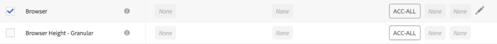

# Label report suite data

Labeling report suite data means that you assign identity, sensitivity, and data governance labels to each variable in a given report suite. Make sure that you first familiarize yourself with the labels and their definitions.

>[!NOTE]
>
>Remember that Labeling needs to be reviewed each time a new report suite is created or when a new variable is enabled within an existing report suite. You may also need to review the labeling when new solution integrations are enabled, as they can expose new variables that may require labeling. A re-implementation of your mobile apps or websites may change the way that existing variables are used, which may also necessitate updates to labels.

## Assign or Edit Report Suite Labels {#section_39F829F35A274EACA532E2F6FF392996}

**Example**: You, as the data controller, plan to collect email addresses and cookie IDs from data subjects to process their Data Privacy requests. These cookie IDs are stored in a report suite in Adobe Analytics. To create a label for email addresses and cookie IDs, you must use the Adobe Cloud Platform's Data Usage Labeling & Enforcement (DULE) framework in Analytics.

1. In Analytics, navigate to **[!UICONTROL Admin]** > **[!UICONTROL Data Governance]** > **[!UICONTROL (select report suite)]** 

1. Select which group of variables you want to label.

   

   * **Standard Dimensions** (Adobe Analytics out-of-the-box dimensions)
   * **Standard Metrics** (Adobe Analytics out-of-the-box metrics)
   * **Conversion Events** (Custom success events)
   * **Merchandising Conversion Dimensions** (Merchandising eVars)
   * **Conversion Dimensions** (non-merchandising eVars)
   * **Custom Traffic Dimensions** (props)
   * **Solution Dimensions and Events** (Dimensions/events related to solutions such as Mobile, Video, Activity Map, etc., and integrations with solutions such as Adobe Campaign, Adobe Experience Manager, Advertising Cloud, etc.)
   * **Data Processing Dimensions** (variables not exposed directly in reporting through the Adobe Analytics UI, but available to you through Data Feeds and/or Data Warehouse requests)

1. (Optional) Click the information (i) icon next to each variable to better understand its most common values over the last 90 days. (This functionality is not available for Data Processing Dimensions, because they are not available in the Analytics UI.)

   

1. Select one or more variables by clicking their checkbox, then select the **[!UICONTROL Edit]** icon (to the right) to edit one or more variable(s).

   

1. The **Identity Data** labels dialog opens automatically. These labels classify data that can be used by itself or in combination with other data to identify or enable direct contact with an individual. For more information on these options, refer to [Identity Data Labels (DULE).](/help/admin/c-data-governance/gdpr-labels.md#identity-data-labels)

   >[!NOTE]
   >
   >The Data Usage Labeling & Enforcement (DULE) Framework is designed to provide a uniform way across Solutions/Services/Platforms to capture, communicate, and use metadata about data across the Adobe Experience Cloud. The metadata helps data controllers indicate which data is personal information, which data is sensitive data, and what contract restrictions are associated with data.

   

1. Open the **Sensitive Data** section to set Sensitive Data Labels, which categorize geolocation data. For more information on these options, refer to [Sensitive Data Labels (DULE).](/help/admin/c-data-governance/gdpr-labels.md#sensitive-data-labels)

   

1. Open the Data Privacy Data section to set **Data Governance** Labels. Use this section to instruct Adobe how to handle each variable for Data Privacy access and delete requests, as well for defining which variables should be scanned to find data subject IDs for these requests. For more information on these options, refer to [Data Governance Labels (Data Privacy).](/help/admin/c-data-governance/gdpr-labels.md#data-governance-labels)

   

1. Click **[!UICONTROL Apply]** once you have completed all labeling.

## Copy Labels to Report Suite(s) {#section_7C6FDAFF049F4126B84F6261F72668EE}

If you want to apply the same DULE/Data Privacy settings to more than one report suite, you can follow these steps:

1. Select the variable group (Standard Dimensions, Conversion Dimensions, etc.) containing the variable you want to copy. Note that you can only copy the labels for one group of variables at a time.
1. Select some or all of the variables in this group.
1. Click **[!UICONTROL Copy Labels to Report Suite(s)]** at the top right of the Data Governance dialog.

   

1. Either check **[!UICONTROL Select All]** to copy labels for the selected variables to all report suites or select the individual report suites that you want to copy the labels to.

   >[!IMPORTANT]
   >
   >Keep in mind that all report suites you select have to be mapped to your Experience Cloud organization.

   When you copy the labels for a variable or set of variables into a different report suite, the copy goes to the variable in the corresponding position in the destination report suite. For Standard Dimensions, Standard Metrics, Solution Dimensions and Events and Data Processing Dimensions, the labels will be copied to the variable with the **same name** in the destination report suite.

   However, for Conversion Variables (eVars), Merchandising Conversion Dimensions and Custom Traffic Dimensions (props) the copy be will to the variable with the **same number** in the destination report suite. For example, eVar12 will be copied into eVar12 in all destination report suites. The names of these variables will be ignored in determining the target of the copy. If the corresponding variable is not enabled in the destination report suite, the copy will fail for that variable.

   When copying the labels for classifications defined for a variable, the labels will be copied to a classification on the corresponding variable in the destination report suite (such eVar7 to eVar7) that has a name identical to the classification being copied. Otherwise, the copy for that classification's labels will fail.

   A status message is displayed after a set of labels has been applied. The status message will include the names of any destination variables or classifications and their report suites for which the copy failed.

   >[!IMPORTANT]
   >
   >You should always check the destination report suites to make sure that the labels copied over correctly. This is especially important for variables that have ID or DEL labels.

1. Click **[!UICONTROL Apply]**.
