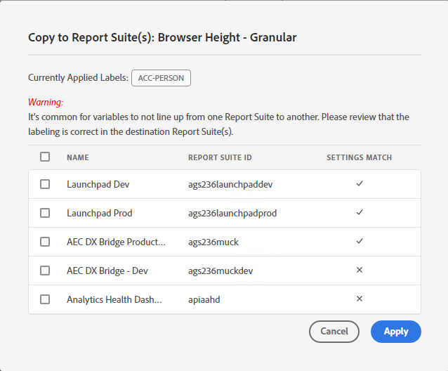
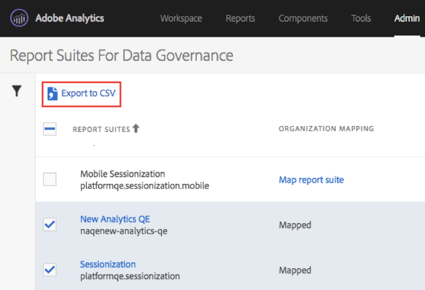

# View/Manage Privacy Labeling for Data Governance

The **[!UICONTROL Privacy Labeling for Data Governance]** dialog provides an overview of a report suite's privacy labels and namespaces. You can also export the settings to a .csv file from here.

## View privacy labels {#view-privacy}

1. Log in to Adobe Experience Cloud.
1. Navigate to  **[!UICONTROL Analytics]** > **[!UICONTROL Admin]** > **[!UICONTROL All admin]** > **[!UICONTROL Data configuration & collection]** >[**[!UICONTROL Data Governance]**.

   >[!NOTE]
   >
   >If you do not see this menu item, you need to be added to a [product profile in Admin Console](https://experienceleague.adobe.com/docs/analytics/admin/admin-console/permissions/product-profile.html) with permissions to this functionality.

1. At the top right, select a report suites whose privacy labels you want to view or manage.

   

| Setting | Description |
| --- | --- |
| **[!UICONTROL Component Name]** | This column lists all the components (dimensions, metrics) that are part of this report suite. |
| **[!UICONTROL Identity]** | Identity data "I" labels are used to categorize data that can identify or contact a specific person. [Learn more](https://experienceleague.adobe.com/docs/analytics/admin/data-governance/gdpr-labels.html?lang=en#identity-data-labels)|
| **[!UICONTROL Sensitivity]** | Sensitive data "S" labels are used to categorize sensitive data such as geographic data. Additional Sensitive Data labels will be introduced in the future to identify other types of sensitive information. [Learn more](https://experienceleague.adobe.com/docs/analytics/admin/data-governance/gdpr-labels.html?lang=en#sensitive-data-labels) |
| **[!UICONTROL GDPR Access]**| Data Governance labels provide users the ability to classify data that reflects privacy-related considerations and contractual conditions to be compliant with regulations and corporate policies. [Learn more](https://experienceleague.adobe.com/docs/analytics/admin/data-governance/gdpr-labels.html?lang=en#data-privacy-access-labels) |
| **[!UICONTROL GDPR Delete]** | A delete label is required only for fields that contain a value that would allow a hit to be associated with the data subject (i.e. that would allow identification of the data subject). Other personal information (favorites, browsing/purchase history, health conditions, etc.) does not need to be deleted since the association with the data subject will be severed. [Learn more](https://experienceleague.adobe.com/docs/analytics/admin/data-governance/gdpr-labels.html?lang=en#data-privacy-delete-labels) |
| **[!UICONTROL Namespace]** | When you label a variable as ID-DEVICE or ID-PERSON, you are prompted to provide a namespace. You can either use a previously defined namespace or define a new one. [Learn more](https://experienceleague.adobe.com/docs/analytics/admin/data-governance/gdpr-labels.html?lang=en#section_F0A47AF8DA384A26BD56032D0ABFD2D7)  |
| **[!UICONTROL Category]** | Refers type of component, such as Standard Component, Conversion Variable, etc. |

{style="table-layout:auto"}

## Copy privacy labels to a report suite  {#copy-to-rs}

If you want to apply the same DULE/Data Privacy settings to more than one report suite, follow these steps:

1. Select the variable that you want to copy. Note that you can only copy the labels for one variable at a time.
1. Click **[!UICONTROL Copy to Report Suite(s)]** at the bottom of the Data Governance dialog.

   

1. The resulting screen shows the variable name, the currently applied label/s that you are trying to copy over, the report suites and their IDs, and whether the settings in the target report suites match.

   

   >[!IMPORTANT]
   >
   >Keep in mind that all report suites you select have to be mapped to your Experience Cloud organization.

   When you copy the labels for a variable or set of variables into a different report suite, the copy goes to the variable in the corresponding position in the destination report suite. For Standard Components, List Variables, and Success Events, the labels will be copied to the variable with the **same name** in the destination report suite.

   However, for Conversion Variables (eVars) and Traffic Dimensions (props) the copy be will to the variable with the **same number** in the destination report suite. For example, eVar12 will be copied into eVar12 in all destination report suites. The names of these variables will be ignored in determining the target of the copy. If the corresponding variable is not enabled in the destination report suite, the copy will fail for that variable.

   When copying the labels for Classifications defined for a variable, the labels will be copied to a classification on the corresponding variable in the destination report suite (such eVar7 to eVar7) that has a name identical to the classification being copied. Otherwise, the copy for that classification's labels will fail.

1. Check the box next to one or more report suites where the settings match.
1. Click **[!UICONTROL Apply]**.

   A status message is displayed after a labels has been applied. The status message will include the names of any destination variables or classifications and their report suites for which the copy failed.

   >[!IMPORTANT]
   >
   >You should always check the destination report suites to make sure that the labels copied over correctly. This is especially important for variables that have ID or DEL labels.

## Export to a .csv file

You can download a CSV file containing all current label definitions for all variables for the selected report suite/s. We recommend that your legal team review your labeling choices and this option facilitates this review. Instead of needing to perform the review while logged into the Data Governance UI, you can share the .CSV file with them. 

1. Click **[!UICONTROL Export CSV]** at the top right and this dialog displays:

   

1. Select one or more report suites for which you want to export all data governance settings.

## Edit privacy labels

Refer to [Assign or edit report suite privacy labels](help/admin/c-data-governance/gdpr-setup-reportsuite.md).
