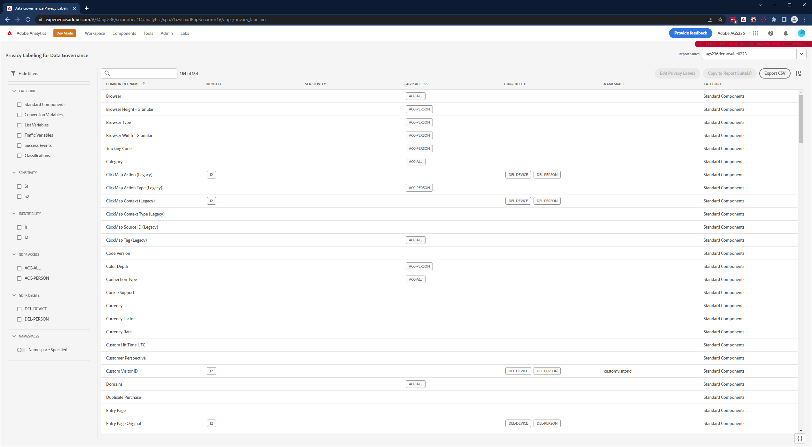

# View/Manage Privacy Labeling for Data Governance

The Privacy Labeling for Data Governance dialog provides an overview of a report suite's privacy labels and namespaces. You can also export the settings to a .csv file from here.

1. Log in to Adobe Experience Cloud.
1. Navigate to  **[!UICONTROL Analytics]** > **[!UICONTROL Admin]** > **[!UICONTROL All admin]** > **[!UICONTROL Data configuration & collection]** >[**[!UICONTROL Data Governance]**.

>[!NOTE]
>
>If you do not see this menu item, you need to be added to a [product profile in Admin Console](https://experienceleague.adobe.com/docs/analytics/admin/admin-console/permissions/product-profile.html) with permissions to this functionality.

1. At the top right, select a report suites whose privacy labels you want to view or manage.

   

| Setting | Description |
| --- | --- |
| **[!UICONTROL Component Name]** | This column lists all the components (dimensions, metrics) that are part of this report suite. |
| **[!UICONTROL Identity]** | |
| **[!UICONTROL Sensitivity]** | |
| **[!UICONTROL GDPR Access]**|  |
| **[!UICONTROL GDPR Delete]** | |
| **[!UICONTROL Namespace]** |  |
| **[!UICONTROL Category]** |  |
| **[!UICONTROL Export to CSV]** | If you mark the checkbox next to one or more of the report suites, the  |

{style="table-layout:auto"}

## Edit privacy labels

## Copy privacy labels to a report suite

Text here

## Export to a .csv file

You can download a CSV file containing all current label definitions for all variables for the selected report suite/s. We recommend that your legal team review your labeling choices and this option facilitates this review. Instead of needing to perform the review while logged into the Data Governance UI, you can share the .CSV file with them. 

1. Click Export CSV at the top right and this dialog displays:

   

1. Select one or more report suites for which you want to export all data governance settings.

## Add Namespace

## View data retention