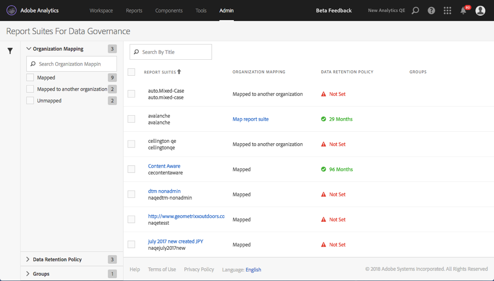

# View/Manage Report Suite's Data Governance Settings

The Data Governance dialog in the Admin Tools provides an overview of which report suites have been configured for data governance, whether they have been mapped to an Experience Cloud organization, and whether a data retention policy is in place for this report suite.

1. Log in to Adobe Experience Cloud.
1. Navigate to  **[!UICONTROL Analytics]** > **[!UICONTROL Admin]** > **[!UICONTROL Data Governance]**.

>[!NOTE]
>
>If you do not see this menu item, you need to be added to a [product profile in Admin Console](https://experienceleague.adobe.com/docs/analytics/admin/admin-console/permissions/product-profile.html) with permissions to this functionality.

1. View all the report suites that are part of your login company:

   

| Setting | Description |
| --- | --- |
| **[!UICONTROL Report Suites]** | The first line lists the friendly name of the report suite. The second line contains the internal name of the report suite. If you are allowed to set labels for a report suite, the first line will be a clickable link that takes you to the labeling page. |
| **[!UICONTROL Organization Mapping]** | <ul><li>Mapped: This report suite has already been mapped to the same Experience Cloud organization as the Analytics login company that you are logged in to. Only report suites that have this setting can be labeled.</li><li>Mapped to Another Organization: Another Experience Cloud organization has already mapped this report suite to their organization.</li></ul> |
| **[!UICONTROL Data Retention Policy]**| The Analytics Data Privacy implementation requires that you have a data retention policy in place. This setting shows whether:<ul><li>A data retention policy is in place for this report suite, and</li><li>How long the data is retained by Adobe before it is deleted. The default data retention period is 25 months.</li></ul>**Note**: Adobe Analytics cannot assist you with processing requests to the Data Privacy API, i.e., processing access or deletion requests you receive from your end users, if the data retention period has not been set. Please contact your Customer Success Manager in order to set your data retention period. |
| **[!UICONTROL Groups]** | Grouping functionality is not currently implemented. |
| Left-hand side bar | Click the funnel icon to open or close the side bar. The [!UICONTROL Organization Mapping] section displays the number of report suites that fall into each of the described categories. The [!UICONTROL Data Retention Policy] section displays each unique data retention policy currently in place for your organization and the number of report suites that were assigned that retention policy. |
| **[!UICONTROL Export to CSV]** | If you mark the checkbox next to one or more of the report suites, the  Export to CSV  option displays. This option lets you download a CSV file containing all current label definitions for all variables for all selected report suites. We recommend that your legal team review your labeling choices and this option facilitates this review. Instead of needing to perform the review while logged into the Data Governance UI, you can share the .CSV file with them. |

{style="table-layout:auto"}
