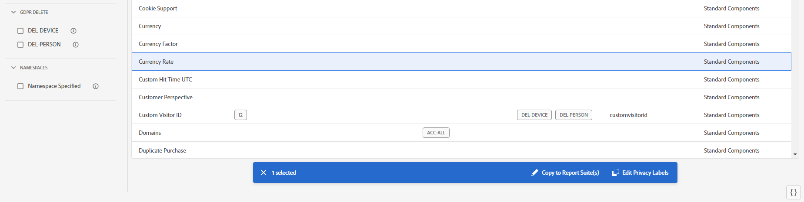

# View/Manage Privacy Labeling for Data Governance

The **[!UICONTROL Privacy Labeling for Data Governance]** dialog provides an overview of a report suite's privacy labels and namespaces. You can also export the settings to a .csv file from here.

1. Log in to Adobe Experience Cloud.
1. Navigate to  **[!UICONTROL Analytics]** > **[!UICONTROL Admin]** > **[!UICONTROL All admin]** > **[!UICONTROL Data configuration & collection]** >[**[!UICONTROL Data Governance]**.

   >[!NOTE]
   >
   >If you do not see this menu item, you need to be added to a [product profile in Admin Console](https://experienceleague.adobe.com/docs/analytics/admin/admin-console/permissions/product-profile.html) with permissions to this functionality.

1. At the top right, select a report suites whose privacy labels you want to view or manage.

   

| Setting | Description |
| --- | --- |
| **[!UICONTROL Component Name]** | This column lists all the components (dimensions, metrics) that are part of this report suite. |
| **[!UICONTROL Identity]** | Identity data "I" labels are used to categorize data that can identify or contact a specific person. [Learn more](https://experienceleague.adobe.com/docs/analytics/admin/data-governance/gdpr-labels.html?lang=en#identity-data-labels)|
| **[!UICONTROL Sensitivity]** | Sensitive data "S" labels are used to categorize sensitive data such as geographic data. Additional Sensitive Data labels will be introduced in the future to identify other types of sensitive information. [Learn more](https://experienceleague.adobe.com/docs/analytics/admin/data-governance/gdpr-labels.html?lang=en#sensitive-data-labels) |
| **[!UICONTROL GDPR Access]**| Data Governance labels provide users the ability to classify data that reflects privacy-related considerations and contractual conditions to be compliant with regulations and corporate policies. [Learn more](https://experienceleague.adobe.com/docs/analytics/admin/data-governance/gdpr-labels.html?lang=en#data-privacy-access-labels) |
| **[!UICONTROL GDPR Delete]** | A delete label is required only for fields that contain a value that would allow a hit to be associated with the data subject (i.e. that would allow identification of the data subject). Other personal information (favorites, browsing/purchase history, health conditions, etc.) does not need to be deleted since the association with the data subject will be severed. [Learn more](https://experienceleague.adobe.com/docs/analytics/admin/data-governance/gdpr-labels.html?lang=en#data-privacy-delete-labels) |
| **[!UICONTROL Namespace]** | When you label a variable as ID-DEVICE or ID-PERSON, you are prompted to provide a namespace. You can either use a previously defined namespace or define a new one. [Learn more](https://experienceleague.adobe.com/docs/analytics/admin/data-governance/gdpr-labels.html?lang=en#section_F0A47AF8DA384A26BD56032D0ABFD2D7)  |
| **[!UICONTROL Category]** | ??? |
| **[!UICONTROL Export to CSV]** | If you mark the checkbox next to one or more of the report suites, the  |

{style="table-layout:auto"}

## Copy privacy labels to a report suite

It is common for variables to not line up in terms of privacy labeling, from one report suite to another. You can preview whether the labeling matches in the destination report suite(s), before you copy labels to another report suite.

1. Select a variable that you want to copy.

1. At the bottom of the screen, click **[!UICONTROL Copy to Report Suite(s)]**.

   

1. Check whether the settings for this variable match in the destination report suite.

   

1. If they match, you will see a check mark in the **[!UICONTROL Settings Match]** column. Click **[!UICONTROL Apply]**.

1. If they do not match, select the check box to the left of the report suite name and click **[!UICONTROL Edit Privacy Labels]** at the bottom of the screen.

## Export to a .csv file

You can download a CSV file containing all current label definitions for all variables for the selected report suite/s. We recommend that your legal team review your labeling choices and this option facilitates this review. Instead of needing to perform the review while logged into the Data Governance UI, you can share the .CSV file with them. 

1. Click **[!UICONTROL Export CSV]** at the top right and this dialog displays:

   

1. Select one or more report suites for which you want to export all data governance settings.

## Edit privacy labels

In the **[!UICONTROL Privacy Labeling for Data Governance]** dialog, select a component whose label/s you want to edit.

Refer to 

## View data retention