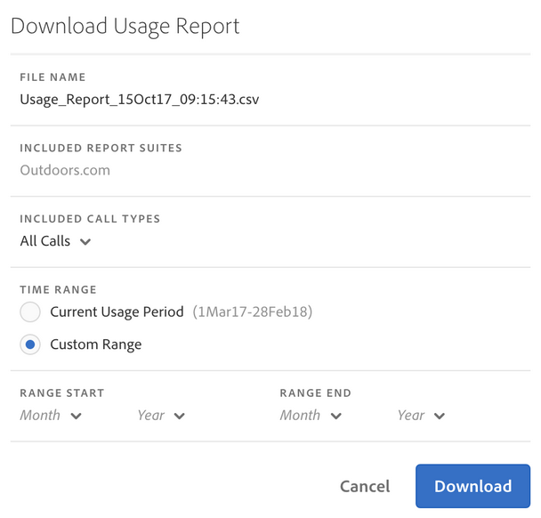

# View report suite usage

The Report Suite Usage tab provides server usage data for each report suite in all Login companies tied to your Billing company, for the current usage period.

**[!UICONTROL Analytics]** > **[!UICONTROL Admin]** > **[!UICONTROL Server Call Usage]** > **[!UICONTROL Report Suite Usage]**

>[!IMPORTANT]
>
>If a report suite is not [linked to an Experience Cloud Organization](https://marketing.adobe.com/resources/help/en_US/mcloud/report-suite-mapping.html), its usage data will not be reflected in this dashboard. Also, a billing ID could be tied to multiple Experience Cloud Orgs; there is not always a 1:1 relationship between an org and a billing ID.

The Report Suite Usage dashboard

* Shows the current usage period's server call usage (All Calls, Primary, Secondary, Mobile Primary, Mobile Secondary) for each report suite in your Experience Cloud organization. 
* Shows percentage of overall usage per server call category. 
* Is updated daily. 
* Is downloadable. 
* Lets you access the **[!UICONTROL Manage Alerts]** UI.

<table id="table_C2775A6364E140B6BE35E8DBBE384152"> 
 <thead> 
  <tr> 
   <th colname="col1" class="entry"> Column </th> 
   <th colname="col2" class="entry"> Definition </th> 
  </tr> 
 </thead>
 <tbody> 
  <tr> 
   <td colname="col1"> 
Report Suite Name 
 </td> 
   <td colname="col2"> 
Friendly name of the report suite 
 </td> 
  </tr> 
  <tr> 
   <td colname="col1"> 
All Calls (% of Total) 
 </td> 
   <td colname="col2"> 
All server calls incurred in the current usage period. 
 </td> 
  </tr> 
  <tr> 
   <td colname="col1"> 
Primary Calls (%) 
 </td> 
   <td colname="col2"> 
All primary server calls (and their percentage of total) incurred in the current usage period. 
 </td> 
  </tr> 
  <tr> 
   <td colname="col1"> 
Secondary Calls (%) 
 </td> 
   <td colname="col2"> 
All secondary server calls (and their percentage of total) incurred in the current usage period. 
 </td> 
  </tr> 
  <tr> 
   <td colname="col1"> 
Mobile Primary (%) 
 </td> 
   <td colname="col2"> 
All mobile primary server calls (and their percentage of total) incurred in the current usage period. 
 </td> 
  </tr> 
  <tr> 
   <td colname="col1"> 
Mobile Secondary (%) 
 </td> 
   <td colname="col2"> 
All mobile secondary server calls (and their percentage of total) incurred in the current usage period. 
 </td> 
  </tr> 
 </tbody> 
</table>

## Download Usage Report {#section_D7345660B5E043CD8850954216509A3D}

This option lets you download current usage data, and data from time periods prior to the current usage period (going back to January 2015). The report downloads as a .csv file.

1. Select at least one report suite. 
1. Click **[!UICONTROL Download Report]**.

   

    <table id="table_7ADC98C9C6D94303AF4814EA4698A183"> 
    <thead> 
    <tr> 
    <th colname="col1" class="entry"> Report Element </th> 
    <th colname="col2" class="entry"> Description </th> 
    </tr> 
    </thead>
    <tbody> 
    <tr> 
    <td colname="col1"> 
File Name 
 </td> 
    <td colname="col2"> 
Hardcoded name: Usage Report &lt;<i>day and time of report creation</i>&gt;.csv 
 </td> 
    </tr> 
    <tr> 
    <td colname="col1"> 
Included Report Suites 
 </td> 
    <td colname="col2"> 
Any report suites you selected on the Report Server Usage page are included in this list. 
 </td> 
    </tr> 
    <tr> 
    <td colname="col1"> 
Included Call Types 
 </td> 
    <td colname="col2"> 
Specify any combination of these:  All Calls  (Default),  Primary ,  Secondary ,  Mobile Primary ,  Mobile Secondary . 
 </td> 
    </tr> 
    <tr> 
    <td colname="col1"> 
Time Range 
 </td> 
    <td colname="col2"> 
You can choose the current usage period or specify a custom range. 
 
For a custom range, specify the  Range Start  and the  Range End . Note that you cannot download usage data prior to January 2015. 
 </td> 
    </tr> 
    </tbody> 
    </table>

1. Click **[!UICONTROL Download]**.

