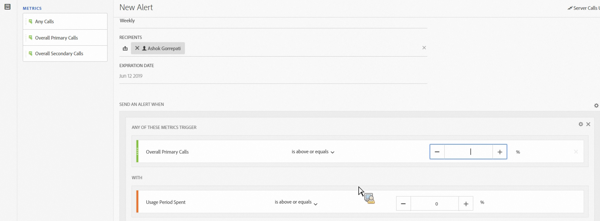

# Server Call Usage alerts

When you set up an alert, it applies to all report suites in all login companies of a Billing company.

## Overview

A new alert category called **[!UICONTROL Server Calls Usage Alert]** is part of the existing [Alert Management](https://experienceleague.adobe.com/docs/ analytics/analyze/analysis-workspace/virtual-analyst/intelligent-alerts/intellligent-alerts.html) user interface.

It is pre-populated with **1 default alert** that appears within any login company that has access to the Server Call Usage feature. This alerts triggers a notification addressed to all the login company's admins if one of the following criteria is satisfied:

* "Any" server call usage that "is above or equals" 100% for any server-call type you are entitled to, OR 
* "Any" server call usage that "is above or equals" 90% for any server-call type you are entitled to, OR 
* "Any" server call usage that "is above or equals" 75% for any server-call type you are entitled to, AND "Usage period spent" "is below or equals" 75% of Usage period.

You can access server call usage alerts in two ways:

* Click **[!UICONTROL Manage Alerts]** in the upper right corner on the Current Usage tab or the Report Suite usage tab, or 
* Navigate to **[!UICONTROL Components]** > **[!UICONTROL Alerts]** in Adobe Analytics.

## Create Server Call Usage Alerts {#section_2A2882C6D48D47C1944D52FB7C766BEC}

To create additional alerts,

1. Click **[!UICONTROL + Add]** and select **[!UICONTROL Server Call Usage Alert]**.

   

1. Define the alert.

   

   * **Title**: Specify a descriptive name. You cannot save the alert without a name.
   * **Time Granularity**: Refers to how often the alert will be checked. *We support only Weekly granularity at this time.* This means that the alert will be checked on a weekly basis and will look back at the data from the current usage period.
   * **Recipients**: Specify anyone on the organization who should get an email when the alert triggers the specified threshold.
   * **Expiration Date**: By default, the expiration date is one year from the alert creation date.
   * **Send an Alert When**:

     *   Any of These Metrics Trigger
         Add the type of server call/s as a metric and specify the alert threshold by selecting the modifier and the threshold:
          *   is above or equals
          *   is below or equals
     *   With
         Specify the threshold and condition (is above or equals or is below or equals) for the Usage Period Spent.

1. Click **[!UICONTROL Save]**.

## Manage Server Calls Usage Alerts {#section_8FF98170763C4B5CBEC6DD43F893177A}

To manage alerts:

1. Select the checkbox next to one or more alerts. The alert management actions display at the top.
1. Complete one or more of these actions: 

   | Action | Definition |
   |--- |--- |
   |+ Add|Access the [Alert Builder](/help/admin/c-server-call-usage/scu-alerts.md) by clicking  [!UICONTROL + Add].|
   |Tag|Tag alerts to organize them for ease of use.|
   |Delete|You can delete all alerts except default alerts.|
   |Rename|You can rename all alerts except default alerts.|
   |Approve|Approve alerts to make them "official."|
   |Enable/Disable|You can enable or disable all alerts, even the default ones.|
   |Renew|When one or more alerts are selected, they can be renewed. This extends their expiration dates to be 1 year from the day [!UICONTROL Renew] was clicked, regardless of their original expiration date.|
   |Export to CSV|See [Download Usage Report](/help/admin/c-server-call-usage/report-suite-usage.md)|
   
