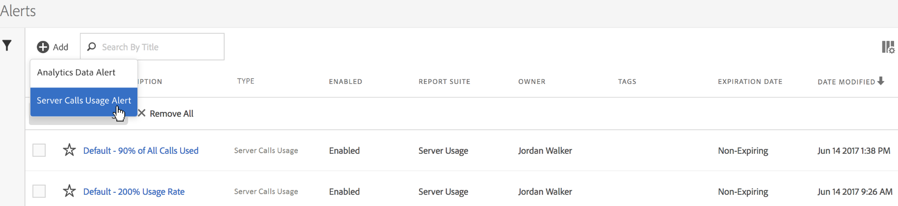
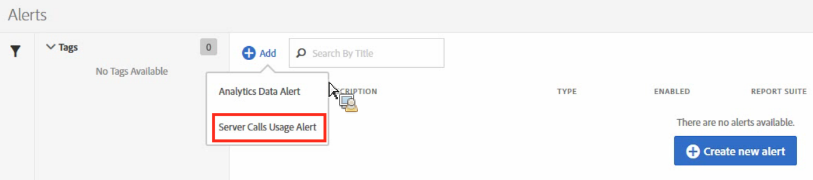
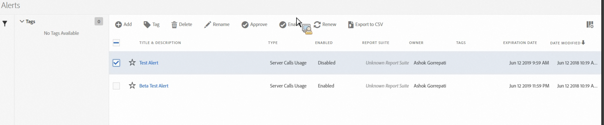

# Server Call Usage alerts

Add or manage server all usage alerts. When you set up an alert, it applies to all report suites in all login companies of a Billing company.

A new alert category called **[!UICONTROL Server Calls Usage Alert]** will be added to the existing [Alert Management](https://marketing.adobe.com/resources/help/en_US/analytics/analysis-workspace/intellligent_alerts.html) user interface.

It is pre-populated with **1 default alert** that would show up within any login company that has access to the Server Call Usage feature. This alerts will trigger a notification addressed to all their admins if one of the following criteria is satisfied:

* "Any" server call usage that "is above or equals" 100% for any server-call type you are entitled to, OR 
* "Any" server call usage that "is above or equals" 90% for any server-call type you are entitled to, OR 
* "Any" server call usage that "is above or equals" 75% for any server-call type you are entitled to, AND "Usage period spent" "is below or equals" 75% of Usage period.

You can access server call usage alerts in two ways:

* Click **[!UICONTROL Manage Alerts]** in the upper right corner on the Current Usage tab or the Report Suite usage tab, or 
* Navigate to **[!UICONTROL Components]** > **[!UICONTROL Alerts]** in Adobe Analytics.

## Create Server Call Usage Alerts {#section_2A2882C6D48D47C1944D52FB7C766BEC}

To create additional alerts,

1. Click **[!UICONTROL + Add]** and select **[!UICONTROL Server Call Usage Alert]**.

   

1. Define the alert.

   

<table id="table_B855DB561EC9473EAC5A838389075606"> 
 <thead> 
  <tr> 
   <th class="entry" colspan="2"> Field </th> 
   <th class="entry" colspan="2"> Description </th> 
  </tr>
 </thead>
 <tbody> 
  <tr> 
   <td colspan="2"> 
Title 
 </td> 
   <td colspan="2"> 
Specify a descriptive name. You cannot save the alert without a name. 
 </td> 
  </tr> 
  <tr> 
   <td colspan="2"> 
Time Granularity 
 </td> 
   <td colspan="2"> 
Refers to how often the alert will be checked. <b>We support only Weekly granularity at this time.</b> This means that the alert will be checked on a weekly basis and will look back at the data from the current usage period. 
 </td> 
  </tr> 
  <tr> 
   <td colspan="2"> 
Recipients 
 </td> 
   <td colspan="2"> 
Specify anyone on the organization who should get an email when the alert triggers the specified threshold. 
 </td> 
  </tr> 
  <tr> 
   <td colspan="2"> 
Expiration Date 
 </td> 
   <td colspan="2"> 
By default, the expiration date is one year from the alert creation date. 
 </td> 
  </tr> 
  <tr> 
   <td colspan="2"> 
Send an Alert When 
 </td> 
   <td colspan="2"> </td> 
  </tr> 
  <tr> 
   <td colspan="2"> 
    <ul id="ul_B78C5BED460D4126A4E835D7489F699C"> 
     <li id="li_41251882CE7E4B1F9BE0C5A1987BBFB1">Any of These Metrics Trigger </li> 
    </ul> </td> 
   <td colspan="2"> 
Add the type of server call/s as a metric and specify the alert threshold by selecting the modifier and the threshold: 
 
    <ul id="ul_43E5900EDBFC4643AD88A579FEB8D3E9"> 
     <li id="li_F6BFB591CD4F41A5B7AB47902CFEE230">is above or equals </li> 
     <li id="li_FCEDF4C639014D84A30AAAFE27A06734">is below or equals </li> 
    </ul> </td> 
  </tr> 
  <tr> 
   <td colspan="2"> 
    <ul id="ul_552579F35F5C441488E69991300CF236"> 
     <li id="li_6B0095B814A54CDABD28802CD1C84AFA">With </li> 
    </ul> </td> 
   <td colspan="2"> 
Specify the threshold and condition (is above or equals or is below or equals) for the Usage Period Spent. 
 </td> 
  </tr> 
 </tbody> 
</table>

1. Click **[!UICONTROL Save]**.

## Manage Server Calls Usage Alerts {#section_8FF98170763C4B5CBEC6DD43F893177A}

To manage alerts:

1. Select the checkbox next to one or more alerts. The alert management actions display at the top. 
1. Complete one or more of these actions: 

<table id="table_2735B4402B9A4F6BBBFA10A1400C86A4"> 
 <thead> 
  <tr> 
   <th colname="col1" class="entry"> Action </th> 
   <th colname="col2" class="entry"> Definition </th> 
  </tr>
 </thead>
 <tbody> 
  <tr> 
   <td colname="col1"> 
+ Add 
 </td> 
   <td colname="col2"> 
Access the <a href="../../admin/c-server-call-usage/scu-alerts.md#section_2A2882C6D48D47C1944D52FB7C766BEC" format="dita" scope="local"> Alert Builder</a> by clicking  + Add. 
 </td> 
  </tr> 
  <tr> 
   <td colname="col1"> 
Tag 
 </td> 
   <td colname="col2"> 
Tag alerts to organize them for ease of use. 
 </td> 
  </tr> 
  <tr> 
   <td colname="col1"> 
Delete 
 </td> 
   <td colname="col2"> 
You can delete all alerts except default alerts. 
 </td> 
  </tr> 
  <tr> 
   <td colname="col1"> 
Rename 
 </td> 
   <td colname="col2"> 
You can rename all alerts except default alerts. 
 </td> 
  </tr> 
  <tr> 
   <td colname="col1"> 
Approve 
 </td> 
   <td colname="col2"> 
Approve alerts to make them "official." 
 </td> 
  </tr> 
  <tr> 
   <td colname="col1"> 
Enable/Disable 
 </td> 
   <td colname="col2"> 
You can enable or disable all alerts, even the default ones. 
 </td> 
  </tr> 
  <tr> 
   <td colname="col1"> 
Renew 
 </td> 
   <td colname="col2"> 
 When one or more alerts are selected, they can be renewed. This extends their expiration dates to be 1 year from the day  Renew was clicked, regardless of their original expiration date. 
 </td> 
  </tr> 
  <tr> 
   <td colname="col1"> 
Export to CSV 
 </td> 
   <td colname="col2"> 
See <a href="../../admin/c-server-call-usage/report-suite-usage.md#section_D7345660B5E043CD8850954216509A3D" format="dita" scope="local"> Download Usage Report</a> 
 </td> 
  </tr> 
 </tbody> 
</table>

