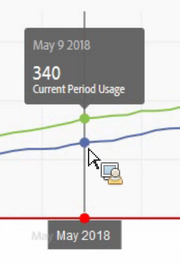
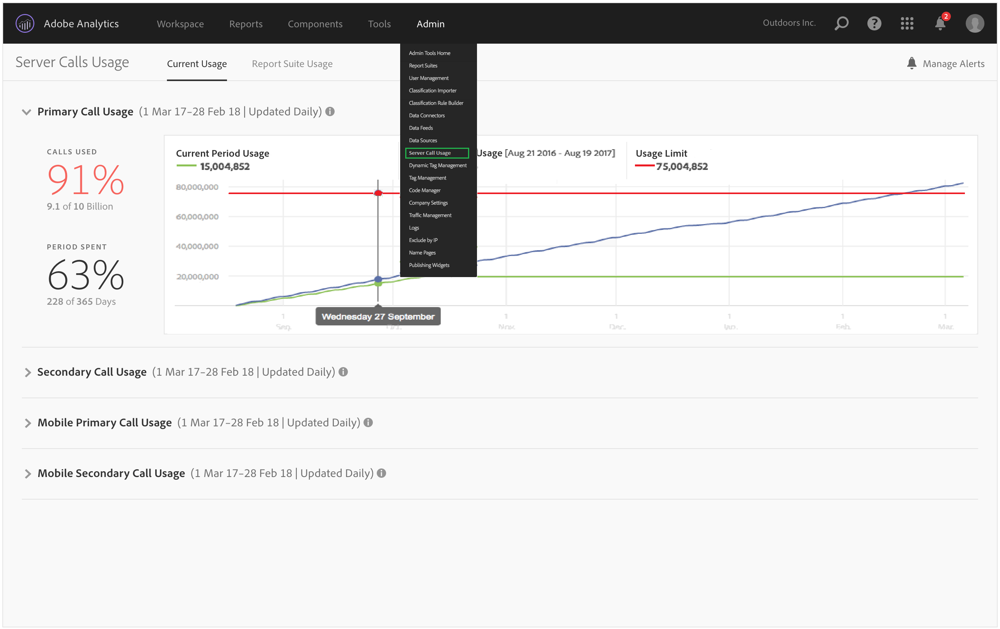

# View current server call usage

**[!UICONTROL Analytics]** > **[!UICONTROL Admin]** > **[!UICONTROL Server Call Usage]** > **[!UICONTROL Current Usage]** 

>[!IMPORTANT]
>
>Any usage and commitment numbers you see are cumulative across all your login companies and report suites.

The Current Usage dashboard

* Shows a breakdown of your server call consumption and commitment across each of your server-call types. This view could be different for different customers and is consistent with what your contract includes. For instance, you may have signed up for 4 separate types of server calls, Primary and Secondary for Web and Primary and Secondary for Mobile. In that case, this view would comprise 4 tabs, one for each type. Within each tab, you will be able to view the consumption for the current usage period.
* Compares current usage (green line) to your contractual usage limit (red line).

  

* Compares your current period's usage to last year's usage (blue line). Obviously, the blue line will only appear if your company has server call usage data from the previous year.

  >[!NOTE]
  >
  >If you want to view usage for a previous time period, you have to go to the [Report Suite Usage](/help/admin/c-server-call-usage/report-suite-usage.md) tab and download the usage data for a previous period.

* Lists the percentage of calls used (in percentages and raw data), and the percentage of the usage period spent (in percentages and raw data).
* By default, is updated daily, with a 5-day processing latency.
* Lets you collapse and expand all reportlets.

|  UI Term  | Definition  |
| --- | --- |
|  Current Period Usage (green)  |The current period is based on the [usage period](/help/admin/c-server-call-usage/overage-overview.md).  |
|  Previous Period Usage (blue)  | The previous period is defined as the current usage period minus 1 year.  |
|  Usage Limit (red)  | Your contractual usage limit for this usage period.  |
