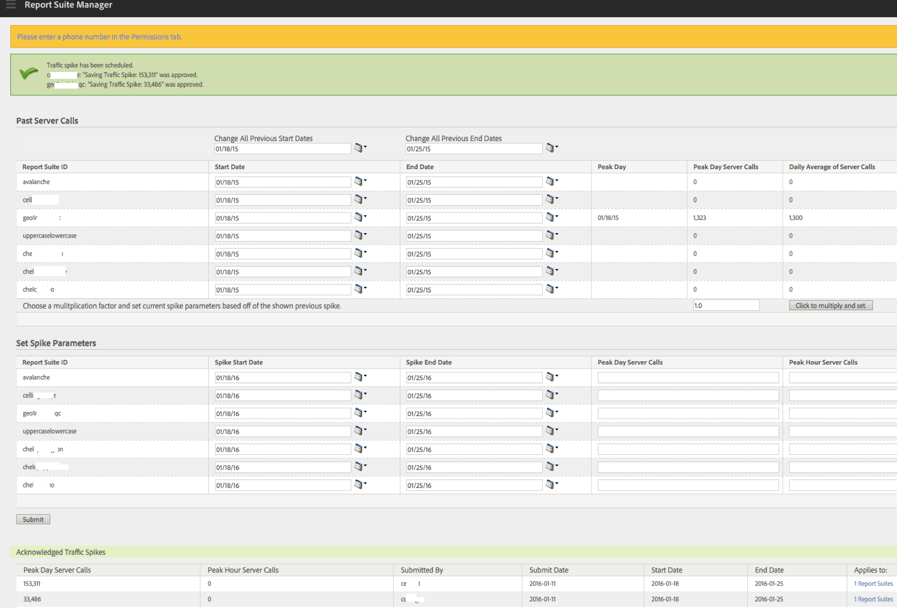

# Estimate past server calls and schedule a traffic spike

You can get, say, last year's daily server call average during a specific time frame, plus an expected increase in server call volume for this year. You can then schedule a traffic spike based on this multiplication factor.

1. Log in to Analytics as an Admin and go to **[!UICONTROL Admin]** > **[!UICONTROL Traffic Management]**.

1. Click **[!UICONTROL Expand]** to expanding the report suite list and click **[!UICONTROL Select Report Suites]** to select multiple report suites.

1. Click **[!UICONTROL Schedule Spikes]**.
1. Under **[!UICONTROL Past Server Calls]**, select a start and end date for the selected report suites.

   The amount for Peak Day, Peak Day Server Calls and Daily Average of Server Calls is generated.

1. Input a value for the multiplication factor and click **[!UICONTROL Click to multiply and set]**.

   The value for each of the columns is multiplied for each report suite.

1. Under **[!UICONTROL Set Spike Parameters]**, submit the spike parameters for the selected report suites.

   The spike is now scheduled for each selected report suite.

