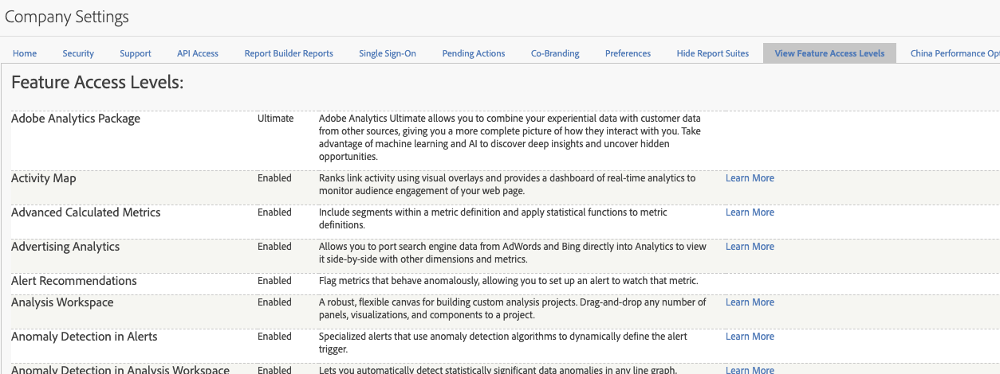

# Feature access levels

**[!UICONTROL Admin]** > **[!UICONTROL All admin]** > **[!UICONTROL Company settings]** > **[!UICONTROL View Feature Access Levels]**

This group of settings allows you to view the level of access to Adobe Analytics packages and features that your company is entitled to. Some features are only available with more advanced product packages (SKUs) such as [Adobe Analytics Ultimate](https://www.adobe.com/data-analytics-cloud/analytics/ultimate.html).

