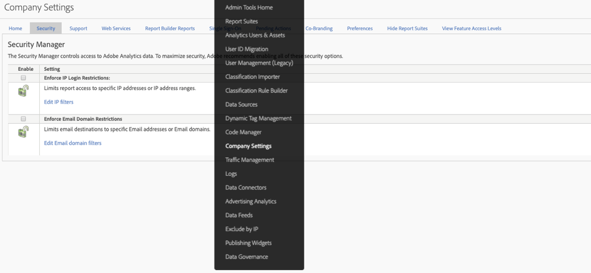

# End-of-life for [!UICONTROL Enforce IP login restrictions]

The **[Enforce IP login restrictions](/help/admin/company/security-manager.md)** feature in Adobe Analytics lets you add specific IP addresses (that are deemed secure) to an allowlist, so as to allow successful logins and access to your Adobe Analytics environment. In many instances, this feature is used to set up a corporate IP address as the only secure IP address that users can log in from. Therefore, in order to use Adobe Analytics, this requires users to either be at a corporate office or to log in the network via VPN. 

We are planning to end-of-life this feature in January, 2021.

## Why are we end-of-lifing this feature?

This feature is broken in some circumstances by the Experience Cloud login migration and/or the Experience Cloud login. It is known to break for customers using **[!UICONTROL Customer Attributes]** or **[!UICONTROL Audience Library]**. 

Additionally, if you own multiple Experience Cloud Solutions, you can circumnavigate this requirement by logging in to the Experience Cloud with one of the other solutions, as this feature does not exist or is not supported outside of Analytics itself. Users could also get around this via IP spoofing.

Finally, Adobe has a functioning and far superior alternative solution via Single-Sign-On and Federated IDs. This feature gives you greater control and security over your users’ login experience. See below for more information.

## How does removal of this feature impact you?

For any customer who has **[!UICONTROL Enforce IP login restrictions]** set up, this feature will be removed in January, 2021. At that time, any IP login restrictions still in place will no longer be enforced. If you still need to restrict login by IP address, you should review and implement the recommended solution of Single-Sign-On and Federated IDs (more info and resources below). 

Additionally, the **[!UICONTROL Enforce IP login restrictions]** setting will be removed from the **[!UICONTROL Admin] > [!UICONTROL All admin] > [!UICONTROL Company settings] > [!UICONTROL Security Manager]** in the Analytics UI (as shown below). 

## What are your other options?

As stated above, this Analytics feature will be end-of-lifed. To give you time to implement SSO and Federated IDs, we have delayed the EOL date to January 2021. 

Both SSO and Federated IDs are superior solutions to the IP Login Restriction feature we have in place today and will provide you with more control, security and features. For information on how to set up SSO/Federated IDs, we have the following help documentation available. We recommend that you read them thoroughly and work with your IT department to get them implemented:

* [Single Sign-On and the Experience Cloud](https://spark.adobe.com/page/JeSB8EPEQIvjD/)
* [Admin Console - Identity Setup documentation](https://helpx.adobe.com/enterprise/using/set-up-identity.html)
* [Admin Console - Identity Setup tutorial (video)](https://helpx.adobe.com/enterprise/how-to/identity-directories-domains.html?playlist=/ccx/v1/collection/product/enterprise/topics/enterprise-identity/collection.ccx.js&ref=helpx.adobe.com)
* [Configure Federated ID tutorial (video)](https://helpx.adobe.com/enterprise/how-to/identity-configure-ids.html?playlist=/ccx/v1/collection/product/enterprise/topics/enterprise-identity/collection.ccx.js&ref=helpx.adobe.com)
* [Single Sign-On - common questions](https://helpx.adobe.com/enterprise/using/sso-faq.html)
* [Adobe-supported identity types](https://helpx.adobe.com/enterprise/using/identity.html)

If you want to continue to voice your support for IP Login Restrictions and request that it be provided by the Experience Cloud, you may vote for this feature on our [Forum page](https://forums.adobe.com/ideas/11648).
