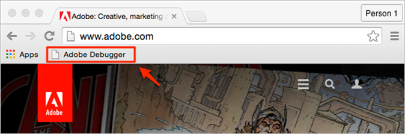
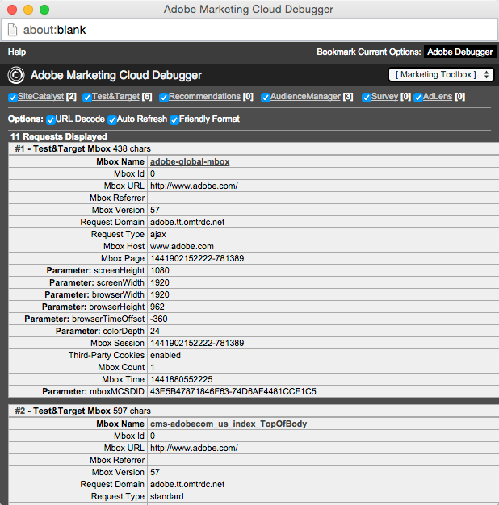

# Determine if you are using first- or third-party cookies

For regional data collection, learn how to determine if you are using first- or third-party cookies.

## First- vs. third-party cookies

A first-party cookie is a cookie that is set on the domain you are currently visiting. For example, if you were on `www.adobe.com`, the cookie would be set on the adobe.com domain.

A third-party cookie is a cookie set on any domain other then the domain currently being visited. For example, If you were visiting `www.adobe.com` and the cookie was set on the `omtrdc.com` domain, that would be considered a third party cookie.

For more information about cookies and how they pertain to Analytics, see [About First-Party Cookies](https://marketing.adobe.com/resources/help/en_US/whitepapers/first_party_cookies/fpcookies_overview.html).

Depending on your implementation, your web property may be using first- or third-party cookies. We can test this by running the [debugger](https://marketing.adobe.com/resources/help/en_US/sc/implement/debugger.html) on your site.

To determine if you are using first- or third-party cookies:

1. If you haven't already, install the Adobe Debugger using the steps listed in [Adobe Debugger Installation](https://marketing.adobe.com/resources/help/en_US/sc/implement/?f=debugger_install).

1. Open your web property in the browser with the debugger installed.

   

1. Click the Bookmarklet to display the debugger.
You should see a new window containing debugging information, such as in the following example:

   

1. Locate the SiteCatalyst Image section.

The first line of the SiteCatalyst section should tell you what type of cookies your site is utilizing and the tracking server.

In this example, the web property is using first-party cookies and has a tracking server of `stats.adobe.com`. If your web property is using third-party cookies, you will see *Third Party Cookies* on the left, and a tracking server ending in `2o7.net or omtrdc.net`.