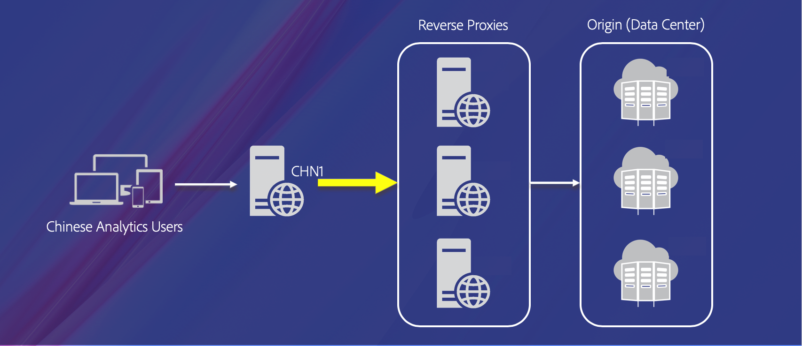
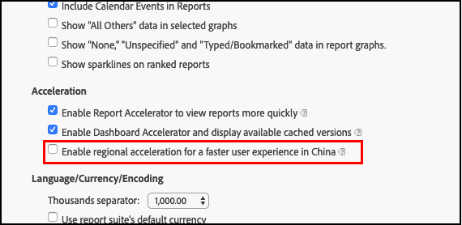

# Regional Data Collection for China

Adobe's Regional Data Collection (RDC) Center in mainland China enables early-adopter customers within China to send data directly to RDC within China, instead of other locations globally. This allows improved data capture and latency rates so that they are similar to global rates outside of China's firewall.

China RDC currently has no traffic volume limitations. Tracking can be brought on to China RDC at any point that is convenient.

You should use China RDC only if your users are located within China.

## China RDC architecture

China RDC architecture includes a reverse proxy with caching in China. It runs under a load balancer for redundancy and capacity. It proxies requests to specified AWS locations outside China, which then proxy requests to Adobe data centers. There are no other components or dependencies.

The user's browser in China makes requests to `sc.omniture.com` initially to log in. After login, the application redirects them according to their report access. Based upon their current assignment and a per-user database setting for *Region Acceleration*, they are redirected to `rp-sc{3,4,5}.chn1.omniture.com`.  Their current assignment also affects any further redirects and also URIs embedded in the HTML responses. Content filtering or substitution is not performed by the reverse proxies. This is peformed by the application itself.

Requests to the China reverse proxies are then sent to another set of reverse proxies in AWS centers near each destination DPC. The requests are then sent to the final destination DPC.

### Redundancies and Single Points of Failure

China RDC is deployed across two AWS availability zones for each load balancer setup. The deployment includes using auto-scale groups. This provides sufficient redundancies for each location to eliminate single points of failure.

### Networks and Dependencies

China RDC service has no dependencies on other device services or Adobe data center connectivity. For safety, existing VPC networks in AWS locations are not used by Analytics collections. New VPC networks are dedicated for this proxy service only. These new VPC networks are not peered with CST or NetEng, so they are not using MCT or any other connectivity back to Adobe systems or networks. 

Network security groups are set up in both domains to protect network and port access.

## Regional acceleration

For faster user experience and data collection within China, you can enable an acceleration option in your report settings. To do this:

In Analysis Workspace, click **Components** > **Report Settings**. Select the option for China acceleration.

Do not select this option if you or your users are located outside of China. If you do, it will unnecessarily slow your data rates.

## Current limitations

The current limitations of China RDC:

1. China RDC does not support first party SSL ([s.trackingServerSecure](https://helpx.adobe.com/analytics/kb/determining-data-center.html) in your JavaScript), or [Server-Side Forwarding](https://marketing.adobe.com/resources/help/en_US/reference/ssf.html) to Adobe Audience Manager. 

1. Although [A4T](https://marketing.adobe.com/resources/help/en_US/target/a4t/c_account_reqs.html) and [ECID](https://marketing.adobe.com/resources/help/en_US/dtm/macid.html) are supported, the Target and Demdex domains are not currently in mainland China and will not have the same speed or reliability benefits as those within the China RDC.

## Tracking setup

For any digital property (such as a mobile app or web page) you want routed to China RDC, simply change the tracking server to:

`<namespace>.sc.adobedc.cn`

Be sure to insert the proper namespace. This is typically found at the beginning of your existing tracking server. For example: `<namespace>.sc.omtrdc.net`--although any namespace value will work. You can also point a non-SSL first-party [CNAME](https://marketing.adobe.com/resources/help/en_US/whitepapers/first_party_cookies/fpcookies_cname.html) record to this new location, if non-SSL first party tracking is desired.

Do not set your global namespace to China RDC if any part of your user network is outside of China. This will dramatically affect the speed of your data collection. Set only your China-based web sites to this namespace.

Non-secure visitor migration is also supported on China RDC. Contact Customer Care to configure visitor migration. Additionally, if special headers are needed, such as custom `HSTS` or `CORS` headers, please file a ticket with [Customer Care](https://helpx.adobe.com/contact/enterprise-support.ec.html), who will have Adobe engineering accommodate the customization.

## Adobe’s commitment to China

Adobe plans to permanently keep China RDC progressing and will eventually add support for features such as first-party SSL and server-side forwarding. Additionally, Adobe plans to provide a demdex (or equivalent) domain in China to fully support ECID and Audience Manager collection from within China. Customers who begin using Adobe's China RDC are welcome to continue using this data collection endpoint indefinitely.

