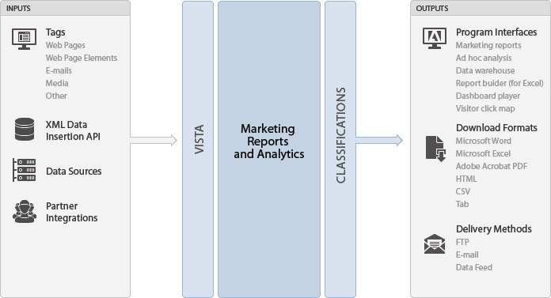

# Data collection in Adobe Analytics

Adobe has created multiple ways to send data into Analytics. These methods include tracking information in real-time from web sites, emails, campaigns, web-based kiosks, mobile devices, client-server applications, and most applications that can access the Internet.

These methods include reporting on information from offline systems via the Data Sources and partner integration platform.

* [Input Options](../data-collection/usecase-sending-data-to-sc.md#section_6525FDEDA5734D0E994AFB78DF555A69) 
* [Output Options](../data-collection/usecase-sending-data-to-sc.md#section_6775F66245A747CD951F9A0E604923D6) 
* [Third-Party Data Connectors](../data-collection/usecase-sending-data-to-sc.md#section_5B8E40F04F764A2A9B4180FE8C8A1C20)

## Input Options {#section_6525FDEDA5734D0E994AFB78DF555A69}

For a list of input options, see [Which Adobe Tool Should I Use?](../c-analytics-product-comparison/which-analytics-tool.md#concept_E7D62115EB5B49959887B338F20CBC1A)

## Output Options {#section_6775F66245A747CD951F9A0E604923D6}

For a list of output options, see [Which Adobe Tool Should I Use?](../c-analytics-product-comparison/which-analytics-tool.md#concept_E7D62115EB5B49959887B338F20CBC1A)  

## Third-Party Integrations {#section_5B8E40F04F764A2A9B4180FE8C8A1C20}

If you're considering integrating third-party applications with reporting, Adobe's data connectors platform represents a streamlined way of importing and exporting data out of Analytics. The various pre-built integrations (email, survey, ad serving, and social media) simplify the process of importing data from other marketing applications and also give you control over what report data is shared with third-party vendors. Data connectors leverage all of the aforementioned input and output mechanisms to automate the process of capturing and sharing data with other systems. 
