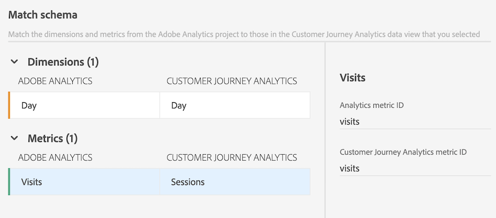
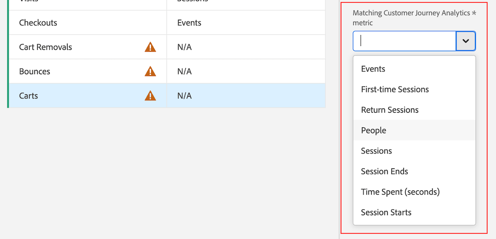

# Migrate components and projects from Adobe Analytics to Customer Journey Analytics

Adobe Analytics administrators can migrate Adobe Analytics projects and their associated components to Customer Journey Analytics. 

The migration process includes:

* Re-creating Adobe Analytics projects in Customer Journey Analytics. 

* Mapping dimensions and metrics from Adobe Analytics report suites to dimensions and metrics in Customer Journey Analytics data views. 

  Some dimensions and metrics are automatically mapped; others you must manually map as part of the migration process. Segments are also migrated, but they do not need to be mapped as part of the migration process. 
  
  All migrated components display in the migration summary when the migration completes.

>[!NOTE]
>
>The information on this page describes how to migrate projects and their associated components with the user interface. 
>
>Alternatively, you can perform the migration using the APIs. For more information, see the [Adobe Analytics APIs](https://adobedocs.github.io/analytics-2.0-apis/?urls.primaryName=Analytics%202.0%20APIs). All API definitions are available in the **[!UICONTROL Select a definition]** drop-down menu.

## Prepare for a migration

Before you migrate any projects to Customer Journey Analytics, learn more about migrating projects in the [Prepare to migrate components and projects from Adobe Analytics to Customer Journey Analytics](/help/admin/tools/component-migration/prepare-component-migration.md). 

In addition, do an [Adobe Analytics inventory](/help/admin/tools/analytics-inventory.md) using the tool available to Analytics administrators.

## Migrate Adobe Analytics projects to Customer Journey Analytics

>[!NOTE]
>
>Before you migrate any projects to Customer Journey Analytics as described in this section, learn more about migrating projects in the [Prepare to migrate components and projects from Adobe Analytics to Customer Journey Analytics](/help/admin/tools/component-migration/prepare-component-migration.md). 
>
>**Any dimensions or metrics that you map apply to this project and to all future projects across your entire IMS org, regardless of which user is performing the migration. These mappings can be updated when migrating future projects.**

1. In Adobe Analytics, select the [!UICONTROL **Admin**] tab, then select [!UICONTROL **All admin**].

1. Under [!UICONTROL **Data configuration & collection**], select [!UICONTROL **Component migration**].

1. Locate each project that you want to migrate. You can filter, sort, or search the project list.

   By default, only projects that are shared with you are displayed. To view all projects in your organization, select the **Filter** icon, then expand [!UICONTROL **Other filters**] and select [!UICONTROL **Show all**]. (For more information about filtering, sorting, and searching the project list, see [Filter, sort, and search the list of projects](#filter-sort-and-search-the-list-of-projects).)

1. (Conditional) To migrate multiple projects at one time, select the checkbox to the left of each project that you want to migrate, then select [!UICONTROL **Migrate to Customer Journey Analytics**].  

   Consider the following when migrating multiple projects:
   
   * You can select up to 20 projects to migrate at one time.

   * The migration status must be the same for all projects you are migrating. 

     For example, if you select one project to migrate that has a migration status of **[!UICONTROL Not started]**, you cannot select another project that has a migration status of **[!UICONTROL Failed]**.

   * You must designate the same project owner for all projects you are migrating. 
   
   * Dimensions and metrics must be mapped to the same data view for all projects you are migrating.

   The [!UICONTROL **Migrate project_name to Customer Journey Analytics**] dialog box is displayed.

   <!-- add screenshot -->

1. (Conditional) To migrate a single project, mouse over the project that you want to migrate, then select the **Migrate** icon .

   The [!UICONTROL **Migrate project_name to Customer Journey Analytics**] dialog box is displayed.

   <!-- add screenshot -->
   
1. In the [!UICONTROL **Project owner**] field, begin typing the name of the user who you want to set as the owner of the projects being migrated in Customer Journey Analytics, then select their name in the drop-down menu. 

   The owner that you specify has full management rights to the migrated projects. The owner must be an administrator in Customer Journey Analytics. You can change the ownership of the projects in a later step.

1. In the [!UICONTROL **Map schema for report suites**] section, select a report suite.

1. In the [!UICONTROL **Data view**] drop-down menu, select the Customer Journey Analytics data view where you want the the projects and components to be migrated.  

   When you are migrating multiple projects, all the projects you are migrating are combined into the single data view mapping. 

1. Select [!UICONTROL **Map schema**].

1. In the [!UICONTROL **Map schema**] section, expand the [!UICONTROL **Dimensions**] and [!UICONTROL **Metrics**] sections. 

   Some dimensions and metrics in Adobe Analytics are automatically mapped to a dimension or metric in Customer Journey Analytics. Others need to be manually mapped.

   **Automatically map dimensions and metrics**

   >[!NOTE]
   >
   >   If you used the WebSDK to ingest data into Adobe Experience Platform, dimensions and metrics cannot be automatically mapped. For more information, see [Prerequisites](/help/admin/tools/component-migration/prepare-component-migration.md#prerequisites) in [Prepare to migrate components and projects from Adobe Analytics to Customer Journey Analytics](/help/admin/tools/component-migration/prepare-component-migration.md).

   Some dimensions and metrics in Adobe Analytics are automatically mapped to a dimension or metric in Customer Journey Analytics. You can't make any mapping decisions for these dimensions and metrics.
   
   For example, the **Visits** metric in Adobe Analytics is automatically mapped with the **Sessions** metric in Customer Journey Analytics.

   You can select any dimension or metric to view their associated IDs. 

   <!-- update screenshot after I can see the Status column -->

   

   **Manually map dimensions and metrics**
   
   Some dimensions and metrics in Adobe Analytics cannot be automatically mapped to a dimension or metric in Customer Journey Analytics. 

   When a dimension or metric cannot be automatically mapped, an orange counter displays next to the [!UICONTROL **Dimensions**] or [!UICONTROL **Metrics**] section header, indicating the number of dimensions or metrics that need to be manually mapped. In the table, a warning icon  displays next to each dimension or metric that needs to be manually mapped.

   In addition, the [!UICONTROL **Status**] column says [!UICONTROL **Not mapped**]. 

   <!-- update screenshot after I can see the Status column -->

   

1. To manually map dimensions and metrics, select a dimension or metric that contains a warning icon , then in the [!UICONTROL **Mapped Customer Journey Analytics metric**] field (or the [!UICONTROL **Mapped Customer Journey Analytics dimension**] field if you are mapping a dimension), select the dimension or metric in Customer Journey Analytics that you want to map to the dimension or metric you selected.

   

   After a dimension or metric is mapped, the warning icon disappears and the [!UICONTROL **Status**] column changes to [!UICONTROL **Mapped**] with a green dot. (A status of [!UICONTROL **Mapped**] with a gray dot indicates that the dimension or metric was mapped during a previous migration; any previous mappings cannot be updated.)
   
   Repeat this process for each dimension or metric that contains the warning icon.
   
   After all dimensions and metrics in the Adobe Analytics report suite are mapped to a dimension or metric in the Customer Journey Analytics report suite, a green check mark  appears next to the report suite name in the [!UICONTROL **Map schema for report suites**] section.

1. (Conditional) If the projects you are migrating contain more than one report suite, select another report suite in the [!UICONTROL **Map schema for report suites**] section, then repeat step 6 through Step 10. <!-- double-check that the step numbers are still correct -->

1. Select [!UICONTROL **Migrate**].

   >[!WARNING]
   >
   >An on-screen warning message displays after you select [!UICONTROL **Migrate**]. Before you choose to continue, understand that any dimensions or metrics you map apply to this project and to all future projects across your entire IMS org, regardless of which user is performing the migration. These mappings can be updated when migrating future projects.

   After a migration completes, the [!UICONTROL **Migration status**] page provides a summary of what was migrated.

   If the migration fails, see the [Retry a failed migration](#retry-a-failed-migration) section below for more information.

1. (Optional) After projects are migrated, you can transfer ownership of the projects to any user in Customer Journey Analytics. For more information, see [Transfer assets](https://experienceleague.adobe.com/en/docs/analytics-platform/using/tools/asset-transfer/transfer-assets) in the Customer Journey Analytics Guide.

## Retry a failed migration

If a migration fails, you can retry the migration.

Before retrying a failed migration, make sure you remove any [unsupported elements](/help/admin/tools/component-migration/prepare-component-migration.md#understand-unsupported-elements-that-cause-errors) from the project.

>[!NOTE]
>
>If the migration continues to fail after retrying, contact Customer Care with the project ID. You can find the project ID on the Migration status page. <!-- when does this page display? How can they get there -->

To retry a failed migration:

1. In Adobe Analytics, select the [!UICONTROL **Admin**] tab, then select [!UICONTROL **All admin**].

1. Under [!UICONTROL **Data configuration & collection**], select [!UICONTROL **Component migration**].

1. Select [!UICONTROL **Failed**] in the [!UICONTROL **Migration status**] column next to the project that you want to retry. 

    

   The [!UICONTROL **Migration status**] page displays.
   
   This page also displays immediately after completing the migration steps described in the section [Migrate Adobe Analytics projects to Customer Journey Analytics](#migrate-adobe-analytics-projects-to-customer-journey-analytics) above. 

1. Select [!UICONTROL **Retry migration**].

## Filter, sort, and search the list of projects

You can filter, sort, and search the list of projects on the Component migration page. 

### Filter the list of projects

   You can filter by the following criteria:

   |Filter | Description |
   |---------|----------|
   | [!UICONTROL **Status**] | The status of the migration: <ul><li>[!UICONTROL **Not started**]</li><li>[!UICONTROL **Started**]</li><li>[!UICONTROL **Completed**]</li><li>[!UICONTROL **Failed**]</li></ul>. | 
   | [!UICONTROL **Tags**] | Select any tags in the list of tags. Only projects that have the selected tags applied are displayed. | 
   | [!UICONTROL **Report suite**] | Select any report suite in the list of report suites. Only projects that use the selected report suites are displayed. |
   | [!UICONTROL **Owners**] | Select any owner in the list of owners. Only projects that are owned by the users you select are displayed. |
   | [!UICONTROL **Other filters**] | The following additional filters are available: <ul><li>[!UICONTROL **Mine**]: Shows only projects where you are set as the owner.</li><li>[!UICONTROL **Shared with me**]: Shows only projects that have been shared with you.</li><li>[!UICONTROL **Favorites**]: Shows only projects that are marked as a favorite. (You can mark a project as a favorite from the [project landing page](/help/analyze/landing.md).)</li><li>[!UICONTROL **Monthly**]</li><li>[!UICONTROL **Yearly**]</li></ul>|

   {style="table-layout:auto"}

### Sort the list of projects

You can sort the list of projects by any column. 

To sort the list of projects:

1. Select the column header of the column you want to sort by. 

1. (Optional) Select the same column header again to reverse the sort order.

### Search for a project

You can search the list of projects on the Component migration page to find the project that you want to migrate. 

1. In the search field at the top of the Component migration page, begin typing the name of the project that you want to migrate. 

1. Select the project when it appears in the drop-down menu. 

<!-- is there going to be a way to customize the columns that are displayed? -->
