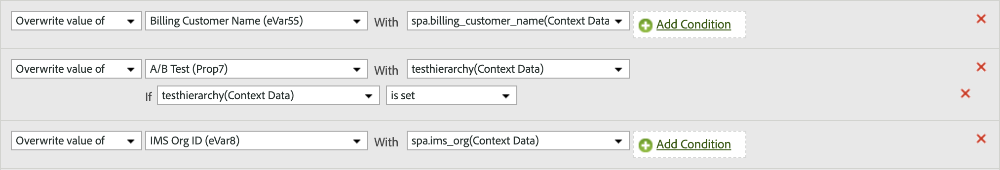
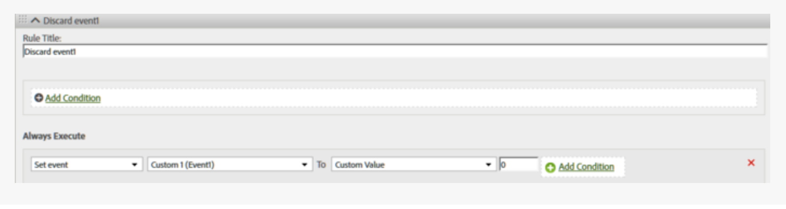

# Processing rules use cases

The applications of how you can use processing rules in your organization are extensive. The following sections elaborate on some common ways that you can use them to your advantage.

+++Copy a context data variable to an eVar

Processing rules are used to move values from [Context data variables](/help/implement/vars/page-vars/contextdata.md) to [Props](/help/components/dimensions/prop.md) and [eVars](/help/components/dimensions/evar.md). Without processing rules, context data variables are meaningless and do not populate any reports in Analytics.

The [!UICONTROL Context Variables] list contains all variables that were sent to the report suite in the last 30 days. If you know the context data variable name but have not sent it into the current report suite, you can manually add it:

The following example takes the `search_term` context data variable and places its value into eVar3:

| Rule set | Value |
| Condition | `search_term` (Context data) is set |
| Action | [!UICONTROL Overwrite value of] eVar3 With `search_term` (Context data) |

The above example works great when there are only a few eVars to populate. If your organization has hundreds of context data variables that each need their own eVar, you can use conditional statements. Dozens of conditional statements can fit inside a single processing rule, allowing your organization the ability to populate all eVars in a report suite without running into the processing rule limit of 150 rules.

The following example populates multiple variables with varying context data variables. One action also contains a conditional statement:

| Rule set | Value |
| Action | [!UICONTROL Overwrite value of] eVar55 with `spa.billing_customer_name` (Context data) |
| Action | [!UICONTROL Overwrite value of] Prop7 with `testhierarchy` (Context data), if `testhierarchy` (Context data) is set |
| Action | [!UICONTROL Overwrite value of] eVar8 with `spa.ims_org` (Context data) |

+++

+++Set an event using a context data variable

Processing rules can trigger events based on [Context data variables](/help/implement/vars/page-vars/contextdata.md).

The [!UICONTROL Context Variables] list contains all variables that were sent to the report suite in the last 30 days. If you know the context data variable name but have not sent it into the current report suite, you can manually add it:

The following rule definition sets an event on every hit that contains a specific context data variable: 

| Rule set | Value |
| --- | --- |
| Condition | `search_term` (Context data) is set |
| Action | [!UICONTROL Set event] Event1 to [!UICONTROL Custom Value] `1` |

+++

+++Populate a variable using a query string parameter

You can populate a variable using a query string parameter. In most cases, you would typically adjust your implementation to obtain the desired query string values. However, if you cannot easily adjust your implementation to collect this data, processing rules are an adequate alternative. If a typo or similar issue prevents the value from being populated, you can populate the variable using processing rules.

Always check to see if a value is empty or contains the expected value before you overwrite it.

| Rule set | Value |
| --- | --- |
| Condition | Campaign is not set  |
| Action | [!UICONTROL Overwrite value of] Campaign with [!UICONTROL Query String Parameter] `cpid` |

| Rule set | Value |
| --- | --- |
| Condition | [!UICONTROL Query String Parameter] `q` [!UICONTROL Is Set] |
| Action | [!UICONTROL Overwrite value of] Internal search terms With [!UICONTROL Query String Parameter] `q` |

+++

+++Conditionally set any event

Events can be set based on any condition available in processing rules. For example, you can trigger an event when the page name equals "Product overview".

| Rule set | Value |
| --- | --- |
| Condition | If [!UICONTROL Page Name] Equals "Product overview" |
| Action | [!UICONTROL Set event] [!UICONTROL Product Views] To [!UICONTROL Custom Value] `1` |

+++

+++Add a subcategory by concatenating the category and page name

You can use the concatenate option to populate values by combining other values.

| Rule set | Value |
| --- | --- |
| Condition | None (Always execute) |
| Action | [!UICONTROL Overwrite value of] eVar1 with [!UICONTROL Concatenated Value] Category + Page Name |

+++

+++Clean up values in a report

You can match values against misspellings collected and update them to display correctly in reports.

Adobe recommends using the most restrictive matching option possible to avoid undesired overwrites. You can run a report on the variable and search for potential rule conditions that you want to use. String comparisons are not case-sensitive.

| Rule set | Value |
| --- | --- |
| Condition | If prop1 [!UICONTROL Starts With] "[!DNL Shoping]" |
| Action | [!UICONTROL Overwrite value of] Prop1 With [!UICONTROL Custom Value] "[!DNL Shopping]" |

+++

+++Remove an event from a hit

You can remove or discard a specific event from a hit using processing rules without altering your implementation. If you set the event to custom value `0`, the event does not count.

| Rule set | Value |
| Condition | None (Always execute) |
| Action | [!UICONTROL Set event] Event1 to [!UICONTROL Custom value] `0` |

+++
